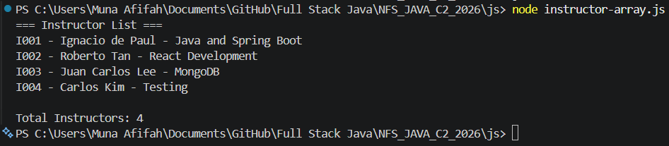
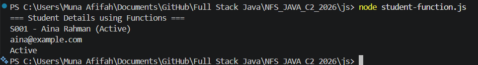
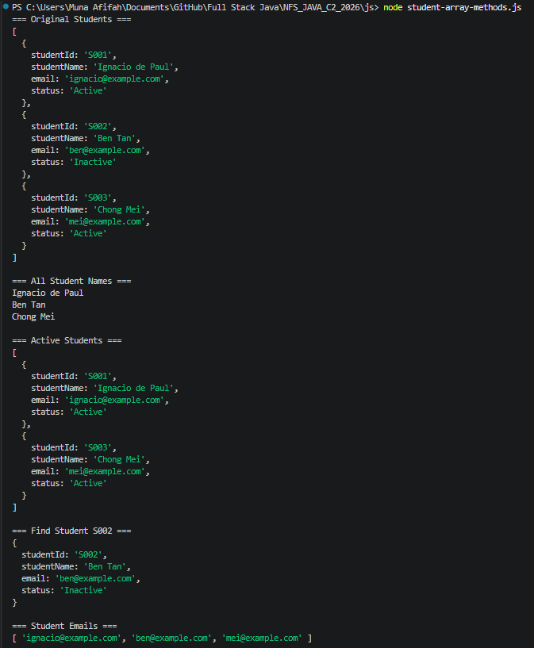
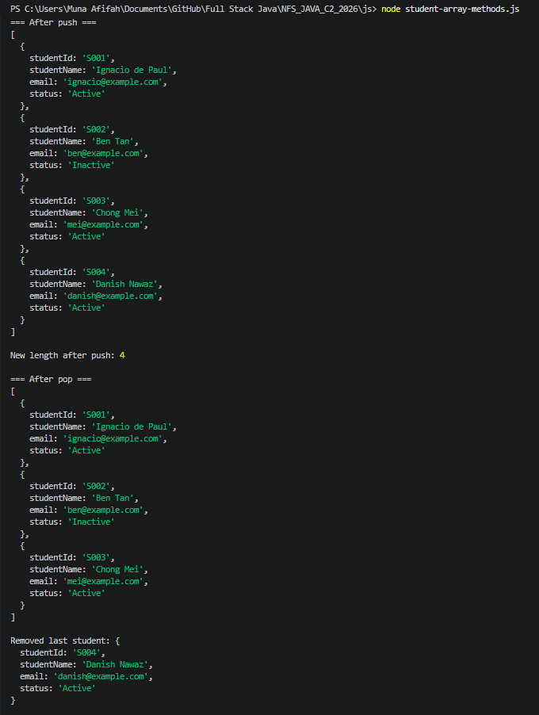
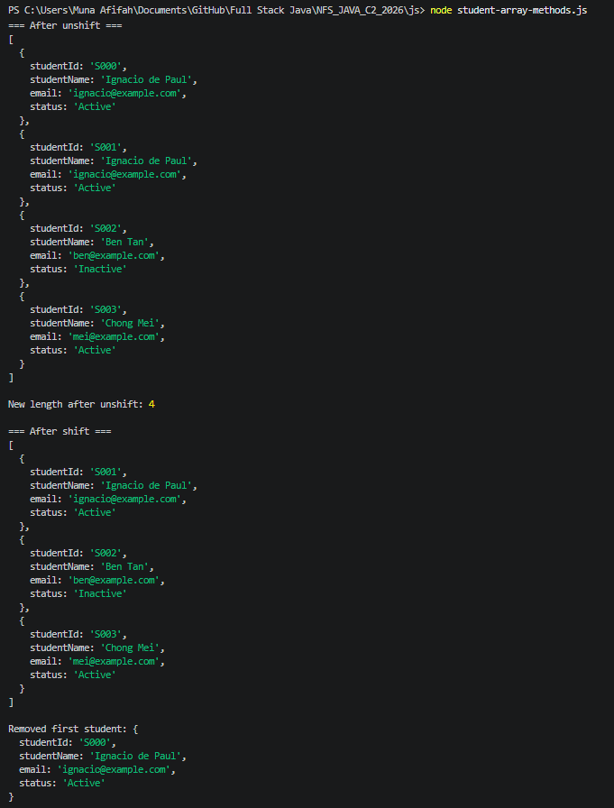
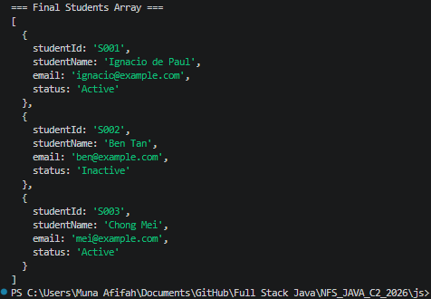
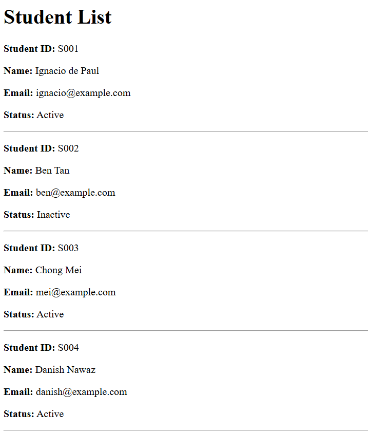
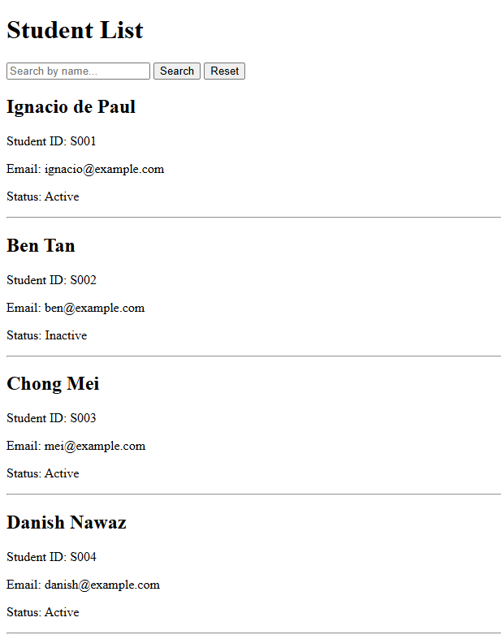
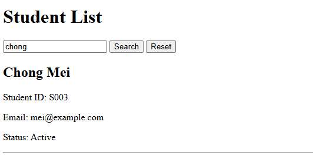
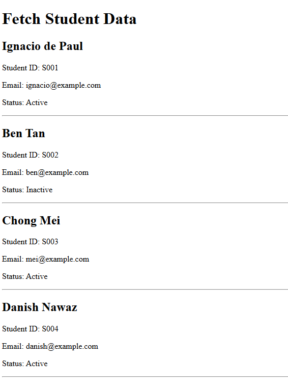

# NFS_JAVA_C2_2026 | Full-Stack Development with Java, React & MongoDB

## Programme Description

This 20-day programme is designed to help participants build a complete full-stack web application using Java, Spring Boot, React, and MongoDB.

The programme takes learners from programming and web fundamentals to backend API development, frontend interface design, database modelling, authentication, testing, performance improvement, and final capstone presentation.

Throughout the programme, participants will work on practical exercises and gradually build a small but production-like web application. The final outcome is a working capstone project that demonstrates the use of a React frontend, Spring Boot backend, MongoDB database, secure authentication, API documentation, testing practices, and deployment-readiness basics.

AI tools such as Gemini are used as learning accelerators to help scaffold examples, suggest refactoring ideas, draft tests, generate sample data, and support MongoDB query or aggregation design. However, participants are expected to review, verify, understand, and take ownership of all generated code.

---

## Programme Duration

* Duration: 20 training days

* Daily Duration: 7 hours per day

* Total Training Hours: 140 hours

* Mode: Instructor-led training with guided labs, team build activities, review sessions, quizzes, and capstone development

---

## Programme Objectives

By the end of this programme, participants will be able to:

* Understand web fundamentals, HTTP, REST, and JSON.

* Write basic to intermediate Java and JavaScript code.

* Build REST APIs using Spring Boot.

* Apply validation, authentication, authorisation, and error-handling practices.

* Model data effectively using MongoDB.

* Use MongoDB indexes, queries, pagination, and aggregation pipelines.

* Build accessible React user interfaces with routing, forms, state, and data fetching.

* Apply testing practices for backend and frontend development.

* Use AI coding assistants responsibly for learning, refactoring, testing, and documentation.

* Design, build, document, and present a full-stack capstone project.

---

---

## Day 4 Exercise 01 - Create a JavaScript Student Object

### What Was Added

**student-object.js** *(new file)*
- Created a JavaScript object literal `student` with four properties: `studentId`, `studentName`, `email`, and `status`
- Printed the whole object using `console.log()`
- Printed each property individually using dot notation and bracket notation
- Used dot notation to access `studentId` and `studentName`
- Used bracket notation to access `email`

### README Reflection - Exercise 01

**What is one difference between a Java object and a JavaScript object?**

In Java, you must define a class first (e.g. `Student.java`) with typed fields and a constructor before you can create an object. In JavaScript, you can create an object directly using `{}` (object literal) without any class definition — the properties are untyped and can be added on the fly.

### Output Screenshot

### GitHub Commit

[https://github.com/Munaafifah/NFS_JAVA_C2_2026/tree/day4](https://github.com/Munaafifah/NFS_JAVA_C2_2026/tree/day4)

---

## Day 4 Exercise 02 - Store Instructors in an Array and Loop Through Them

### What Was Added

**instructor-array.js** *(new file)*
- Created a `const instructors = []` array containing 4 instructor objects
- Each object has `instructorId`, `instructorName`, and `expertise` properties
- Used a `for...of` loop to iterate and print each instructor in readable format
- Printed total count using `.length`

### README Reflection - Exercise 02

**How is a JavaScript array similar to Java ArrayList?**

Both JavaScript arrays and Java `ArrayList` are dynamic — they can grow in size and hold multiple items. You can add elements and access them by index. The key difference is that Java `ArrayList` requires a declared type (e.g. `ArrayList<Instructor>`) while a JavaScript array can hold any mix of types without type declaration.

### Output Screenshot

### GitHub Commit

[https://github.com/Munaafifah/NFS_JAVA_C2_2026/tree/day4](https://github.com/Munaafifah/NFS_JAVA_C2_2026/tree/day4)

---

## Day 4 Exercise 03 - Write Functions and Arrow Functions for Student Data

### What Was Added

**student-functions.js** *(new file)*
- Created a `student` object with `studentId`, `studentName`, `email`, and `status` properties
- Wrote a normal function `formatStudent(student)` returning a formatted string e.g. `S001 - Aina Rahman (Active)`
- Wrote an arrow function `getStudentEmail(student)` returning the student's email
- Wrote a short arrow function `getStudentStatus(student)` returning the student's status in one line
- Printed all three outputs using `console.log()`

### README Reflection - Exercise 03

**Why are arrow functions important before learning React?**

Arrow functions are used everywhere in React — in event handlers, array methods like `map()` and `filter()`, and component callbacks. Learning them now means React syntax will feel familiar instead of confusing. They are shorter, cleaner, and avoid common issues with the `this` keyword compared to normal functions.

### Output Screenshot

### GitHub Commit

[https://github.com/Munaafifah/NFS_JAVA_C2_2026/tree/day4](https://github.com/Munaafifah/NFS_JAVA_C2_2026/tree/day4)

---

## Day 4 Exercise 04 - Practise JavaScript Array Methods

### What Was Added

**student-array-methods.js** *(new file)*
- Created a `students` array containing 3 student objects with `studentId`, `studentName`, `email`, and `status`
- Used `forEach` to loop through and print all student names
- Used `filter` to create `activeStudents` array containing only Active students
- Used `find` to locate student `S002` and store in `foundStudent`
- Used `map` to extract all emails into `studentEmails` array
- Used `push` to add Danish Nawaz to the end — stored new length in `newLengthAfterPush`
- Used `pop` to remove the last student — stored in `removedLastStudent`
- Used `unshift` to add S000 to the beginning — stored new length in `newLengthAfterUnshift`
- Used `shift` to remove the first student — stored in `removedFirstStudent`
- Printed the final array after all modifications

### README Reflection - Exercise 04

**1. What is the difference between filter, find, and map?**
- `filter` keeps items matching a condition and returns a **new array**
- `find` returns only the **first single object** that matches, not an array
- `map` transforms every item and returns a **new array** with the transformed results

**2. Which four array methods change the original array?**
`push`, `pop`, `shift`, and `unshift` all modify the original array directly.

**3. What does push return?**
`push` returns the **new length** of the array after the item is added.

**4. What does pop return?**
`pop` returns the **removed item** (the last element that was taken out).

**5. What is the difference between shift and unshift?**
`shift` removes the **first** item from the array. `unshift` adds a new item to the **beginning** of the array.

### Output Screenshot

### GitHub Commit

[https://github.com/Munaafifah/NFS_JAVA_C2_2026/tree/day4](https://github.com/Munaafifah/NFS_JAVA_C2_2026/tree/day4)

---

## Day 4 Exercise 05 - Render Student Cards in HTML

### What Was Added

**student-dom-rendering/index.html** *(new file)*
- Created HTML page with `<title>Student List</title>`
- Added `<h1>Student List</h1>` as the page heading
- Added `

` as the container for student cards
- Linked `script.js` at the bottom of the body

**student-dom-rendering/script.js** *(new file)*
- Created a `students` array containing 4 student objects with `studentId`, `studentName`, `email`, and `status`
- Used `document.getElementById("student-list")` to select the container div
- Used `forEach` to loop through every student
- Used `document.createElement("div")` to create a new card for each student
- Used `innerHTML` to fill each card with student details
- Used `appendChild` to add each card into the container on the page

### README Reflection - Exercise 05

**What does the DOM allow JavaScript to do?**

The DOM (Document Object Model) allows JavaScript to access and manipulate HTML elements on a page. Without the DOM, JavaScript can only run logic but cannot interact with what the user sees. With the DOM, JavaScript can find elements, create new ones, fill them with content, and add them to the page dynamically — which is exactly how React works under the hood.

### Output Screenshot

### GitHub Commit

[https://github.com/Munaafifah/NFS_JAVA_C2_2026/tree/day4](https://github.com/Munaafifah/NFS_JAVA_C2_2026/tree/day4)

---

## Day 4 Exercise 06 - Add Search to the Student List

### What Was Added

**student-search-ui/index.html** *(new file)*
- Created HTML page with `<title>Student Search</title>`
- Added `<h1>Student List</h1>` as the page heading
- Added `<input id="search-input">` for the user to type a search keyword
- Added `<button id="search-button">` to trigger the search
- Added `<button id="reset-button">` to clear search and show all students
- Added `

` as the container for student cards
- Linked `script.js` at the bottom of the body

**student-search-ui/script.js** *(new file)*
- Created a `students` array containing 4 student objects with `studentId`, `studentName`, `email`, and `status`
- Selected all DOM elements at the top using `document.getElementById`
- Created `renderStudents(studentArray)` function that clears the container, shows "No students found" if empty, otherwise renders a card for each student
- Used `searchButton.addEventListener` to read the keyword, filter students by name using `.toLowerCase().includes()`, and render filtered results
- Used `resetButton.addEventListener` to clear the input and render all students again
- Called `renderStudents(students)` on page load to show all students by default

### README Reflection - Exercise 06

**How is JavaScript filter used in a search feature?**

`filter` loops through every student and keeps only the ones whose name includes the search keyword. By converting both the student name and the keyword to lowercase using `.toLowerCase()`, the search becomes case-insensitive — so typing `chong` will match `Chong Mei` regardless of capitalisation.

### Output Screenshot

### GitHub Commit

[https://github.com/Munaafifah/NFS_JAVA_C2_2026/tree/day4](https://github.com/Munaafifah/NFS_JAVA_C2_2026/tree/day4)

---

## Day 4 Exercise 07 - Load Students from a JSON File Using Fetch

### What Was Added

**student-fetch-json/students.json** *(new file)*
- Created a JSON file containing 4 student records
- Each record has `studentId`, `studentName`, `email`, and `status`
- Used correct JSON format with double quotes and no trailing commas

**student-fetch-json/index.html** *(new file)*
- Created HTML page with `<title>Fetch Student Data</title>`
- Added `<h1>Fetch Student Data</h1>` as the page heading
- Added `
` to show loading or error messages
- Added `

` as the container for student cards
- Linked `script.js` at the bottom of the body

**student-fetch-json/script.js** *(new file)*
- Selected `status-message` and `student-list` elements using `document.getElementById`
- Created `renderStudents(students)` function to clear the container and render a card for each student
- Created `async function loadStudents()` using `try/catch` to handle errors
- Used `fetch("students.json")` to request the JSON file
- Used `await response.json()` to convert JSON into JavaScript objects
- Checked `response.ok` and threw an error if the file failed to load
- Cleared the loading message and called `renderStudents(students)` after successful load
- Called `loadStudents()` at the bottom to trigger the fetch on page load

### README Reflection - Exercise 07

**1. What does async mean?**
`async` marks a function that contains code which may take time to finish. It allows the function to use `await` inside it.

**2. What does await do?**
`await` pauses the function at that line and waits for the task to finish before moving to the next line — for example, waiting for `fetch` to return a response.

**3. What does fetch do?**
`fetch` sends a request to load data from a file or API and returns a response object containing the data.

**4. Why do we use fetch before connecting to a real backend API?**
Because the concept is the same — `fetch("students.json")` today becomes `fetch("http://localhost:8080/api/students")` when we connect to Spring Boot. Learning fetch now prepares us for real API calls later.

**5. Why should this exercise be run using Live Server?**
Because browsers block direct file access for security reasons. Live Server runs a local web server so `fetch("students.json")` works correctly. Double-clicking the HTML file directly would cause the fetch to fail.

### Output Screenshot

### GitHub Commit

[https://github.com/Munaafifah/NFS_JAVA_C2_2026/tree/day4](https://github.com/Munaafifah/NFS_JAVA_C2_2026/tree/day4)

---

