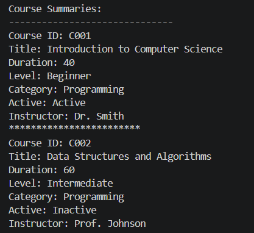

## Day 1 Exercise 01 - Code Explanation

1. What is the purpose of Course.java?

   It's a blueprint (class) that represents a course. It stores course details like courseId, title, durationHours, and level, and can have an Instructor assigned to it.

2. What is the purpose of Instructor.java?

It's a blueprint for an instructor. It stores instructorId, instructorName, and expertise, and has methods to retrieve those values.

3. What is the purpose of Student.java?

A blueprint for a student which likely stores student details like name, ID, and possibly which courses they're enrolled in.

4. What does the constructor do?

It initializes an object when you use new. For example:
javanew Course("C001", "Introduction to Computer Science", 40, "Beginner");
This runs the constructor and fills in all the fields with those values.

5. Why are the fields marked as private?

To protect the data so that 7nobody outside the class can directly change courseId or title. They must go through getters/setters. This is called encapsulation.

6. What does course1.assignInstructor(instructor1) mean?

It calls the assignInstructor method on the course1 object, linking an Instructor object to that course. Similar to TypeScript: course1.assignInstructor(instructor1).

7. What does student1.printProfile() do?

It prints the student's details to the console — like name, ID, etc.

## One explanation from AI that helped:

AI explained that one class can use another class by simply declaring it as a field. In Course.java, the line private Instructor instructor means Course is storing an Instructor object inside it. Java knows about Instructor because both files are in the same package so they can see each other automatically without needing to import anything.

## One part I still needed the trainer to explain:

Why does main have to be static — what does static even mean and why can't we just call it normally?

## Day 1 Exercise 02 - Improve the Course Class

Changes made to Course.java:
- Added two new fields: category (String) and active (boolean)
- Updated constructor to accept category and active as parameters
- Updated printSummary() to display Category and Status
- Used ternary operator to print "Active" or "Inactive" instead of true/false

