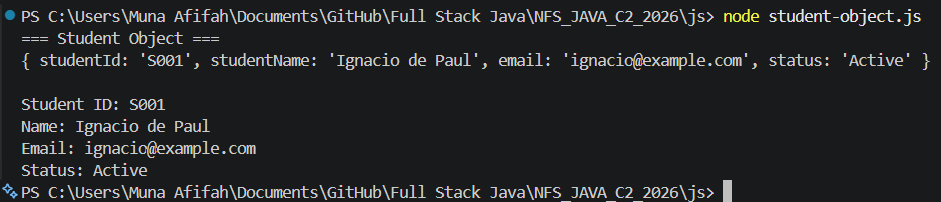

# NFS_JAVA_C2_2026 | Full-Stack Development with Java, React & MongoDB

## Programme Description

This 20-day programme is designed to help participants build a complete full-stack web application using Java, Spring Boot, React, and MongoDB.

The programme takes learners from programming and web fundamentals to backend API development, frontend interface design, database modelling, authentication, testing, performance improvement, and final capstone presentation.

Throughout the programme, participants will work on practical exercises and gradually build a small but production-like web application. The final outcome is a working capstone project that demonstrates the use of a React frontend, Spring Boot backend, MongoDB database, secure authentication, API documentation, testing practices, and deployment-readiness basics.

AI tools such as Gemini are used as learning accelerators to help scaffold examples, suggest refactoring ideas, draft tests, generate sample data, and support MongoDB query or aggregation design. However, participants are expected to review, verify, understand, and take ownership of all generated code.

---

## Programme Duration

* Duration: 20 training days

* Daily Duration: 7 hours per day

* Total Training Hours: 140 hours

* Mode: Instructor-led training with guided labs, team build activities, review sessions, quizzes, and capstone development

---

## Programme Objectives

By the end of this programme, participants will be able to:

* Understand web fundamentals, HTTP, REST, and JSON.

* Write basic to intermediate Java and JavaScript code.

* Build REST APIs using Spring Boot.

* Apply validation, authentication, authorisation, and error-handling practices.

* Model data effectively using MongoDB.

* Use MongoDB indexes, queries, pagination, and aggregation pipelines.

* Build accessible React user interfaces with routing, forms, state, and data fetching.

* Apply testing practices for backend and frontend development.

* Use AI coding assistants responsibly for learning, refactoring, testing, and documentation.

* Design, build, document, and present a full-stack capstone project.

---

---

## Day 4 Exercise 01 - Create a JavaScript Student Object

### What Was Added

**student-object.js** *(new file)*
- Created a JavaScript object literal `student` with four properties: `studentId`, `studentName`, `email`, and `status`
- Printed the whole object using `console.log()`
- Printed each property individually using dot notation and bracket notation
- Used dot notation to access `studentId` and `studentName`
- Used bracket notation to access `email`

### README Reflection - Exercise 01

**What is one difference between a Java object and a JavaScript object?**

In Java, you must define a class first (e.g. `Student.java`) with typed fields and a constructor before you can create an object. In JavaScript, you can create an object directly using `{}` (object literal) without any class definition — the properties are untyped and can be added on the fly.

### Output Screenshot

### GitHub Commit

[https://github.com/Munaafifah/NFS_JAVA_C2_2026/tree/day4](https://github.com/Munaafifah/NFS_JAVA_C2_2026/tree/day4)

---
