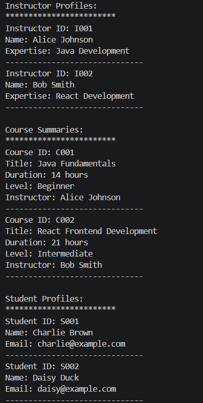
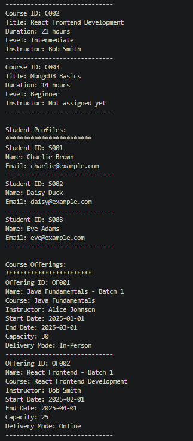
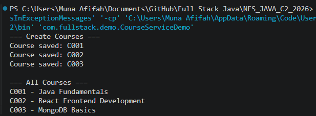
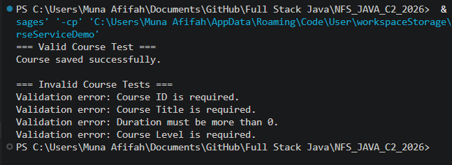
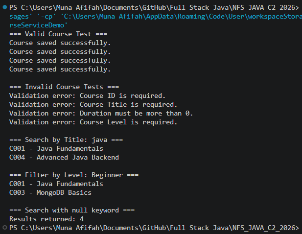
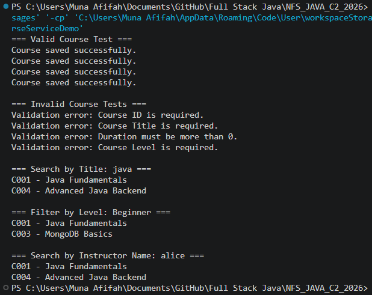
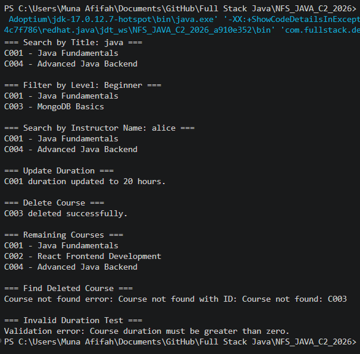

# NFS_JAVA_C2_2026 | Full-Stack Development with Java, React & MongoDB

## Programme Description

This 20-day programme is designed to help participants build a complete full-stack web application using Java, Spring Boot, React, and MongoDB.

The programme takes learners from programming and web fundamentals to backend API development, frontend interface design, database modelling, authentication, testing, performance improvement, and final capstone presentation.

Throughout the programme, participants will work on practical exercises and gradually build a small but production-like web application. The final outcome is a working capstone project that demonstrates the use of a React frontend, Spring Boot backend, MongoDB database, secure authentication, API documentation, testing practices, and deployment-readiness basics.

AI tools such as Gemini are used as learning accelerators to help scaffold examples, suggest refactoring ideas, draft tests, generate sample data, and support MongoDB query or aggregation design. However, participants are expected to review, verify, understand, and take ownership of all generated code.

---

## Programme Duration

* Duration: 20 training days

* Daily Duration: 7 hours per day

* Total Training Hours: 140 hours

* Mode: Instructor-led training with guided labs, team build activities, review sessions, quizzes, and capstone development

---

## Programme Objectives

By the end of this programme, participants will be able to:

* Understand web fundamentals, HTTP, REST, and JSON.

* Write basic to intermediate Java and JavaScript code.

* Build REST APIs using Spring Boot.

* Apply validation, authentication, authorisation, and error-handling practices.

* Model data effectively using MongoDB.

* Use MongoDB indexes, queries, pagination, and aggregation pipelines.

* Build accessible React user interfaces with routing, forms, state, and data fetching.

* Apply testing practices for backend and frontend development.

* Use AI coding assistants responsibly for learning, refactoring, testing, and documentation.

* Design, build, document, and present a full-stack capstone project.

---

---

## Day 2 Assignment 01 - Clean Up the Model Classes

### What Changed

**Course.java**
- Constructor now uses setters instead of assigning fields directly
- Added `setCourseId()`, `setTitle()`, and `setLevel()` — all reject blank values
- `setDurationHours()` rejects zero or negative values
- `printSummary()` now ends with a separator line
- Extracted a private `requireText()` helper to avoid repeating blank-check logic

**Instructor.java**
- Constructor now uses setters with validation
- Added `setInstructorId()`, `setInstructorName()`, and `setExpertise()` — all reject blank values
- Renamed `getProfile()` to `printProfile()` to better reflect what the method does
- `printProfile()` now ends with a separator line

**Student.java**
- Constructor now uses setters with validation
- Added `setStudentId()`, `setStudentName()`, and `setEmail()` — all reject blank values

### Output Screenshot

### GitHub Commit

[https://github.com/Munaafifah/NFS_JAVA_C2_2026/tree/day2](https://github.com/Munaafifah/NFS_JAVA_C2_2026/tree/day2)

---

## Day 2 Assignment 02 - Use ArrayList and Loops

### What Changed

**Main.java**
- Added `import java.util.ArrayList` at the top
- Created four `ArrayList` collections: `courses`, `instructors`, `students`, and `courseOfferings`
- Replaced named variables (`course1`, `course2`) with `courses.get(0)` and `courses.get(1)` to access items inside the list
- Added a third student to meet the assignment requirement
- Added two `CourseOffering` objects with all 8 required fields: `offeringId`, `offeringName`, `course`, `instructor`, `startDate`, `endDate`, `capacity`, and `deliveryMode`
- Replaced individual `printSummary()` / `printProfile()` calls with enhanced `for` loops for all four lists

### Output Screenshot

### GitHub Commit

[https://github.com/Munaafifah/NFS_JAVA_C2_2026/tree/day2](https://github.com/Munaafifah/NFS_JAVA_C2_2026/tree/day2)

---

## Day 2 Assignment 03.1 - Create the CourseService Structure

### What Changed

**CourseRepository.java** *(provided by trainer)*
- Interface provided as-is from the trainer — defines `save()`, `findById()`, `findAll()`, `deleteById()`, and `existsById()`

**InMemoryCourseRepository.java** *(provided by trainer)*
- Provided as-is from the trainer — implements `CourseRepository` using a `LinkedHashMap` to store courses in memory

**CourseService.java** *(new file)*
- Created following the assignment structure — contains a `private final CourseRepository` field and a constructor that receives a `CourseRepository` via constructor injection with no business methods yet

### GitHub Commit

[https://github.com/Munaafifah/NFS_JAVA_C2_2026/tree/day2](https://github.com/Munaafifah/NFS_JAVA_C2_2026/tree/day2)

---

## Day 2 Assignment 03.2 - Create and List Courses

### What Changed

**CourseService.java**
- Added `createCourse()` — validates that the course is not null (throws `InvalidCourseException` if so), then saves it via `courseRepository.save()`
- Added `getAllCourses()` — returns all courses via `courseRepository.findAll()`

**CourseServiceDemo.java** *(new file)*
- Created a separate demo entry point with its own `main` method
- Instantiated `InMemoryCourseRepository` and passed it into `CourseService` via constructor injection
- Created and saved three courses using `createCourse()`
- Retrieved and printed all courses using `getAllCourses()`

### Output Screenshot

### GitHub Commit

[https://github.com/Munaafifah/NFS_JAVA_C2_2026/tree/day2](https://github.com/Munaafifah/NFS_JAVA_C2_2026/tree/day2)

---

## Day 2 Assignment 03.3 - Add Course Validation

### What Changed

**CourseService.java**
- Updated `createCourse()` to call `validateCourse()` before saving
- Added `validateCourse()` — rejects a course if it is null, has a blank ID, blank title, duration of zero or less, or blank level; throws `InvalidCourseException` with a clear message for each case
- Added `isBlank()` helper method to keep the null and blank checks reusable across the validation logic

**CourseServiceDemo.java**
- Added a valid course test and four invalid course tests, each wrapped in a try-catch to print the validation error message
- Tested: empty ID, empty title, duration of 0, and empty level

### Output Screenshot

### GitHub Commit

[https://github.com/Munaafifah/NFS_JAVA_C2_2026/tree/day2](https://github.com/Munaafifah/NFS_JAVA_C2_2026/tree/day2)

---

## Day 2 Assignment 03.4 - Search and Filter Courses

### What Changed

**CourseService.java**
- Added `searchByTitle()` — searches all courses where the title contains the keyword, case-insensitive; treats null keyword as empty string to avoid crashes
- Added `filterByLevel()` — filters all courses where the level matches the input, case-insensitive; treats null level as empty string to avoid crashes
- Both methods use Java Stream API with `stream()`, `filter()`, and `toList()`

**CourseServiceDemo.java**
- Added four valid courses (`C001`–`C004`) at the top so search and filter tests have enough data to work with
- Added search by title test using keyword `"java"` — matched `C001` and `C004`
- Added filter by level test using `"Beginner"` — matched `C001` and `C003`
- Added null keyword test — returned all 4 courses safely without crashing

### Output Screenshot

### GitHub Commit

[https://github.com/Munaafifah/NFS_JAVA_C2_2026/tree/day2](https://github.com/Munaafifah/NFS_JAVA_C2_2026/tree/day2)

---

## Day 2 Assignment 03.5 - Assign Instructor and Search by Instructor

### What Changed

**CourseService.java**
- Added `getCourseById()` — finds a course by ID using `courseRepository.findById()`, throws `CourseNotFoundException` if not found
- Added `assignInstructor()` — retrieves the course by ID, assigns the instructor, and saves the updated course
- Added `searchByInstructorName()` — searches all courses by instructor name, case-insensitive; safely skips courses with no instructor assigned; treats null input as empty string

**CourseServiceDemo.java**
- Created two instructors and assigned them to courses using `assignInstructor()`
- Added search by instructor name test using keyword `"alice"` — matched `C001` and `C004`

### Output Screenshot

### GitHub Commit

[https://github.com/Munaafifah/NFS_JAVA_C2_2026/tree/day2](https://github.com/Munaafifah/NFS_JAVA_C2_2026/tree/day2)

---

## Day 2 Assignment 03.6 - Update and Delete Courses

### What Changed

**CourseService.java**
- Added `updateDuration()` — validates that the new duration is greater than zero (throws `InvalidCourseException` if not), finds the course by ID, updates the duration, and saves it
- Added `deleteCourse()` — checks that the course exists (throws `CourseNotFoundException` if not), then deletes it via `courseRepository.deleteById()`

**CourseServiceDemo.java**
- Added update duration test — updated `C001` from 14 to 20 hours successfully
- Added delete course test — deleted `C003` successfully
- Added remaining courses print — confirmed `C003` no longer appears in the list
- Added find deleted course test — confirmed `CourseNotFoundException` is thrown when searching for `C003`
- Added invalid duration test — confirmed `InvalidCourseException` is thrown when passing `0` as the new duration

### Output Screenshot

### GitHub Commit

[https://github.com/Munaafifah/NFS_JAVA_C2_2026/tree/day2](https://github.com/Munaafifah/NFS_JAVA_C2_2026/tree/day2)

---

