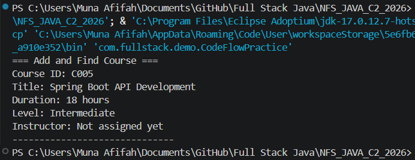
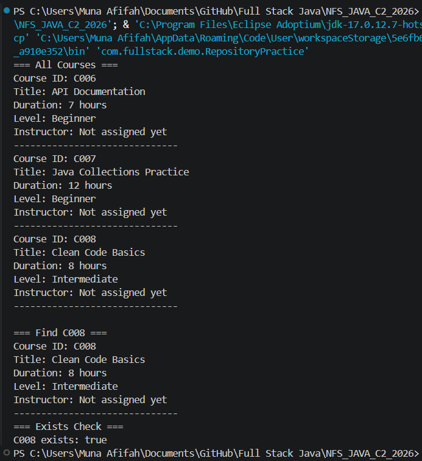
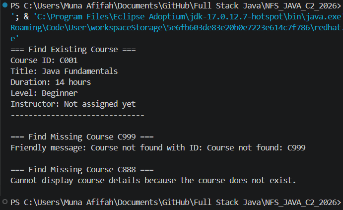
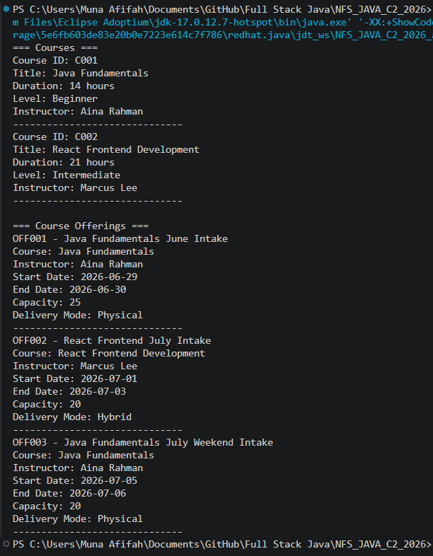

# NFS_JAVA_C2_2026 | Full-Stack Development with Java, React & MongoDB

## Programme Description

This 20-day programme is designed to help participants build a complete full-stack web application using Java, Spring Boot, React, and MongoDB.

The programme takes learners from programming and web fundamentals to backend API development, frontend interface design, database modelling, authentication, testing, performance improvement, and final capstone presentation.

Throughout the programme, participants will work on practical exercises and gradually build a small but production-like web application. The final outcome is a working capstone project that demonstrates the use of a React frontend, Spring Boot backend, MongoDB database, secure authentication, API documentation, testing practices, and deployment-readiness basics.

AI tools such as Gemini are used as learning accelerators to help scaffold examples, suggest refactoring ideas, draft tests, generate sample data, and support MongoDB query or aggregation design. However, participants are expected to review, verify, understand, and take ownership of all generated code.

---

## Programme Duration

* Duration: 20 training days

* Daily Duration: 7 hours per day

* Total Training Hours: 140 hours

* Mode: Instructor-led training with guided labs, team build activities, review sessions, quizzes, and capstone development

---

## Programme Objectives

By the end of this programme, participants will be able to:

* Understand web fundamentals, HTTP, REST, and JSON.

* Write basic to intermediate Java and JavaScript code.

* Build REST APIs using Spring Boot.

* Apply validation, authentication, authorisation, and error-handling practices.

* Model data effectively using MongoDB.

* Use MongoDB indexes, queries, pagination, and aggregation pipelines.

* Build accessible React user interfaces with routing, forms, state, and data fetching.

* Apply testing practices for backend and frontend development.

* Use AI coding assistants responsibly for learning, refactoring, testing, and documentation.

* Design, build, document, and present a full-stack capstone project.

---

---

## Day 3 Assignment 01 - Build and Trace the Code Flow

### What Was Added

**CodeFlowPractice.java** *(new file)*
- Created new demo class in `com.fullstack.demo` package
- Created `InMemoryCourseRepository` and `CourseService` instances
- Added course `C005` (Spring Boot API Development) via `courseService.createCourse()`
- Retrieved course `C005` via `courseService.getCourseById()`
- Printed result using `course.printSummary()`
- Added trace comments explaining the full call flow from demo → service → repository → map → back to demo

### README Reflection - Assignment 01

**When getCourseById("C004") is called, which file does the request go to first, second, and third?**

1. **First → `CourseService.java`** — the demo class calls `courseService.getCourseById("C004")`, so the request enters the service layer first.
2. **Second → `CourseRepository.java`** — `CourseService` calls `courseRepository.findById("C004")` through the interface.
3. **Third → `InMemoryCourseRepository.java`** — the actual implementation runs, looks up the `LinkedHashMap`, and returns an `Optional<Course>` back up the chain.

### Output Screenshot

### GitHub Commit

[https://github.com/Munaafifah/NFS_JAVA_C2_2026/tree/day3](https://github.com/Munaafifah/NFS_JAVA_C2_2026/tree/day3)

---

## Day 3 Assignment 02 - Interface and Repository Storage Practice

### What Was Added

**RepositoryPractice.java** *(new file)*
- Created `CourseRepository` variable pointing to `InMemoryCourseRepository` instance
- Saved three courses (C006, C007, C008) directly through the repository
- Printed all courses using `findAll()` in a for loop
- Found C007 using `findById()` with `Optional<Course>`
- Checked C008 exists using `existsById()`

### README Reflection - Assignment 02

**Why is InMemoryCourseRepository temporary storage?**
Because it stores data inside a `LinkedHashMap` which lives in the program's memory. When the program stops, all data is lost. Nothing is saved to disk or a real database.

**What would probably replace it later when we use MongoDB?**
A new class like `MongoCourseRepository` that also implements `CourseRepository`. It would use MongoDB to store data permanently. Because the rest of the code only depends on the `CourseRepository` interface, nothing else needs to change.

### Output Screenshot

### GitHub Commit

[https://github.com/Munaafifah/NFS_JAVA_C2_2026/tree/day2](https://github.com/Munaafifah/NFS_JAVA_C2_2026/tree/day2)

---

## Day 3 Assignment 03 - Exception Practice with CourseService

### What Was Added

**ExceptionPractice.java** *(new file)*
- Created `CourseRepository` and `CourseService` instances
- Added two courses (C001, C002) via `courseService.createCourse()`
- Retrieved and printed C001 successfully using `getCourseById()`
- Handled missing course C999 using `try/catch` with `CourseNotFoundException`
- Handled missing course C888 using `try/catch` with a custom friendly message
- Program does not crash when a course is not found

### README Reflection

**Why is throwing CourseNotFoundException better than printing inside CourseService?**
Because different callers handle errors differently. A console app prints a friendly message, a web API returns a 404 JSON response, and a frontend app may show a popup. If `CourseService` printed the error itself, it would be locked to one behaviour. By throwing the exception instead, the caller decides how to display or handle it.

### Output Screenshot

### GitHub Commit

[https://github.com/Munaafifah/NFS_JAVA_C2_2026/tree/day3](https://github.com/Munaafifah/NFS_JAVA_C2_2026/tree/day3)

---

## Day 3 Assignment 04 - Object Relationships and Composition

### What Was Added

**Day3_Assignment04_ObjectRelationshipPractice.java** *(new file)*
- Created two `Instructor` objects (Aina Rahman, Marcus Lee)
- Created two `Course` objects (C001, C002)
- Assigned instructors to courses using `course.setInstructor()`
- Created two `CourseOffering` objects (OFF001, OFF002) using composition
- Created a third offering (OFF003) reusing the same `javaCourse` with different dates
- Added comments explaining composition — CourseOffering HAS a Course and HAS an Instructor

### README Reflection

**Why is CourseOffering a better design than putting start date, end date, and capacity directly inside Course?**
Because the same course can run multiple times with different dates, instructors, and capacities. If we put those fields inside `Course`, we could only run it once. `CourseOffering` separates the course content from the scheduling details.

### Output Screenshot

### GitHub Commit

[https://github.com/Munaafifah/NFS_JAVA_C2_2026/tree/day3](https://github.com/Munaafifah/NFS_JAVA_C2_2026/tree/day3)

---

