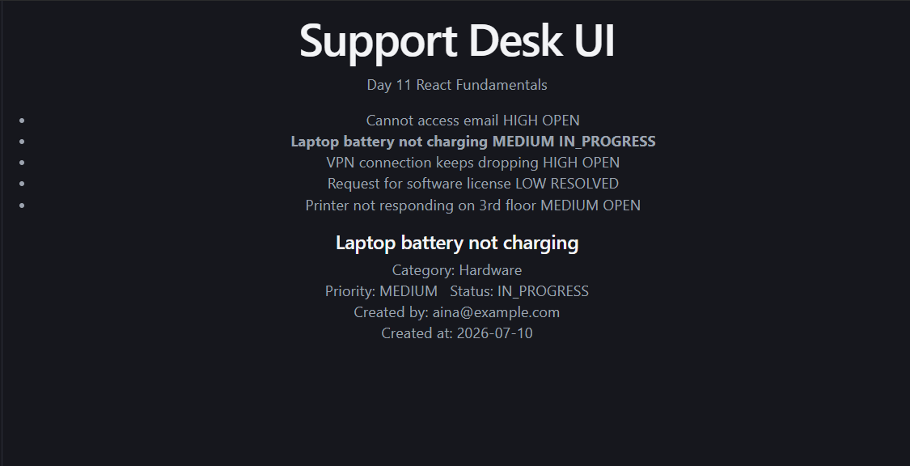
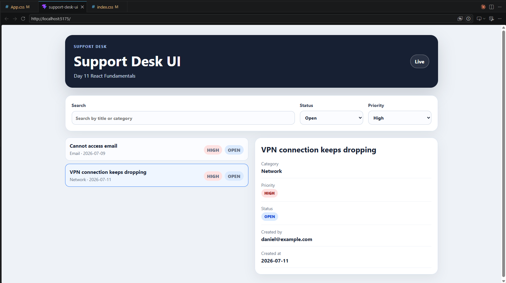
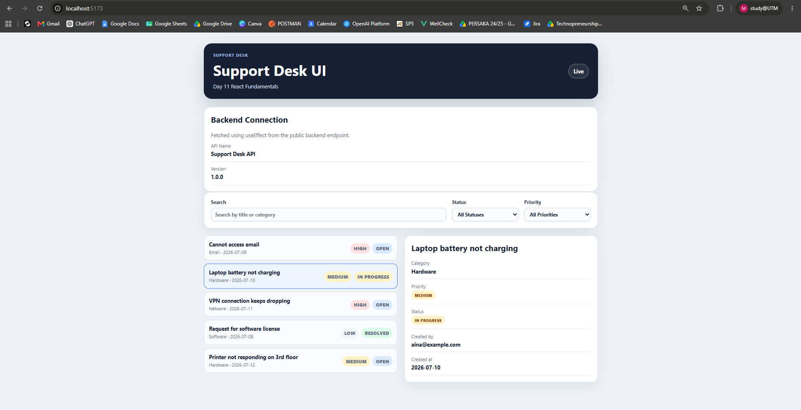
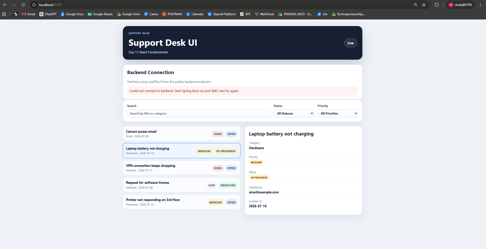

---

## Day 11 Exercise 01 - Create the React Project

### What Was Added
- Created a new Vite React project named `support-desk-ui` inside the `frontend/` folder
- Installed dependencies with `npm install`
- Ran the dev server with `npm run dev` and confirmed the default Vite React page loaded at `http://localhost:5173`
- Replaced the default `App.jsx` content with a minimal component rendering `Support Desk UI`

```jsx
export default function App() {
  return <h1>Support Desk UI</h1>;
}
```

### Output Screenshot


### GitHub Commit
[https://github.com/Munaafifah/NFS_JAVA_C2_2026/tree/day11](https://github.com/Munaafifah/NFS_JAVA_C2_2026/tree/day11)

---

## Day 11 Exercise 02 - Build Layout Components

### What Was Added
- Created `src/components/AppHeader.jsx` rendering the title "Support Desk UI" and subtitle "Day 11 React Fundamentals"
- Created `src/components/Layout.jsx` that wraps page content and renders `AppHeader` plus any `children` passed to it
- Updated `App.jsx` to use `Layout`, passing in a placeholder `<p>Ticket dashboard goes here</p>`

**Component tree:**
```text
App
└── Layout
    └── AppHeader
```

### Output Screenshot


### GitHub Commit
[https://github.com/Munaafifah/NFS_JAVA_C2_2026/tree/day11](https://github.com/Munaafifah/NFS_JAVA_C2_2026/tree/day11)

---

## Day 11 Exercise 03 - Ticket Sample Data, List and Detail

### What Was Added
- Created `src/data/sampleTickets.js` with 5 sample tickets (id, title, category, priority, status, createdBy, createdAt)
- Created `src/components/PriorityBadge.jsx` and `src/components/StatusBadge.jsx` to render priority/status as badges
- Created `src/components/TicketList.jsx` to display all tickets and handle selection via click
- Created `src/components/TicketDetail.jsx` to show the currently selected ticket's details, with a fallback message when nothing is selected
- Updated `App.jsx` to hold `selectedId` state with `useState`, find the matching ticket, and pass data/handlers down to `TicketList` and `TicketDetail`

### Output Screenshot


### GitHub Commit
[https://github.com/Munaafifah/NFS_JAVA_C2_2026/tree/day11](https://github.com/Munaafifah/NFS_JAVA_C2_2026/tree/day11)

---

## Day 11 Exercise 04 - State, Search and Filter

### What Was Added
- Created `src/components/TicketFilterPanel.jsx` with a search input and dropdowns for status and priority, all as controlled inputs
- Updated `App.jsx` to hold `searchText`, `statusFilter`, and `priorityFilter` state with `useState`
- Added filtering logic that derives `filteredTickets` from `sampleTickets` on every render, matching search text against title/category and applying status/priority filters
- Updated `TicketList` and `TicketDetail` to use the filtered results instead of the full ticket list
- Fixed a styling conflict in `index.css` where leftover Vite default root styles (`color-scheme: light dark`, root text/background colors) were overriding `App.css` and causing washed-out text on dropdowns and ticket titles

### Output Screenshot


### GitHub Commit
[https://github.com/Munaafifah/NFS_JAVA_C2_2026/tree/day11](https://github.com/Munaafifah/NFS_JAVA_C2_2026/tree/day11)

---

## Day 11 Exercise 05 - useEffect, Loading and Error UI

### What Was Added
- Updated `vite.config.js` to proxy `/api` requests to the backend at `http://localhost:8081`
- Created `src/services/api.js` with a `fetchApiInfo()` function that calls `/api/v1/info` and throws on a failed response
- Created `src/components/ApiInfoCard.jsx` using `useEffect` and `useState` to manage loading, error, and success states when fetching backend data
- Added `.message`, `.loading-message`, and `.error-message` styles to `App.css` for the connection status states
- Updated `App.jsx` to render `ApiInfoCard` above the ticket filter panel
- On the backend, added missing `app.jwt.secret` and `app.jwt.expiration-minutes` properties to `application.properties`, and permitted `/api/v1/info` in `SecurityConfig`
- Created `InfoController.java` on the backend to serve API name/version at `GET /api/v1/info`, resolving a 401 caused by the endpoint not existing yet

### Output Screenshot



### GitHub Commit
[https://github.com/Munaafifah/NFS_JAVA_C2_2026/tree/day11](https://github.com/Munaafifah/NFS_JAVA_C2_2026/tree/day11)

---


## Day 11 Exercise 06 - Component Tree and Reflection

### What Was Added
- Documented the final Support Desk UI component tree based on components built across Exercises 01-05
- Answered reflection questions on state ownership, props, `useEffect` usage, and loading/error handling

**Component tree:**
```text
App
├── Layout
│   └── AppHeader
├── ApiInfoCard
├── TicketFilterPanel
└── (workspace grid)
    ├── TicketList
    │   ├── PriorityBadge
    │   └── StatusBadge
    └── TicketDetail
        ├── PriorityBadge
        └── StatusBadge
```

### README Reflection

1. **Which component owns the selected ticket state?**
   `App` — it holds `selectedId` via `useState` and passes `selectedId`/`onSelect` down to `TicketList`, and the derived `selectedTicket` down to `TicketDetail`.

2. **Which components receive props?**
   `Layout` (`children`), `TicketFilterPanel` (search/filter values and change handlers), `TicketList` (`tickets`, `selectedId`, `onSelect`), `TicketDetail` (`ticket`), and `PriorityBadge`/`StatusBadge` (`priority`/`status`).

3. **What does `useEffect` do in your app?**
   In `ApiInfoCard`, `useEffect` runs once on mount to call `fetchApiInfo()` and update state (`apiInfo`, `loading`, `error`) based on the result, connecting the component to the backend outside of the render cycle.

4. **What loading state did you create?**
   A `loading` boolean in `ApiInfoCard`, shown as a blue "Loading API info..." message while the fetch is in progress.

5. **What error state did you create?**
   An `error` string in `ApiInfoCard`, shown as a red "Could not connect to backend" message when the fetch fails (e.g., backend stopped or unauthorized).

6. **What would change when you connect this UI to the protected backend API later?**
   Ticket data would come from `TicketV1Controller` endpoints instead of `sampleTickets.js`, requests would need an `Authorization` header with a JWT (since routes like `/api/v1/tickets/**` require `USER`/`ADMIN` roles), and the UI would need a login flow plus loading/error handling around each ticket-related fetch, not just the info endpoint.

### GitHub Commit
[https://github.com/Munaafifah/NFS_JAVA_C2_2026/tree/day11](https://github.com/Munaafifah/NFS_JAVA_C2_2026/tree/day11)

---