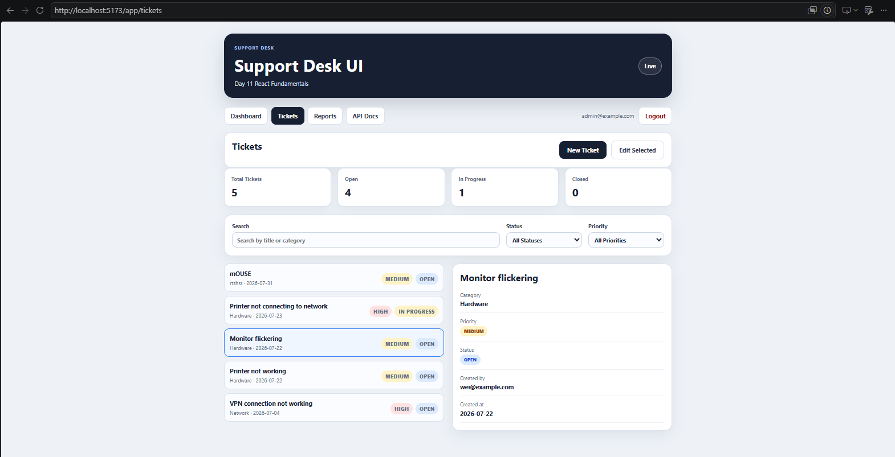

---

## Day 14 Exercise 01 - Create API Client Layer

### What Was Added
- Created `src/services/httpClient.js` with a reusable `apiRequest(path, options)` function that centralizes request method, JWT `Authorization` header, JSON request body serialization, JSON response parsing (checked against the response's content-type), and backend error message extraction from `ApiErrorResponse`
- Added a `buildQueryString(params)` helper for constructing query strings from an object, skipping undefined/null/empty values
- Rewrote every function in `src/services/api.js` (`fetchApiInfo`, `fetchApiDocs`, `fetchTickets`, `fetchTicketById`, `createTicket`, `updateTicket`, `fetchTicketReports`) to call `apiRequest` instead of repeating `fetch`, header, and `.json()` logic individually
- Verified no behavior changed by re-testing the full flow: login, viewing tickets, creating a ticket, editing a ticket, viewing reports, and viewing API docs

### GitHub Commit
[https://github.com/Munaafifah/NFS_JAVA_C2_2026/tree/day14](https://github.com/Munaafifah/NFS_JAVA_C2_2026/tree/day14)

---

## Day 14 Exercise 02 - Ticket Data Context And Reducer

### What Was Added
- Added `fetchPagedTickets(token, params)` to `src/services/api.js`, calling the existing `GET /api/tickets/paged` endpoint via `apiRequest` and `buildQueryString`
- Created `src/context/TicketDataContext.jsx` using `useReducer` to manage tickets, selected ticket id, loading state, error state, page information, and filters (search text, status, priority)
- Implemented the required actions `LOAD_START`, `LOAD_SUCCESS`, `LOAD_ERROR`, `SET_SEARCH_TEXT`, `SET_STATUS_FILTER`, `SELECT_TICKET`, plus an additional `SET_PRIORITY_FILTER` action to preserve the existing priority filter already in use
- Wrapped the protected `/app` route with `TicketDataProvider` in `App.jsx`
- Rewrote `TicketsPage.jsx` to source all data and actions from `useTicketData()` instead of local component state
- Verified the ticket list, summary cards, search/status/priority filters, and list-to-detail selection all continue to work correctly, now driven entirely through the shared reducer context

### Output Screenshot

### GitHub Commit
[https://github.com/Munaafifah/NFS_JAVA_C2_2026/tree/day14](https://github.com/Munaafifah/NFS_JAVA_C2_2026/tree/day14)

---