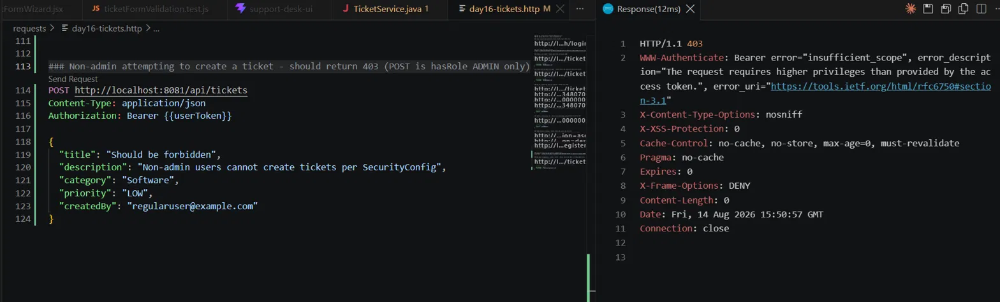

---

## Day 16 Exercise 0 - Prompt Engineering Warm-Up

### What Was Added

**Poor prompt:**

```text
Fix my TicketService, it's messy.
```

**Better prompt:**

```text
Context:
I am working on the Support Desk Ticket project. The backend is a Spring
Boot API with a TicketService class that handles creating and updating
tickets. The create and update methods currently repeat similar validation
and status-normalization logic.

Task:
Refactor TicketService to extract the repeated logic into private helper
methods, without changing what the service does from the outside.

Constraints:
- Do not change public method names (createTicket, updateTicket, etc.).
- Do not change the TicketController endpoint URLs.
- Do not change TicketResponse or TicketRequest DTO fields.
- Do not change exception types or messages thrown on invalid input.
- Do not change existing status or priority values.
- Keep the code readable for a beginner Java developer.

Expected output:
1. The refactored TicketService.java file
2. A short explanation of each new helper method and why it exists
3. A list of exactly what stayed the same

Tests:
What HTTP requests (create, update, invalid input) should I run afterward
to confirm behaviour is unchanged?

Review:
What could this refactor accidentally break? List the risks before I apply it.
```

**Why the second prompt is safer:** the poor prompt gives no context,
constraints, or expected output, so an AI assistant could rename methods,
change the API shape, or restructure things in ways that break the frontend
with no way to catch it. The better prompt fixes this with explicit
Constraints (protecting endpoints, DTOs, and exceptions from being touched)
and by asking for Tests and Review, so the response includes a verification
plan alongside the code instead of just a diff to trust blindly.


### GitHub Commit
[https://github.com/Munaafifah/NFS_JAVA_C2_2026/tree/day16](https://github.com/Munaafifah/NFS_JAVA_C2_2026/tree/day16)

---

## Day 16 Exercise 1 - AI Refactor Safety Checklist

### What Was Added

- [ ] Safe to share: `TicketService.java`, `TicketController.java`, DTOs, `Ticket` model
- [ ] Safe to share: `TicketFormWizard.jsx`
- [ ] Not safe to share: `application.properties`, `UserDataSeeder.java`
- [ ] Not safe to share: `.http` files with a real token still pasted in
- [ ] Remove before pasting: `app.jwt.secret` value
- [ ] Remove before pasting: MongoDB username/password, any Bearer token
- [ ] Must not change: endpoint URLs, HTTP methods, DTO field names
- [ ] Must not change: exception types and messages, default `"OPEN"` status
- [ ] Must not change: ticket form field names, CSS classes, payload shape
- [ ] Proof it's safe: `.http` regression file + Vitest tests pass


### GitHub Commit
[https://github.com/Munaafifah/NFS_JAVA_C2_2026/tree/day16](https://github.com/Munaafifah/NFS_JAVA_C2_2026/tree/day16)

---

## Day 16 Exercise 2 - Backend Ticket Service Refactor

### What Was Added
- Refactored `TicketService.java` using the Generate → Explain → Test → Review pattern, extracting repeated logic into private helper methods
- Extracted the lookup pattern, duplicate-title check, filter selection, and sort-direction resolution into named helpers
- Kept all public method signatures, endpoint URLs, exception types/messages, and the default `"OPEN"` status unchanged
- Created `requests/day16-tickets.http` to verify create, duplicate-title (409), get-by-id (200/404), update (200/404), and paged sorting (asc/desc)
- Ran the regression checks and confirmed no behaviour changed

| Before | After |
|---|---|
| `findById().orElseThrow()` repeated in `getTicketById` and `updateTicket` | Extracted to `findTicketOrThrow(id)` |
| Duplicate-title check inline in `createTicket` | Extracted to `ensureTitleIsUniqueForCreate(title)` |
| If/else chain for status/priority/category inline in `getAllTickets` | Extracted to `fetchByFirstMatchingFilter(...)` |
| Ternary for sort direction inline in `getPagedTickets` | Extracted to `resolveSortDirection(direction)` |
| `"OPEN"` magic string in `createTicket` | Named constant `DEFAULT_STATUS_ON_CREATE` |

### Output Screenshot


### GitHub Commit
[https://github.com/Munaafifah/NFS_JAVA_C2_2026/tree/day16](https://github.com/Munaafifah/NFS_JAVA_C2_2026/tree/day16)

---

## Day 16 Exercise 3 - Extract Ticket Form Validation

### What Was Added
- Created `src/utils/ticketFormValidation.js` containing `validateTicketForm(formValues)` and `normalizeTicketFormPayload(formValues)`, extracted from the inline validation logic in `TicketFormWizard.jsx`
- Updated `TicketFormWizard.jsx` to import validation from the new utility instead of handling it inline, with no change to UI, CSS classes, field names, or submit payload shape
- Created `src/utils/ticketFormValidation.test.js` with unit tests for a valid form, a missing required field, and an invalid priority value
- Verified manually on localhost: blank-field submission shows the same inline error messages, a valid new ticket saves and appears in the list, and editing an existing ticket updates correctly
- Ran `npm run test` — all 22 tests pass across 6 test files, including the pre-existing `TicketFormWizard.test.jsx` (3/3) and the new `ticketFormValidation.test.js` (3/3)

### Output Screenshot


### GitHub Commit
[https://github.com/Munaafifah/NFS_JAVA_C2_2026/tree/day16](https://github.com/Munaafifah/NFS_JAVA_C2_2026/tree/day16)

---

## Day 16 Exercise 4 - Generate Then Harden Tests

### What Was Added
- Asked an AI assistant to draft tests for `ticketFormValidation.js` first, producing a weak 3-test draft with vague names and one assertion that would pass even on broken code
- Manually hardened the suite in `ticketFormValidation.test.js`, growing it from 3 to 11 tests
- Added a short comment at the top of the file explaining what was improved from the draft
- Ran `npm run test` — all 30 tests pass across 6 test files, including the pre-existing `TicketFormWizard.test.jsx` (3/3), confirming the hardened suite didn't break anything downstream

| AI draft | Hardened version |
|---|---|
| Vague test names (`'works'`, `'bad priority'`) | Descriptive names stating the exact behaviour checked |
| `expect(errors).toBeTruthy()` — passes even on `{}` (empty object is truthy) | Exact message checks, e.g. `errors.priority` toBe `'Choose a valid priority.'` |
| Only 1 field checked in normalization test | All 3 trimmable fields checked, plus priority/status confirmed unchanged |
| No combined-error case | Added a test confirming all 5 fields flag together, not just the first |
| No enum coverage | Loops over `PRIORITY_OPTIONS` / `STATUS_OPTIONS` to confirm every valid value passes |


### GitHub Commit
[https://github.com/Munaafifah/NFS_JAVA_C2_2026/tree/day16](https://github.com/Munaafifah/NFS_JAVA_C2_2026/tree/day16)

---

## Day 16 Exercise 6 - AI-Assisted Coding Reflection

### What Was Added

1. **What did the AI assistant help you do faster?** Spotting the exact
   repeated patterns worth extracting (the `findById().orElseThrow()` lookup,
   the inline duplicate-title check) and drafting a full test suite skeleton
   in seconds instead of writing each `it()` block by hand.
2. **What AI suggestion did you reject or change?** The exercise brief's
   suggested `validateTicketFormStep(formValues, stepToValidate,
   reviewConfirmed)` signature — it assumed a multi-step wizard, but the
   actual `TicketFormWizard` is a single-page form, so I used
   `validateTicketForm(formValues)` instead.
3. **Why shouldn't developers accept generated code blindly?** It can't see
   your controller, your existing tests, or your actual UI — a first draft
   test suite even included `expect(errors).toBeTruthy()`, which silently
   passes even when validation is broken (an empty object is truthy).
4. **What private information should never be pasted into AI tools?** JWT
   secrets and real login tokens — like the one already pasted into
   `day13-tickets.http`, which is exactly what Exercise 1's checklist flags.
5. **What tests proved the refactor preserved behaviour?**
   `requests/day16-tickets.http` (create, duplicate-title 409, get/update
   valid and invalid ids, paged sort both directions) and `npm run test`,
   30/30 passing including the pre-existing `TicketFormWizard.test.jsx`.
6. **What part of AI-assisted refactoring still feels unclear?** How much
   extraction is "too much" before a refactor stops being small and starts
   becoming a redesign — for example, whether `fetchByFirstMatchingFilter`
   should have stayed inline since it's only used in one place, versus
   `findTicketOrThrow`, which was clearly justified because it removed
   real duplication across two methods.

### GitHub Commit
[https://github.com/Munaafifah/NFS_JAVA_C2_2026/tree/day16](https://github.com/Munaafifah/NFS_JAVA_C2_2026/tree/day16)

---

## Day 16 Exercise 7 - AI Regression Check

### What Was Added
- Created a regression checklist covering all 10 required areas for the TicketService/TicketFormWizard refactor
- Used the suggested AI review prompt to identify a regression risk before assuming the refactor was safe
- Verified 403 handling specifically for this exercise: registered a throwaway non-admin user, confirmed `POST /api/tickets` returns `403 insufficient_scope` when attempted with a `USER`-role token, matching the `hasRole("ADMIN")` rule in `SecurityConfig`

**Regression checklist:**
- [/] Login — returns a valid token
- [/] Protected ticket list — loads with a token
- [/] Create ticket form — submits and appears in the list
- [/] Edit ticket form — loads and saves updates
- [/] API request headers — `Authorization: Bearer` still accepted
- [/] Validation rules — inline error messages unchanged
- [/] 401 handling — request without a token rejected
- [/] 403 handling — non-admin token rejected on `POST /api/tickets` with `403 insufficient_scope`
- [/] Unit tests — 30/30 passing
- [/] Manual smoke test — create/edit/validation walked through live on localhost

**Risk AI identified:** switching `validate()` from an internal component method to an imported pure function could break `TicketFormWizard.test.jsx` if that test mocked the old method directly instead of testing observable behaviour.

**Test used to confirm behaviour:** re-ran `npm run test` after the change — `TicketFormWizard.test.jsx` still passed 3/3, confirming its tests check behaviour, not implementation.

### Output Screenshot


### GitHub Commit
[https://github.com/Munaafifah/NFS_JAVA_C2_2026/tree/day16](https://github.com/Munaafifah/NFS_JAVA_C2_2026/tree/day16)

---