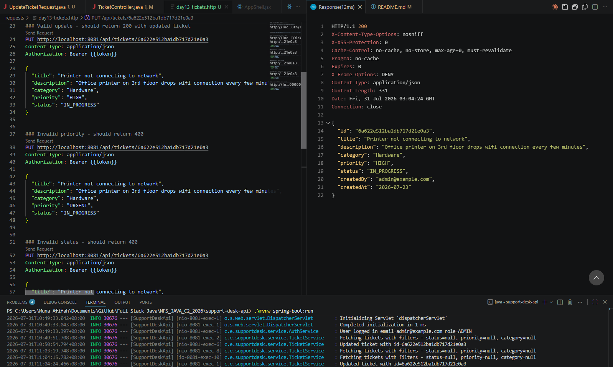

---

## Day 13 Exercise 01 - Backend Update Ticket Endpoint

### What Was Added
- Created `UpdateTicketRequest` DTO with validation on title, description, category, priority (`LOW`, `MEDIUM`, `HIGH`), and status (`OPEN`, `IN_PROGRESS`, `CLOSED`)
- Added `updateTicket(String id, UpdateTicketRequest request)` to `TicketService`, which looks up the ticket, updates its fields, and preserves the original `createdBy`/`createdAt`
- Added `PUT /api/tickets/{id}` endpoint to `TicketController`, secured behind existing JWT authentication
- Verified with a `.http` file covering a valid update, invalid priority, invalid status, missing required field, and a non-existent ticket id

### Output Screenshot

### GitHub Commit
[https://github.com/Munaafifah/NFS_JAVA_C2_2026/tree/day13](https://github.com/Munaafifah/NFS_JAVA_C2_2026/tree/day13)

---