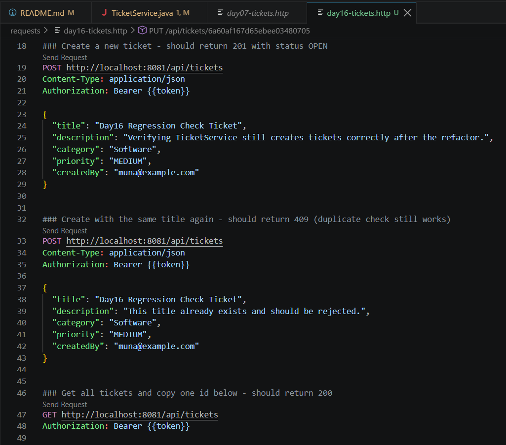
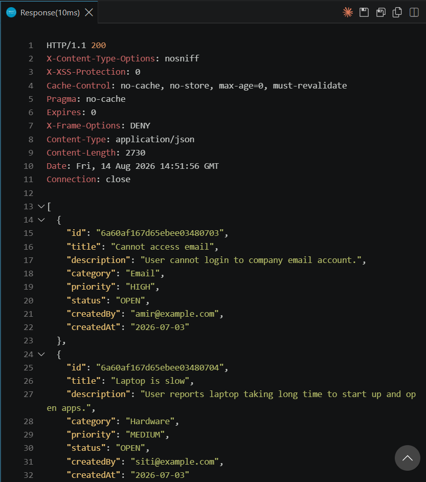
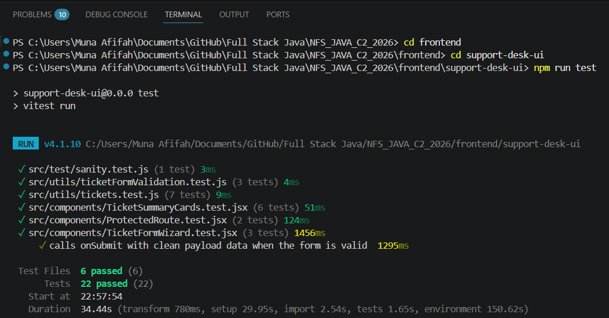

---

## Day 16 Exercise 0 - Prompt Engineering Warm-Up

### What Was Added

**Poor prompt:**

```text
Fix my TicketService, it's messy.
```

**Better prompt:**

```text
Context:
I am working on the Support Desk Ticket project. The backend is a Spring
Boot API with a TicketService class that handles creating and updating
tickets. The create and update methods currently repeat similar validation
and status-normalization logic.

Task:
Refactor TicketService to extract the repeated logic into private helper
methods, without changing what the service does from the outside.

Constraints:
- Do not change public method names (createTicket, updateTicket, etc.).
- Do not change the TicketController endpoint URLs.
- Do not change TicketResponse or TicketRequest DTO fields.
- Do not change exception types or messages thrown on invalid input.
- Do not change existing status or priority values.
- Keep the code readable for a beginner Java developer.

Expected output:
1. The refactored TicketService.java file
2. A short explanation of each new helper method and why it exists
3. A list of exactly what stayed the same

Tests:
What HTTP requests (create, update, invalid input) should I run afterward
to confirm behaviour is unchanged?

Review:
What could this refactor accidentally break? List the risks before I apply it.
```

**Why the second prompt is safer:** the poor prompt gives no context,
constraints, or expected output, so an AI assistant could rename methods,
change the API shape, or restructure things in ways that break the frontend
with no way to catch it. The better prompt fixes this with explicit
Constraints (protecting endpoints, DTOs, and exceptions from being touched)
and by asking for Tests and Review, so the response includes a verification
plan alongside the code instead of just a diff to trust blindly.


### GitHub Commit
[https://github.com/Munaafifah/NFS_JAVA_C2_2026/tree/day16](https://github.com/Munaafifah/NFS_JAVA_C2_2026/tree/day16)

---

## Day 16 Exercise 1 - AI Refactor Safety Checklist

### What Was Added

- [ ] Safe to share: `TicketService.java`, `TicketController.java`, DTOs, `Ticket` model
- [ ] Safe to share: `TicketFormWizard.jsx`
- [ ] Not safe to share: `application.properties`, `UserDataSeeder.java`
- [ ] Not safe to share: `.http` files with a real token still pasted in
- [ ] Remove before pasting: `app.jwt.secret` value
- [ ] Remove before pasting: MongoDB username/password, any Bearer token
- [ ] Must not change: endpoint URLs, HTTP methods, DTO field names
- [ ] Must not change: exception types and messages, default `"OPEN"` status
- [ ] Must not change: ticket form field names, CSS classes, payload shape
- [ ] Proof it's safe: `.http` regression file + Vitest tests pass


### GitHub Commit
[https://github.com/Munaafifah/NFS_JAVA_C2_2026/tree/day16](https://github.com/Munaafifah/NFS_JAVA_C2_2026/tree/day16)

---

## Day 16 Exercise 2 - Backend Ticket Service Refactor

### What Was Added
- Refactored `TicketService.java` using the Generate → Explain → Test → Review pattern, extracting repeated logic into private helper methods
- Extracted the lookup pattern, duplicate-title check, filter selection, and sort-direction resolution into named helpers
- Kept all public method signatures, endpoint URLs, exception types/messages, and the default `"OPEN"` status unchanged
- Created `requests/day16-tickets.http` to verify create, duplicate-title (409), get-by-id (200/404), update (200/404), and paged sorting (asc/desc)
- Ran the regression checks and confirmed no behaviour changed

| Before | After |
|---|---|
| `findById().orElseThrow()` repeated in `getTicketById` and `updateTicket` | Extracted to `findTicketOrThrow(id)` |
| Duplicate-title check inline in `createTicket` | Extracted to `ensureTitleIsUniqueForCreate(title)` |
| If/else chain for status/priority/category inline in `getAllTickets` | Extracted to `fetchByFirstMatchingFilter(...)` |
| Ternary for sort direction inline in `getPagedTickets` | Extracted to `resolveSortDirection(direction)` |
| `"OPEN"` magic string in `createTicket` | Named constant `DEFAULT_STATUS_ON_CREATE` |

### Output Screenshot



### GitHub Commit
[https://github.com/Munaafifah/NFS_JAVA_C2_2026/tree/day16](https://github.com/Munaafifah/NFS_JAVA_C2_2026/tree/day16)

---

## Day 16 Exercise 3 - Extract Ticket Form Validation

### What Was Added
- Created `src/utils/ticketFormValidation.js` containing `validateTicketForm(formValues)` and `normalizeTicketFormPayload(formValues)`, extracted from the inline validation logic in `TicketFormWizard.jsx`
- Updated `TicketFormWizard.jsx` to import validation from the new utility instead of handling it inline, with no change to UI, CSS classes, field names, or submit payload shape
- Created `src/utils/ticketFormValidation.test.js` with unit tests for a valid form, a missing required field, and an invalid priority value
- Verified manually on localhost: blank-field submission shows the same inline error messages, a valid new ticket saves and appears in the list, and editing an existing ticket updates correctly
- Ran `npm run test` — all 22 tests pass across 6 test files, including the pre-existing `TicketFormWizard.test.jsx` (3/3) and the new `ticketFormValidation.test.js` (3/3)

### Output Screenshot


### GitHub Commit
[https://github.com/Munaafifah/NFS_JAVA_C2_2026/tree/day16](https://github.com/Munaafifah/NFS_JAVA_C2_2026/tree/day16)

---