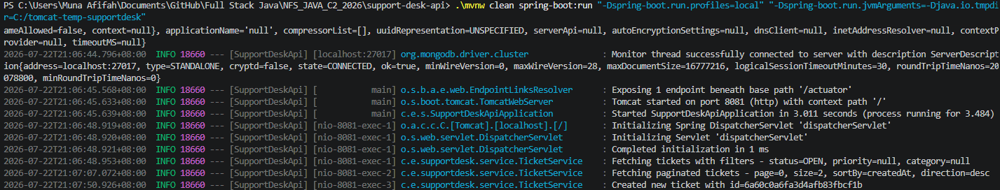
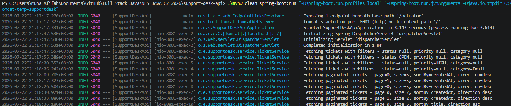
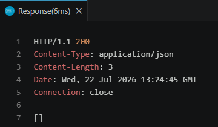
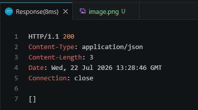
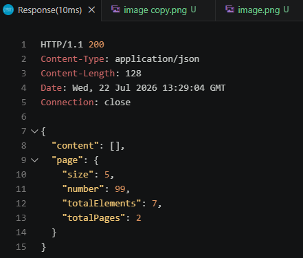
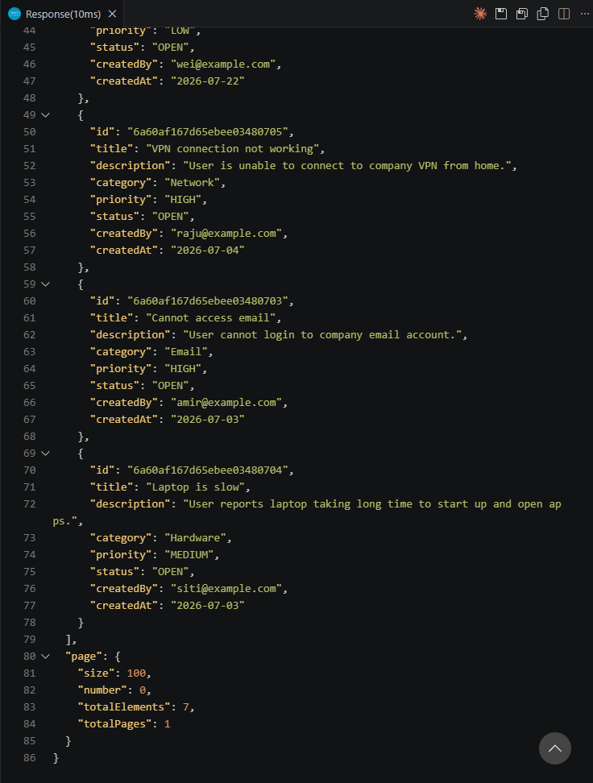
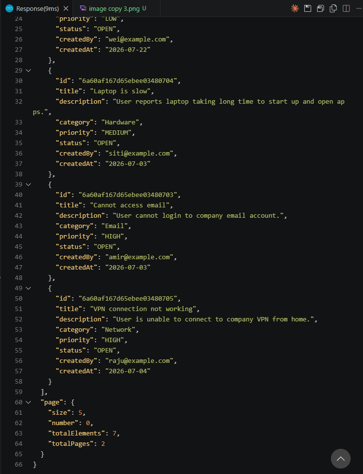
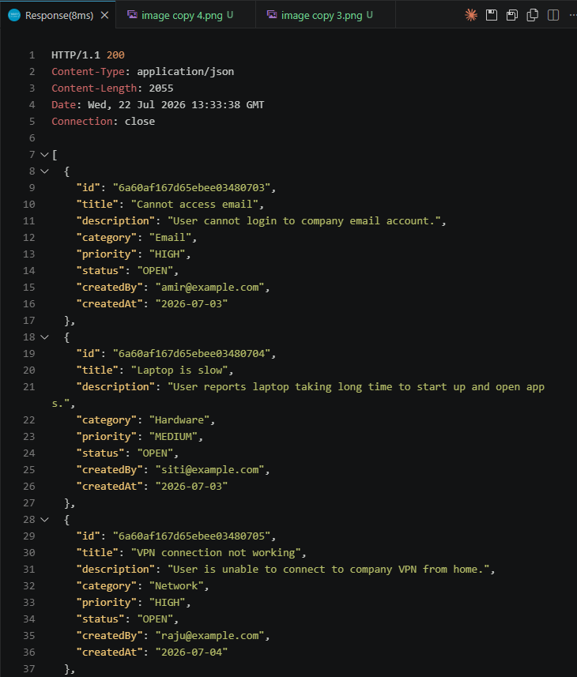

## Day 8 Exercise 3 - Add Ticket Indexes and Logging

### What Was Added
**Ticket.java** *(updated)*
- Added `@Indexed` to `category`, `priority`, `status`, `createdBy`, and `createdAt` — these are the fields most commonly used for filtering and sorting
- `title`, `description`, and `id` left unindexed since they aren't used for filtering

**application-local.properties** *(already present)*
- `spring.data.mongodb.auto-index-creation=true` was already configured from Exercise 1/2 setup

**TicketService.java** *(updated)*
- Added an SLF4J `Logger`
- `getAllTickets()` logs the incoming filter values (`status`, `priority`, `category`)
- `getPagedTickets()` logs the pagination parameters (`page`, `size`, `sortBy`, `direction`)
- `createTicket()` logs the newly created ticket's ID after saving
- No passwords, tokens, or sensitive data included in any log line

---
### Output Screenshot

### GitHub Commit
[https://github.com/Munaafifah/NFS_JAVA_C2_2026/tree/day8](https://github.com/Munaafifah/NFS_JAVA_C2_2026/tree/day8)

---

## Day 8 Exercise 4 - Query Test File and Notes

### What Was Added
**day08-tickets.http** *(updated)*
- Added all 7 required requests: get all tickets, filter by status/priority/category, and three paginated requests (page 0 size 5, page 1 size 5, page 0 size 5 sorted by createdAt descending)
- Also includes extra pagination requests (size 2, sorted by title ascending) for additional coverage

---
### Notes

**1. Which query parameters did you implement?**
`status`, `priority`, and `category` for filtering on `GET /api/tickets`; and `page`, `size`, `sortBy`, `direction` for pagination and sorting on `GET /api/tickets/paged`.

**2. Which fields did you index?**
`category`, `priority`, `status`, `createdBy`, and `createdAt` — the fields most commonly used for filtering and sorting.

**3. Why should an API use pagination?**
Returning all records at once doesn't scale as data grows — it slows down responses and wastes bandwidth. Pagination lets clients request small, manageable chunks of data at a time, which keeps the API fast and responsive even with large datasets.

**4. What log messages appear when you call the filtering endpoint?**
`Fetching tickets with filters - status=..., priority=..., category=...`, showing exactly which filter values were passed in the request.

**5. What endpoint proves your sorting works?**
`GET /api/tickets/paged?page=0&size=5&sortBy=createdAt&direction=desc` — comparing the response order against the same request with `direction=asc` (or `sortBy=title`) shows the tickets returned in a different order, confirming sorting is applied.

---
### Output Screenshot

### GitHub Commit
[https://github.com/Munaafifah/NFS_JAVA_C2_2026/tree/day8](https://github.com/Munaafifah/NFS_JAVA_C2_2026/tree/day8)

---

## Day 8 Exercise 5 - Query Behaviour and Troubleshooting

### What Was Added
**day08-tickets.http** *(updated)*
- Added 6 unusual/edge-case query requests: invalid status, invalid priority, page with no records, very large page size, unknown sort field, and combined filters

---
### Test Results

**Test 1: Invalid status value**
Returned 200 OK with an empty array. No error was thrown.

**Test 2: Invalid priority value**
Same as Test 1. Returned 200 OK with an empty array.

**Test 3: Page number with no records (page=99)**
No crash. Returned an empty content array, but the page metadata still showed accurate totalElements and totalPages.

**Test 4: Very large page size (size=100)**
The API accepted it without restriction and returned all tickets in one page.

**Test 5: Unknown sort field**
Returned data normally with no error. The invalid sort field was silently ignored instead of being rejected.

**Test 6: Combined filters (status=OPEN and priority=HIGH)**
Only the status filter was applied. Tickets with different priorities (HIGH, MEDIUM, LOW) were all returned, confirming priority was ignored.

---
### Reflection Questions

**1. What happened when you used an invalid status?**
The API returned 200 OK with an empty array. No error or warning was given.

**2. What happened when you used an invalid priority?**
Same behaviour. 200 OK with an empty array, no indication the value was invalid.

**3. What happened when you requested page 99?**
No crash. The API returned an empty content array with accurate pagination metadata showing the page was out of range.

**4. What happened when you used an unknown sort field?**
No error was thrown. Tickets were returned normally, meaning the invalid sort field was silently ignored.

**5. Why should an API limit page size?**
Without a limit, a client could request a very large page size and force the server to load and return too much data at once, which could slow down or overload the server with a bigger dataset.

**6. Why should an API validate sort fields?**
Without validation, a client can pass any string as sortBy and the API gives no indication it did nothing useful, which can confuse the API user.

**7. Does your current API support combined filters?**
No. The current logic only checks one filter at a time (status first, then priority, then category) and ignores the rest once one is found.

**8. What log messages helped you understand what happened?**
The log line showing the filter values received by the service helped confirm exactly what was passed in, even when the response didn't explain why some filters were ignored.

**9. Which behaviour would you improve in a future version?**
I would validate status and priority against a fixed set of allowed values, limit the maximum page size, validate sortBy against known fields, and rewrite filtering to support combining multiple filters at once.

---
### Output Screenshots

### GitHub Commit
[https://github.com/Munaafifah/NFS_JAVA_C2_2026/tree/day8](https://github.com/Munaafifah/NFS_JAVA_C2_2026/tree/day8)

---