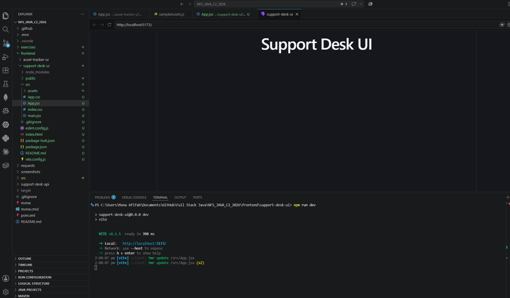
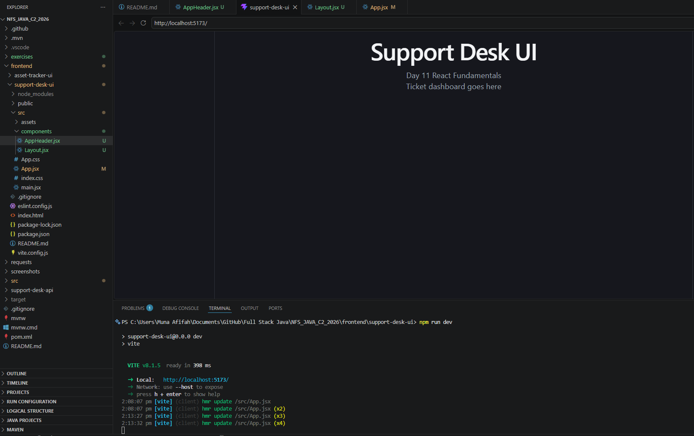

---

## Day 11 Exercise 01 - Create the React Project

### What Was Added
- Created a new Vite React project named `support-desk-ui` inside the `frontend/` folder
- Installed dependencies with `npm install`
- Ran the dev server with `npm run dev` and confirmed the default Vite React page loaded at `http://localhost:5173`
- Replaced the default `App.jsx` content with a minimal component rendering `Support Desk UI`

```jsx
export default function App() {
  return <h1>Support Desk UI</h1>;
}
```

### Output Screenshot


### GitHub Commit
[https://github.com/Munaafifah/NFS_JAVA_C2_2026/tree/day11](https://github.com/Munaafifah/NFS_JAVA_C2_2026/tree/day11)

---


## Day 11 Exercise 02 - Build Layout Components

### What Was Added
- Created `src/components/AppHeader.jsx` rendering the title "Support Desk UI" and subtitle "Day 11 React Fundamentals"
- Created `src/components/Layout.jsx` that wraps page content and renders `AppHeader` plus any `children` passed to it
- Updated `App.jsx` to use `Layout`, passing in a placeholder `<p>Ticket dashboard goes here</p>`

**Component tree:**
```text
App
└── Layout
    └── AppHeader
```

### Output Screenshot


### GitHub Commit
[https://github.com/Munaafifah/NFS_JAVA_C2_2026/tree/day11](https://github.com/Munaafifah/NFS_JAVA_C2_2026/tree/day11)

---