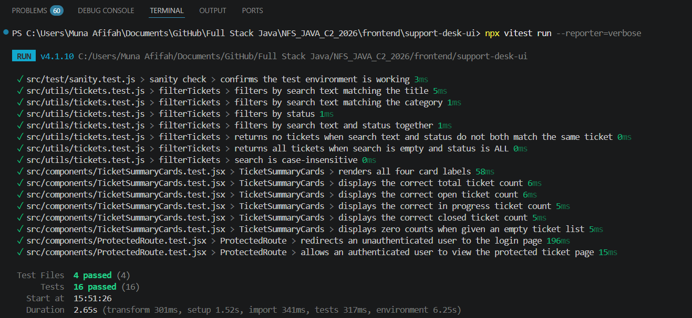
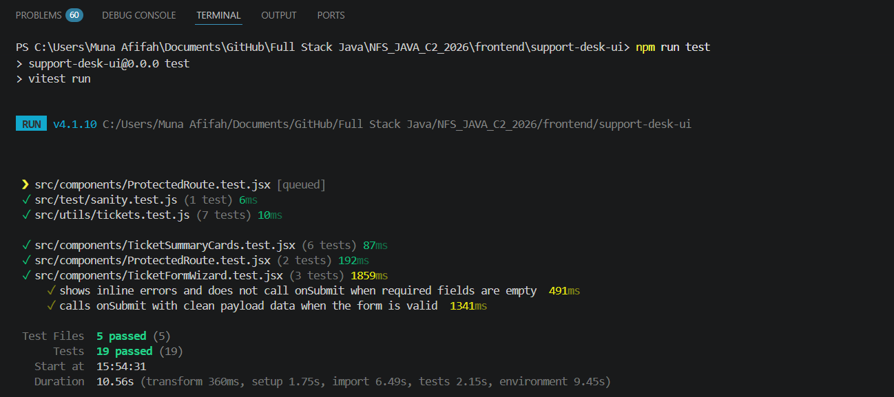
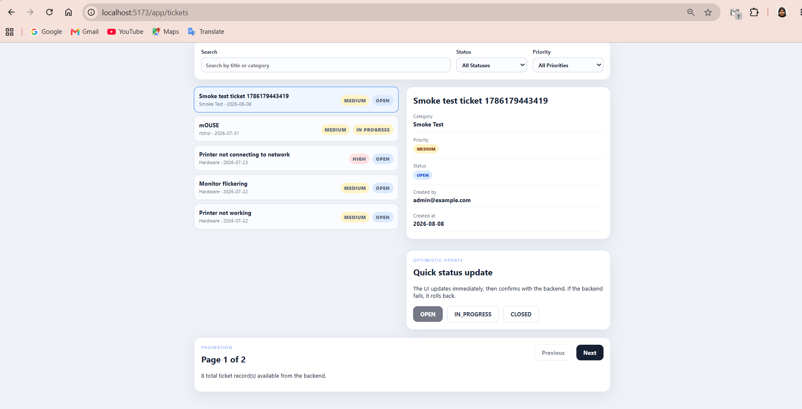

---

## Day 15 Exercise 01 - Set Up Frontend Testing Tools

### What Was Added
- Installed `vitest`, `jsdom`, `@testing-library/react`, `@testing-library/jest-dom`, and `@testing-library/user-event` as dev dependencies
- Added `test` and `test:watch` scripts to `package.json`
- Updated `vite.config.js` with a `test` block: `environment: 'jsdom'`, `globals: true`, `setupFiles: './src/test/setup.js'`, and `css: true`
- Created `src/test/setup.js` importing `@testing-library/jest-dom/vitest`, plus `afterEach` cleanup (unmounting components, clearing localStorage, restoring mocks) between tests
- Created a sample sanity test at `src/test/sanity.test.js` to confirm the test environment runs correctly
- Verified `npm run test` runs with no configuration errors and the sample test passes

### Output Screenshot

### GitHub Commit
[https://github.com/Munaafifah/NFS_JAVA_C2_2026/tree/day15](https://github.com/Munaafifah/NFS_JAVA_C2_2026/tree/day15)

---

## Day 15 Exercise 02 - Test Ticket Filter Utility

### What Was Added
- Created `src/utils/tickets.test.js` with unit tests for the existing `filterTickets(tickets, searchText, statusFilter, priorityFilter)` function
- Tests cover: filtering by search text matching title, filtering by search text matching category, filtering by status, filtering by search text and status together, returning no results when search and status don't both match the same ticket, returning all tickets when search is empty and status is `ALL`, and case-insensitive search
- All tests run against local sample data with no React rendering and no backend calls, matching the unit test definition from the Day 15 concepts guide
- Verified all 7 new tests pass alongside the existing sanity test, for 8 passing tests total

### Output Screenshot

### GitHub Commit
[https://github.com/Munaafifah/NFS_JAVA_C2_2026/tree/day15](https://github.com/Munaafifah/NFS_JAVA_C2_2026/tree/day15)

---

## Day 15 Exercise 03 - Test Ticket Summary Cards

### What Was Added
- Created `src/components/TicketSummaryCards.test.jsx` using React Testing Library to render `TicketSummaryCards` with sample ticket data
- Tests confirm all four card labels render (`Total Tickets`, `Open`, `In Progress`, `Closed`) and that each card displays the correct count, scoped per-card using `within()` so the test verifies each number is paired with the right label rather than just present anywhere on the page
- Added an edge case test confirming all counts correctly show `0` when given an empty ticket list
- Verified all 6 new component tests pass alongside the existing 8 tests from Exercises 1 and 2, for 14 passing tests total across 3 test files

### Output Screenshot

### GitHub Commit
[https://github.com/Munaafifah/NFS_JAVA_C2_2026/tree/day15](https://github.com/Munaafifah/NFS_JAVA_C2_2026/tree/day15)

---

## Day 15 Exercise 04 - Test Protected Ticket Route

### What Was Added
- Created `src/components/ProtectedRoute.test.jsx`, mocking `useAuth()` directly so each test controls `isAuthenticated` without needing a real backend call
- Built a small test router using `MemoryRouter` matching the actual `Outlet`-based structure from `App.jsx` (rather than a `children`-prop pattern), with a `/login` route and a protected `/app/tickets` route wrapped by `ProtectedRoute`
- Test 1 confirms an unauthenticated user (`isAuthenticated: false`) is redirected to and sees the login page, with the protected content never rendering
- Test 2 confirms an authenticated user (`isAuthenticated: true`) sees the protected ticket page directly, with the login page never rendering
- Verified both tests pass alongside the existing 14 tests from Exercises 1–3, for 16 passing tests total across 4 test files
- This test proves frontend route guarding only; the backend still independently enforces JWT validation and role checks on every protected endpoint

### Output Screenshot

### GitHub Commit
[https://github.com/Munaafifah/NFS_JAVA_C2_2026/tree/day15](https://github.com/Munaafifah/NFS_JAVA_C2_2026/tree/day15)

---

## Day 15 Exercise 05 - Test Ticket Form Validation

### What Was Added
- Created `src/components/TicketFormWizard.test.jsx` using React Testing Library and `userEvent` to simulate real typing and clicking
- Test 1 submits a completely empty form and confirms inline errors appear for title, description, and category, and that `onSubmit` is never called
- Test 2 types trimmed-with-whitespace values into title, description, and category, submits, and confirms `onSubmit` is called exactly once with a clean, trimmed payload including the default `priority: 'MEDIUM'` and `status: 'OPEN'`
- Test 3 renders the form with `saving={true}` and confirms the submit button shows "Saving..." and is disabled
- Verified all 3 new tests pass alongside the existing 16 tests from Exercises 1–4, for 19 passing tests total across 5 test files
- This test protects the core frontend flow: user input → validation → submit, catching regressions before they reach the backend

### Output Screenshot

### GitHub Commit
[https://github.com/Munaafifah/NFS_JAVA_C2_2026/tree/day15](https://github.com/Munaafifah/NFS_JAVA_C2_2026/tree/day15)

---

## Day 15 Exercise 06 - End-to-End Smoke Test

### What Was Added
- Installed Playwright browser binaries via `npx playwright install`
- Created `playwright.config.js` pointing at `http://localhost:5173`, with a `webServer` block that auto-starts `npm run dev` if not already running
- Created `e2e/day15-smoke.spec.js`, testing the full main user flow in a real browser against the real backend: login → dashboard → Tickets → New Ticket form → submit a valid ticket with a timestamped unique title (to avoid the duplicate-title 409 check) → confirm the success message
- Fixed two selector ambiguities during the first runs: `getByRole('link', { name: 'Tickets' })` matched both the nav link and the Dashboard's "View Tickets" button, resolved with `exact: true`; and "New Ticket" is a `<button>` (not a `<Link>`) in the current `TicketsPage.jsx`, so the selector role was corrected from `link` to `button`
- Verified the test passes against the live Spring Boot backend on port 8081, and confirmed manually that the ticket it created is genuinely persisted and visible in the real ticket list afterward
- This test proves the React UI, protected routes, and backend API all work together correctly end-to-end

### Output Screenshot

### GitHub Commit
[https://github.com/Munaafifah/NFS_JAVA_C2_2026/tree/day15](https://github.com/Munaafifah/NFS_JAVA_C2_2026/tree/day15)

---

## Day 15 Exercise 07 - Milestone 2 Evidence Submission

### What Was Added
Compiled evidence for Milestone 2, reusing screenshots already captured in Exercises 1–6 rather than creating new ones:

1. **Passing Vitest tests** → `D15_Exercise01.png` (test setup working), `D15_Exercise02.png` (filter utility tests), `D15_Exercise03.png` (summary card tests), `D15_Exercise04.png` (protected route tests), `D15_Exercise05.png` (form validation tests) — 19 tests passing total across 5 files
2. **Passing Playwright smoke test** → `D15_Exercise06.png` (1 test passed, full login-to-ticket-creation flow)
3. **Successful login** → `D15_Exercise06.png` (Playwright's login step is part of the same passing smoke test)
4. **Protected ticket page** → `D15_Exercise04.png` (ProtectedRoute test proves the guard works; the real protected Tickets page was also shown live earlier in Day 14)
5. **Ticket form validation error** → `D15_Exercise05.png` (inline errors shown when required fields are empty)
6. **Successful ticket create or update** → `D15_Exercise06.png` (the smoke test's created ticket, confirmed visible afterward in the live ticket list)

### Review Questions

**1. What is a unit test?**
A test that checks a small piece of logic on its own, like `filterTickets`, without rendering React or calling the backend.

**2. What is a component test?**
A test that renders a React component and checks what the user would actually see on screen.

**3. What is an end-to-end test?**
A test that runs in a real browser against the real app and real backend, checking that a full user flow works together.

**4. Why should protected routes be tested?**
To prove unauthenticated users are actually blocked and authenticated users can actually get in, since this is a core security behavior that's easy to accidentally break.

**5. Why do we mock API responses in component tests?**
So the tests run fast and don't depend on the backend, database, or a valid login token being available.

**6. Why does the E2E test need the backend running?**
Because it makes real network requests — login and ticket creation would just fail without a live backend to respond to them.

**7. Which test gave you the most trouble?**
The Playwright E2E smoke test — it needed two rounds of selector fixes: first because "Tickets" matched both the nav link and the Dashboard's "View Tickets" button, and then because "New Ticket" turned out to be a button rather than a link, which caused the test to time out until the selector role was corrected.

### Output Screenshots

**1 & 2. Vitest Tests Setup**

**Ticket Filter Utility Tests**

**Ticket Summary Cards Tests**

**3 & 4. Protected Route Tests**

**5. Ticket Form Validation Tests**

**2, 3 & 6. Playwright E2E Smoke Test**

### GitHub Commit
[https://github.com/Munaafifah/NFS_JAVA_C2_2026/tree/day15](https://github.com/Munaafifah/NFS_JAVA_C2_2026/tree/day15)

---