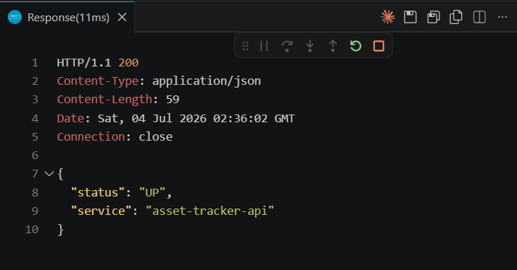
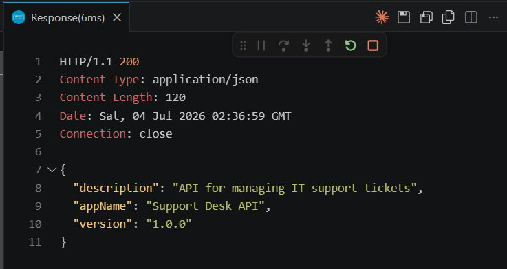
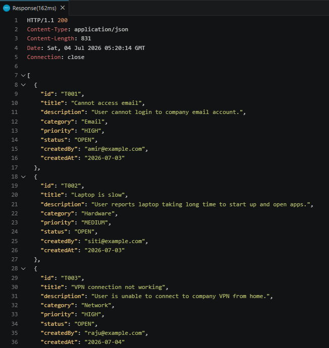
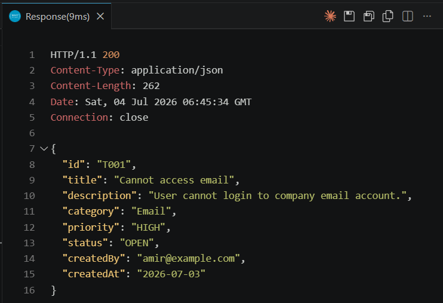
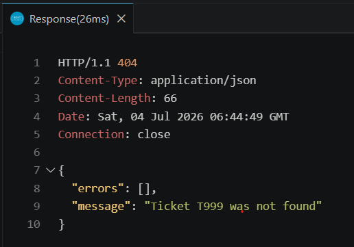

# NFS_JAVA_C2_2026 | Full-Stack Development with Java, React & MongoDB

## Programme Description

This 20-day programme is designed to help participants build a complete full-stack web application using Java, Spring Boot, React, and MongoDB.

The programme takes learners from programming and web fundamentals to backend API development, frontend interface design, database modelling, authentication, testing, performance improvement, and final capstone presentation.

Throughout the programme, participants will work on practical exercises and gradually build a small but production-like web application. The final outcome is a working capstone project that demonstrates the use of a React frontend, Spring Boot backend, MongoDB database, secure authentication, API documentation, testing practices, and deployment-readiness basics.

AI tools such as Gemini are used as learning accelerators to help scaffold examples, suggest refactoring ideas, draft tests, generate sample data, and support MongoDB query or aggregation design. However, participants are expected to review, verify, understand, and take ownership of all generated code.

---

## Programme Duration

* Duration: 20 training days

* Daily Duration: 7 hours per day

* Total Training Hours: 140 hours

* Mode: Instructor-led training with guided labs, team build activities, review sessions, quizzes, and capstone development

---

## Programme Objectives

By the end of this programme, participants will be able to:

* Understand web fundamentals, HTTP, REST, and JSON.

* Write basic to intermediate Java and JavaScript code.

* Build REST APIs using Spring Boot.

* Apply validation, authentication, authorisation, and error-handling practices.

* Model data effectively using MongoDB.

* Use MongoDB indexes, queries, pagination, and aggregation pipelines.

* Build accessible React user interfaces with routing, forms, state, and data fetching.

* Apply testing practices for backend and frontend development.

* Use AI coding assistants responsibly for learning, refactoring, testing, and documentation.

* Design, build, document, and present a full-stack capstone project.

---

## Day 6 Exercise 1 - Health and About Endpoint

### What Was Added

**src/main/java/com/example/assetTracker/controller/HealthController.java** *(student-created)*
- `@RestController` class exposing two GET endpoints for the Asset Tracker API
- `GET /api/health` — returns a JSON object with `status` and `service` fields to confirm the API is running
- `GET /api/about` — returns a JSON object with `appName`, `version`, and `description` fields describing the application
- Both methods return `Map<String, String>`, letting Spring Boot automatically serialize the response to JSON without manual JSON construction

**requests/assets.http** *(new file)*
- Two REST Client requests testing the new endpoints:
  1. Health check — `GET http://localhost:8080/api/health`
  2. About info — `GET http://localhost:8080/api/about`

### Output Screenshot

### GitHub Commit

[https://github.com/Munaafifah/NFS_JAVA_C2_2026/tree/day6](https://github.com/Munaafifah/NFS_JAVA_C2_2026/tree/day6)

---

## Day 6 Exercise 2 - Build the Ticket Read API

### What Was Added

**src/main/java/com/example/assetTracker/dto/TicketResponse.java** *(student-created)*
- Response DTO representing a support ticket
- Fields: `id`, `title`, `description`, `category`, `priority`, `status`, `createdBy`, `createdAt`
- Constructor + getters only, following the same pattern as `AssetResponse.java`

**src/main/java/com/example/assetTracker/service/TicketService.java** *(student-created)*
- `@Service` class storing a hardcoded list of 3 tickets in an `ArrayList<TicketResponse>`
- `getAllTickets()` method returns the full ticket list
- Ticket data is stored here, not inside the controller, per the exercise restriction

**src/main/java/com/example/assetTracker/controller/TicketController.java** *(student-created)*
- `@RestController` with `@RequestMapping("/api/tickets")`
- Constructor-injects `TicketService`
- `GET /api/tickets` — calls `ticketService.getAllTickets()` and returns the list as JSON

**requests/assets.http** *(updated)*
- Added `GET http://localhost:8080/api/tickets` request

### Output Screenshot

### GitHub Commit

[https://github.com/Munaafifah/NFS_JAVA_C2_2026/tree/day6](https://github.com/Munaafifah/NFS_JAVA_C2_2026/tree/day6)

---

## Day 6 Exercise 3 - Ticket by ID and 404 Handling

### What Was Added

**src/main/java/com/example/assetTracker/service/TicketService.java** *(updated)*
- Added `getTicketById(String id)` method
- Searches the existing ticket list using a stream `filter` + `findFirst`
- Throws `ResourceNotFoundException` with a clear message if no match is found

**src/main/java/com/example/assetTracker/controller/TicketController.java** *(updated)*
- Added `GET /api/tickets/{id}` endpoint using `@PathVariable`
- Delegates the lookup entirely to `ticketService.getTicketById(id)` — no search logic in the controller

**src/main/java/com/example/assetTracker/exception/GlobalExceptionHandler.java** *(existing, reused)*
- `@RestControllerAdvice` already handled `ResourceNotFoundException` app-wide
- Converts the exception into a `404 Not Found` response with a JSON `message` field, using the existing `ApiErrorResponse` DTO

**requests/assets.http** *(updated)*
- Added two new requests:
  1. Get existing ticket — `GET http://localhost:8080/api/tickets/T001`
  2. Get missing ticket — `GET http://localhost:8080/api/tickets/T999`

### Output Screenshot

### GitHub Commit

[https://github.com/Munaafifah/NFS_JAVA_C2_2026/tree/day6](https://github.com/Munaafifah/NFS_JAVA_C2_2026/tree/day6)

---

