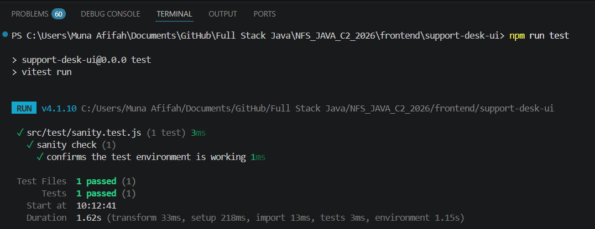

---

## Day 15 Exercise 01 - Set Up Frontend Testing Tools

### What Was Added
- Installed `vitest`, `jsdom`, `@testing-library/react`, `@testing-library/jest-dom`, and `@testing-library/user-event` as dev dependencies
- Added `test` and `test:watch` scripts to `package.json`
- Updated `vite.config.js` with a `test` block: `environment: 'jsdom'`, `globals: true`, `setupFiles: './src/test/setup.js'`, and `css: true`
- Created `src/test/setup.js` importing `@testing-library/jest-dom/vitest`, plus `afterEach` cleanup (unmounting components, clearing localStorage, restoring mocks) between tests
- Created a sample sanity test at `src/test/sanity.test.js` to confirm the test environment runs correctly
- Verified `npm run test` runs with no configuration errors and the sample test passes

### Output Screenshot

### GitHub Commit
[https://github.com/Munaafifah/NFS_JAVA_C2_2026/tree/day15](https://github.com/Munaafifah/NFS_JAVA_C2_2026/tree/day15)

---