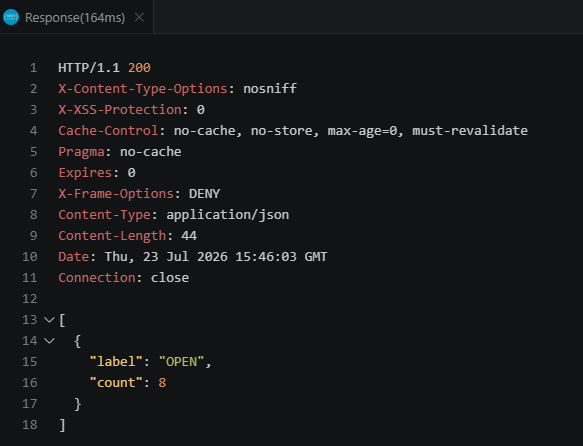
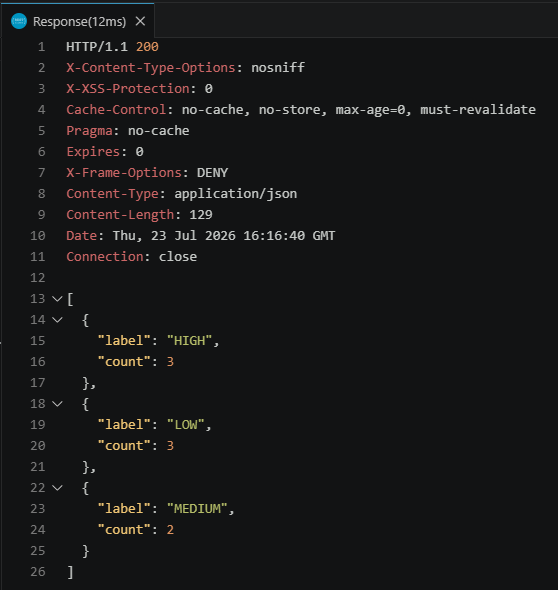

---


## Day 10 Exercise 1 - Add Versioned Ticket API Endpoints

### What Was Added
**TicketV1Controller.java** *(new file, `controller` package)*
- New controller mapped to `/api/v1/tickets`, reusing the existing `TicketService` entirely — no new business logic added
- Endpoints: `GET /api/v1/tickets`, `GET /api/v1/tickets/paged`, `GET /api/v1/tickets/{id}`, `POST /api/v1/tickets`

**SecurityConfig.java** *(updated)*
- Added a new rule: `/api/v1/tickets/**` requires `USER` or `ADMIN` role for both GET and POST, matching the exercise's simpler rule for the versioned endpoint (unlike `/api/tickets`, where POST is restricted to `ADMIN` only)

**day10-tickets.http** *(new file)*
- 4 tests covering the versioned endpoint's access control and confirming the old `/api/tickets` route still works


### Test Results
**TEST 1: Get v1 tickets without token** — returned `401 Unauthorized`, confirming the versioned endpoint is protected the same as the original.

**TEST 2: Login as USER** — returned `200 OK` with a fresh JWT token.

**TEST 3: Get v1 tickets with USER token** — returned `200 OK` with the ticket list, confirming the new `/api/v1/tickets` endpoint works correctly using the existing service layer.

**TEST 4: Old `/api/tickets` endpoint** — still returned `200 OK` as before, confirming both the old and new versioned routes work side by side without conflict.


### Reflection Question

**Why might a company keep both `/api/tickets` and `/api/v1/tickets` temporarily?**
To avoid breaking existing clients that are still using the old unversioned route. Introducing a new version doesn't mean the old one has to disappear immediately. Keeping both running side by side gives other teams or applications time to migrate to the new version before the old route is eventually deprecated and removed.


### Output Screenshots


### GitHub Commit
[https://github.com/Munaafifah/NFS_JAVA_C2_2026/tree/day10](https://github.com/Munaafifah/NFS_JAVA_C2_2026/tree/day10)

---


## Day 10 Exercise 2 - Create a Ticket Report by Status

### What Was Added
**ReportCountResponse.java** *(new file, `dto` package)*
- Simple DTO with `label` and `count` fields, used to represent grouped aggregation results

**TicketReportService.java** *(new file, `service` package)*
- Uses `MongoTemplate` to run a MongoDB aggregation pipeline that groups tickets by a given field, counts each group, and sorts by label
- `countTicketsByStatus()` groups tickets by the `status` field

**ReportController.java** *(new file, `controller` package)*
- `GET /api/v1/reports/tickets-by-status` — returns the grouped ticket count by status

**SecurityConfig.java** *(updated)*
- Added `/api/v1/reports/**` requiring authentication (any logged-in user, no specific role needed), matching the exercise's security rule

**day10-tickets.http** *(updated)*
- Added a test for the new report endpoint using a valid token

### Test Results
`GET /api/v1/reports/tickets-by-status` with a valid token returned `200 OK`:
```json
[
  {
    "label": "OPEN",
    "count": 8
  }
]
```
Since all current tickets have status `OPEN`, the aggregation correctly grouped them into a single entry with an accurate count, confirming the aggregation pipeline works as expected.


### Reflection Question

**Why is a grouped report endpoint better than asking the frontend to download all tickets and count them manually?**
Downloading every ticket just to count them wastes bandwidth and processing power, especially as the dataset grows. MongoDB's aggregation pipeline does the grouping and counting directly in the database, which is far more efficient, and the frontend only receives the small summarized result it actually needs instead of the entire raw dataset.


### Output Screenshot


### GitHub Commit
[https://github.com/Munaafifah/NFS_JAVA_C2_2026/tree/day10](https://github.com/Munaafifah/NFS_JAVA_C2_2026/tree/day10)


---


## Day 10 Exercise 3 - Create a Ticket Report by Priority

### What Was Added
**TicketReportService.java** *(updated)*
- Added `countTicketsByPriority()`, reusing the existing `countTicketsByField()` helper to group tickets by the `priority` field

**ReportController.java** *(updated)*
- Added `GET /api/v1/reports/tickets-by-priority` — returns the grouped ticket count by priority

**day10-tickets.http** *(updated)*
- Added a test for the new report endpoint using a valid token


### Test Results
`GET /api/v1/reports/tickets-by-priority` with a valid token returned `200 OK`:
```json
[
  {
    "label": "HIGH",
    "count": 3
  },
  {
    "label": "LOW",
    "count": 3
  },
  {
    "label": "MEDIUM",
    "count": 2
  }
]
```
The aggregation correctly grouped all 8 tickets by their `priority` value, confirming the same aggregation pattern used for the status report works correctly for a different field.


### Reflection Question

**How could this report help a support manager decide where to assign staff?**
If the report shows a high number of HIGH priority tickets compared to LOW, the manager can see at a glance that urgent issues are piling up and quickly assign more staff to handle them first, rather than manually scrolling through every ticket to figure out the priority breakdown.


### Output Screenshot


### GitHub Commit
[https://github.com/Munaafifah/NFS_JAVA_C2_2026/tree/day10](https://github.com/Munaafifah/NFS_JAVA_C2_2026/tree/day10)


---

