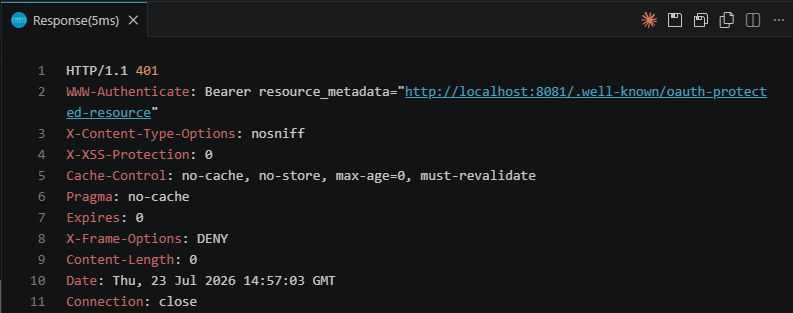
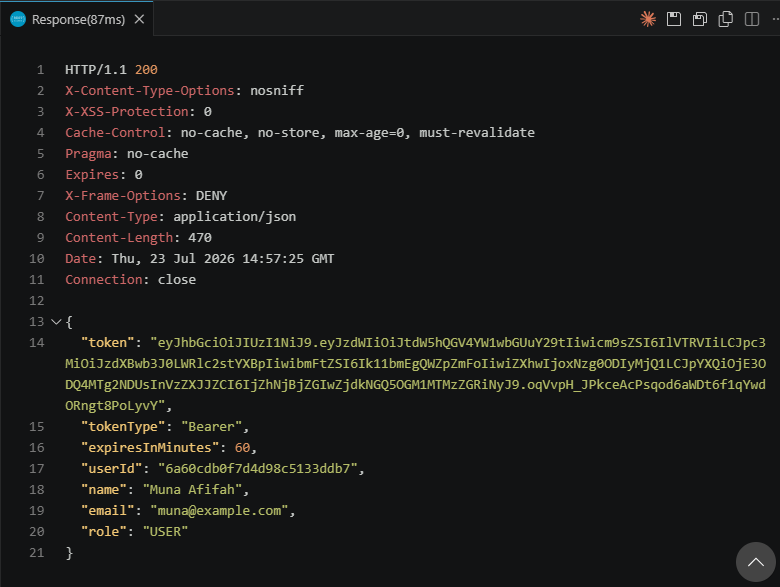
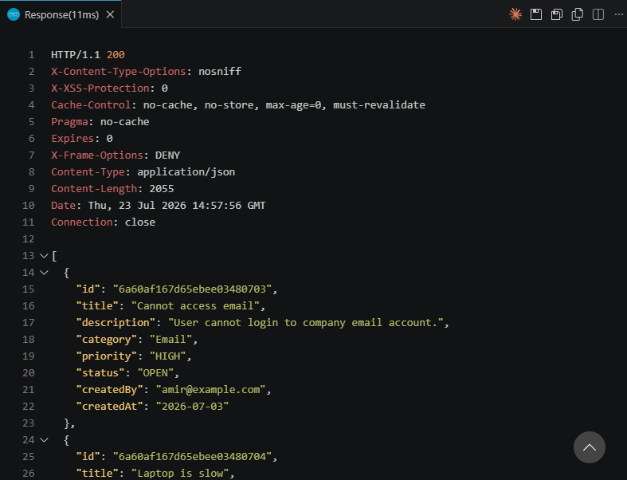
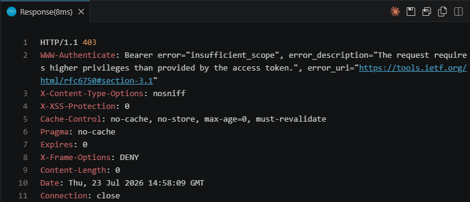
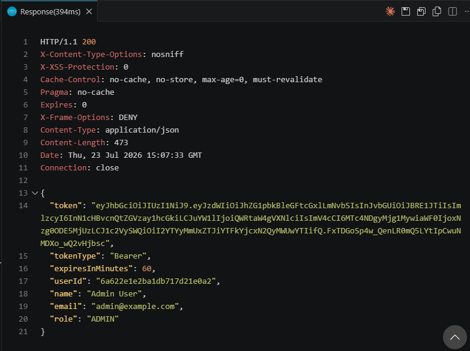
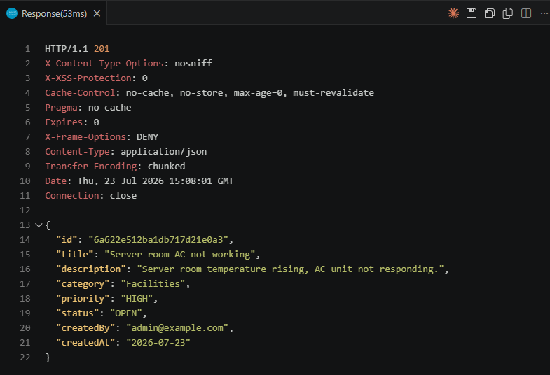

---

## Day 9 Exercise 2 - Register and Login

### What Was Added
**DTOs** *(new files, `dto` package)*
- `RegisterRequest.java` — validates `name`, `email` (must be valid format), and `password` (minimum 6 characters)
- `LoginRequest.java` — validates `email` and `password` are not blank
- `AuthResponse.java` — returns `token`, `email`, and `role` after successful register/login

**JwtService.java** *(new file, `service` package)*
- Generates a signed JWT containing the user's email as the subject and role as a claim
- Uses HS256 signing with a secret and expiry configured in `application-local.properties`

**AuthService.java** *(new file, `service` package)*
- `register()` — trims and lowercases the email, checks for duplicates, hashes the password with BCrypt, saves the user with role `USER`, and returns a JWT
- `login()` — verifies the email exists and the password matches the stored hash, returns a JWT if valid or `401 Unauthorized` if not

**AuthController.java** *(new file, `controller` package)*
- `POST /api/auth/register` — returns `201 Created` with the auth response
- `POST /api/auth/login` — returns `200 OK` with the auth response

**SecurityConfig.java** *(new file, `config` package)*
- Added `spring-boot-starter-security` and configured all endpoints to remain open (`permitAll`) for now, since protecting specific routes is covered in a later exercise
- Prevents Spring Security's default auto-lock behavior from blocking existing ticket endpoints

**pom.xml** *(updated)*
- Added `spring-boot-starter-security` for password hashing (BCrypt)
- Added `jjwt-api`, `jjwt-impl`, `jjwt-jackson` for creating and signing JWT tokens

**application-local.properties** *(updated)*
- Added `jwt.secret` and `jwt.expiration-ms` for token signing and expiry

**day09-auth.http** *(new file)*
- 4 tests: register success, login success, duplicate email, wrong password

---
### Test Results
**TEST 1: Register new user** — returned `201 Created` with a JWT token, email, and role `USER`.

**TEST 2: Login with correct credentials** — returned `200 OK` with a JWT token, email, and role.

**TEST 3: Register with duplicate email** — returned `409 Conflict` with an "Email already registered" message.

**TEST 4: Login with wrong password** — returned `401 Unauthorized` with an "Invalid email or password" message.

---
### Output Screenshots

### GitHub Commit
[https://github.com/Munaafifah/NFS_JAVA_C2_2026/tree/day9](https://github.com/Munaafifah/NFS_JAVA_C2_2026/tree/day9)

---

## Day 9 Exercise 3 - Protect Ticket Endpoints

### What Was Added
**pom.xml** *(updated)*
- Added `spring-boot-starter-security` and `spring-boot-starter-oauth2-resource-server`
- Removed the earlier `jjwt-*` dependencies, replaced with Spring Security's built-in JWT support

**security/SecurityConfig.java** *(new file, moved from `config` to match trainer's structure)*
- Configures Spring Security as a stateless OAuth2 Resource Server
- Public: `/api/health`, `/api/auth/**`
- Protected: `GET /api/tickets/**` requires `USER` or `ADMIN` role; `POST /api/tickets` requires `ADMIN` role only
- Defines beans for `PasswordEncoder` (BCrypt), `AuthenticationManager`, `JwtEncoder`, `JwtDecoder`, and a `JwtAuthenticationConverter` that reads the `role` claim from the token and maps it to a Spring Security authority

**security/AppUserDetailsService.java** *(new file)*
- Implements `UserDetailsService`, loading an `AppUser` from `AppUserRepository` by email
- Converts the stored user into Spring Security's `UserDetails`, used during login to verify credentials

**application-local.properties** *(updated)*
- Replaced earlier JWT properties with `app.jwt.secret` and `app.jwt.expiration-minutes`, matching the new security configuration

### Test Results
**TEST 5: Get tickets without token** — returned `401 Unauthorized`, with a proper `WWW-Authenticate` header pointing to the OAuth2 protected resource metadata.

**TEST 6: Login as USER to get a token** — returned `200 OK` with a JWT token, token type, expiry, user ID, name, email, and role `USER`.

**TEST 7: Get tickets with USER token** — returned `200 OK` with the full ticket list, confirming USER role can view tickets.

**TEST 8: Create ticket with USER token** — returned `403 Forbidden` with `error="insufficient_scope"`, confirming USER role is correctly blocked from creating tickets.

This matches the exercise's expected behaviour:
| Scenario | Expected | Actual |
|---|---|---|
| GET /api/tickets without token | 401 | 401 |
| GET /api/tickets with USER token | 200 | 200 |
| POST /api/tickets with USER token | 403 | 403 |
| POST /api/tickets with ADMIN token | 201 | Requires an admin account (Exercise 4) |

### Output Screenshots

### GitHub Commit
[https://github.com/Munaafifah/NFS_JAVA_C2_2026/tree/day9](https://github.com/Munaafifah/NFS_JAVA_C2_2026/tree/day9)

---

## Day 9 Exercise 4 - Seed an Admin User

### What Was Added
**UserDataSeeder.java** *(new file, `config` package)*
- Seeds one admin user on startup: `Admin User` / `admin@example.com` / role `ADMIN`
- Password (`Admin@12345`) is hashed using the existing `PasswordEncoder` (BCrypt) bean before saving
- Uses `existsByEmailIgnoreCase(...)` to check for an existing admin account, preventing duplicate seeding on every app restart
- Follows the same `@Configuration` + `@Bean CommandLineRunner` pattern as `AssetDataSeeder` and `TicketDataSeeder`

### Test Results
**TEST 9: Login as ADMIN** — returned `200 OK` with a JWT token, confirming the seeded admin account can log in successfully with the hashed password.

**TEST 10: Create ticket with ADMIN token** — returned `201 Created`, confirming the ADMIN role has permission to create tickets, closing out the final case from Exercise 3's expected behaviour table.

This completes the full role-based access matrix:
| Scenario | Expected | Actual |
|---|---|---|
| GET /api/tickets without token | 401 | 401 |
| GET /api/tickets with USER token | 200 | 200 |
| POST /api/tickets with USER token | 403 | 403 |
| POST /api/tickets with ADMIN token | 201 | 201 |

### Output Screenshot

### GitHub Commit
[https://github.com/Munaafifah/NFS_JAVA_C2_2026/tree/day9](https://github.com/Munaafifah/NFS_JAVA_C2_2026/tree/day9)

---

