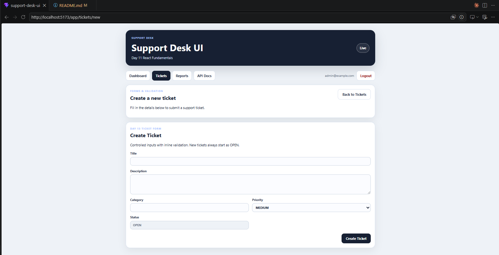
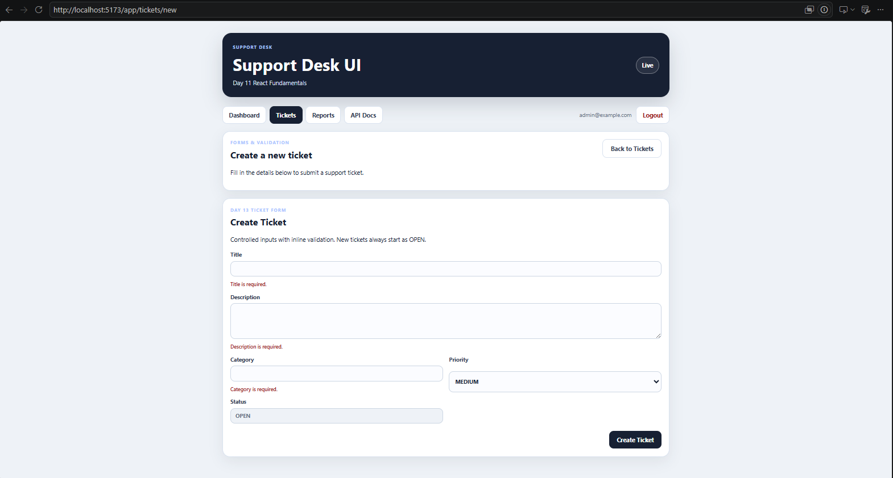
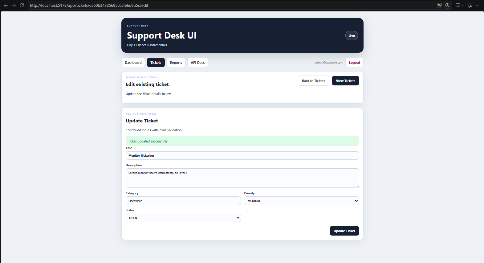

---

## Day 13 Exercise 01 - Backend Update Ticket Endpoint

### What Was Added
- Created `UpdateTicketRequest` DTO with validation on title, description, category, priority (`LOW`, `MEDIUM`, `HIGH`), and status (`OPEN`, `IN_PROGRESS`, `CLOSED`)
- Added `updateTicket(String id, UpdateTicketRequest request)` to `TicketService`, which looks up the ticket, updates its fields, and preserves the original `createdBy`/`createdAt`
- Added `PUT /api/tickets/{id}` endpoint to `TicketController`, secured behind existing JWT authentication
- Verified with a `.http` file covering a valid update, invalid priority, invalid status, missing required field, and a non-existent ticket id

### Output Screenshot

### GitHub Commit
[https://github.com/Munaafifah/NFS_JAVA_C2_2026/tree/day13](https://github.com/Munaafifah/NFS_JAVA_C2_2026/tree/day13)

---

## Day 13 Exercise 02 - Create Ticket Form Page

### What Was Added
- Created `src/components/TicketFormWizard.jsx` with controlled inputs for title, description, category, and priority (status is shown as a disabled field since new tickets are always created as `OPEN` by the backend)
- Added client-side validation requiring title, description, category, and a valid priority before submission
- Created `src/pages/TicketFormPage.jsx`, which calls `createTicket()` with the logged-in user's email as `createdBy`, and shows saving/error/success states
- Added `createTicket()` to `src/services/api.js`
- Added a `/app/tickets/new` route to `App.jsx`, nested under the existing protected `/app` layout
- Added a "New Ticket" button on `TicketsPage.jsx` linking into the form
- Verified the form opens from the protected area, displays all fields correctly, and successfully creates a new ticket visible in the ticket list

### Output Screenshot

### GitHub Commit
[https://github.com/Munaafifah/NFS_JAVA_C2_2026/tree/day13](https://github.com/Munaafifah/NFS_JAVA_C2_2026/tree/day13)

---

## Day 13 Exercise 03 - Client-Side Validation

### What Was Added
- Added `status` as tracked form state in `TicketFormWizard.jsx` (defaulting to `OPEN`), so it participates in validation like every other field, even though the input itself stays disabled since new tickets are always created as `OPEN`
- Extended `validate()` to check all five required fields: title, description, category, priority, and status
- Inline error messages render beside/below each field via ``, driven by `fieldErrors` state
- Submission is blocked via `if (!validate()) return;` inside `handleSubmit` whenever any required field fails validation
- Verified by submitting an empty form and confirming all five inline errors appear without a network request being sent

### Output Screenshot

### GitHub Commit
[https://github.com/Munaafifah/NFS_JAVA_C2_2026/tree/day13](https://github.com/Munaafifah/NFS_JAVA_C2_2026/tree/day13)

---

## Day 13 Exercise 04 - Submit Ticket To Backend

### What Was Added
- Added `createTicket(token, payload)`, `fetchTicketById(id, token)`, and `updateTicket(id, token, payload)` to `src/services/api.js`, all using the JWT token from `AuthContext`
- Extended `TicketFormWizard.jsx` with a `mode` prop (`create`/`edit`) so the same component handles both flows, with the Status field switching from a disabled display to an editable dropdown in edit mode
- Rewrote `TicketFormPage.jsx` to detect edit mode via `useParams`, fetch and prefill the existing ticket on mount when editing, and branch between `createTicket` and `updateTicket` on submit
- Added an `/app/tickets/:ticketId/edit` route in `App.jsx`
- Added an "Edit Selected" button on `TicketsPage.jsx`, enabled only when a ticket is selected in the list, navigating to the edit route for that ticket
- Verified all required states: loading spinner while fetching/saving, success message on save, backend error message surfaced on failure
- Verified the full flow: selected an existing ticket, edited its priority/status, submitted, and confirmed the change persisted in MongoDB and reflected in the ticket list

### Output Screenshot

### GitHub Commit
[https://github.com/Munaafifah/NFS_JAVA_C2_2026/tree/day13](https://github.com/Munaafifah/NFS_JAVA_C2_2026/tree/day13)

---