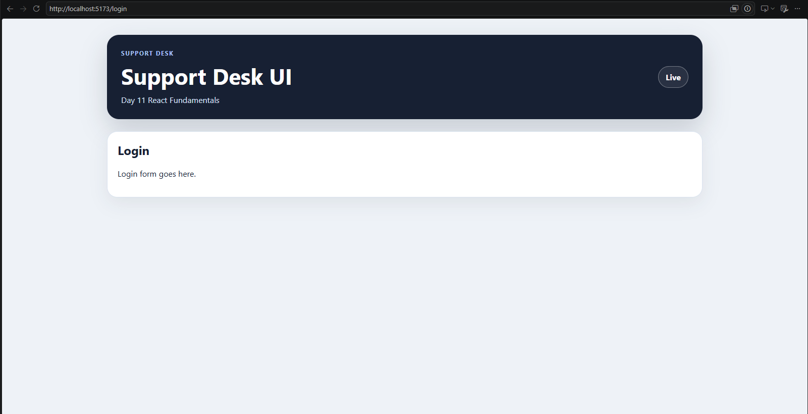
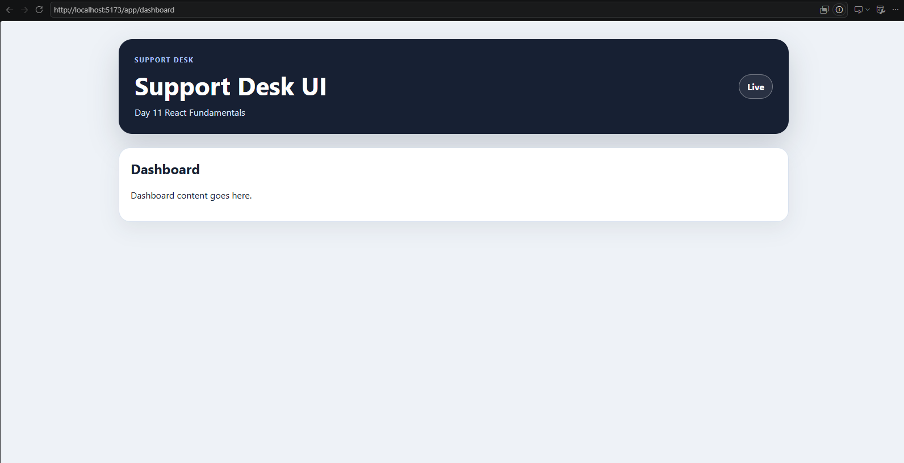
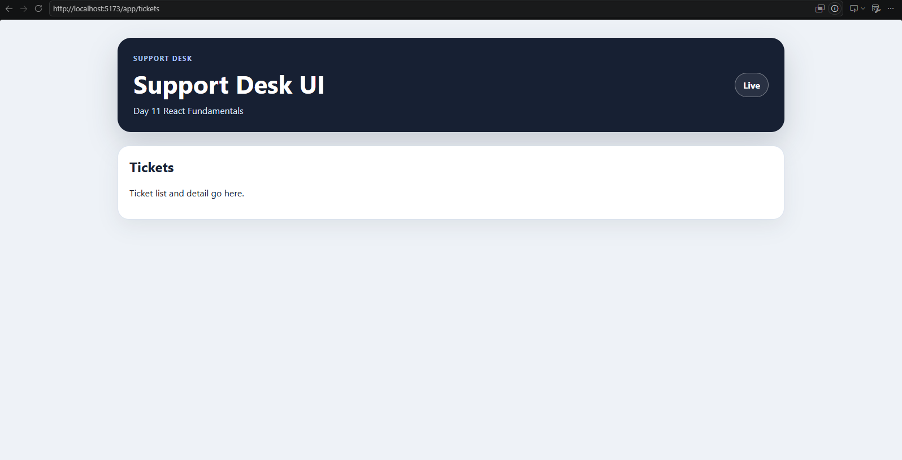
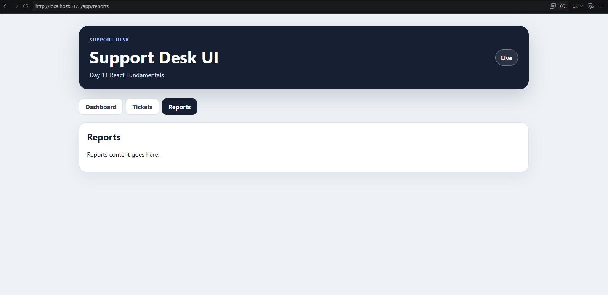

---

## Day 12 Exercise 01 - Add React Router

### What Was Added
- Installed `react-router-dom`
- Created `src/pages/LoginPage.jsx`, `src/pages/DashboardPage.jsx`, and `src/pages/TicketsPage.jsx` as placeholder route components
- Wrapped the app with `BrowserRouter` in `main.jsx`
- Updated `App.jsx` to define three routes using `Routes`/`Route`: `/login`, `/app/dashboard`, and `/app/tickets`, each rendered inside the shared `Layout`
- Verified each route renders its correct page by navigating directly to the URLs

### Output Screenshot

### GitHub Commit
[https://github.com/Munaafifah/NFS_JAVA_C2_2026/tree/day12](https://github.com/Munaafifah/NFS_JAVA_C2_2026/tree/day12)

---

## Day 12 Exercise 02 - Create Nested App Layout

### What Was Added
- Created `src/pages/ReportsPage.jsx` as a placeholder page
- Created `src/components/AppShell.jsx` with a `NavLink` navigation bar (Dashboard, Tickets, Reports) and an `Outlet` for rendering matched child routes
- Updated `App.jsx` to nest `/app/dashboard`, `/app/tickets`, and `/app/reports` as child routes under a parent `/app` route rendering `AppShell`
- Added `.app-nav` and `.nav-link` styles to `App.css`, including an `.active` state for the currently selected nav link

### Output Screenshot

### GitHub Commit
[https://github.com/Munaafifah/NFS_JAVA_C2_2026/tree/day12](https://github.com/Munaafifah/NFS_JAVA_C2_2026/tree/day12)

---