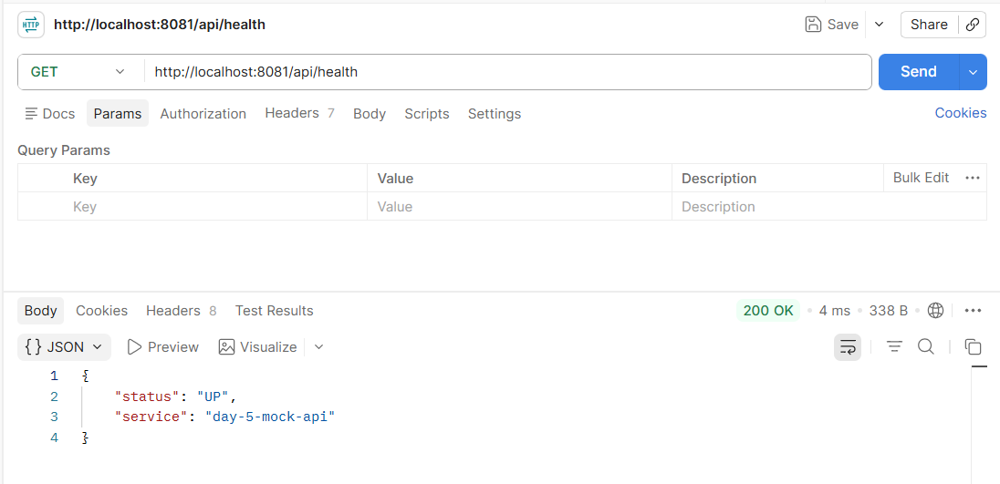
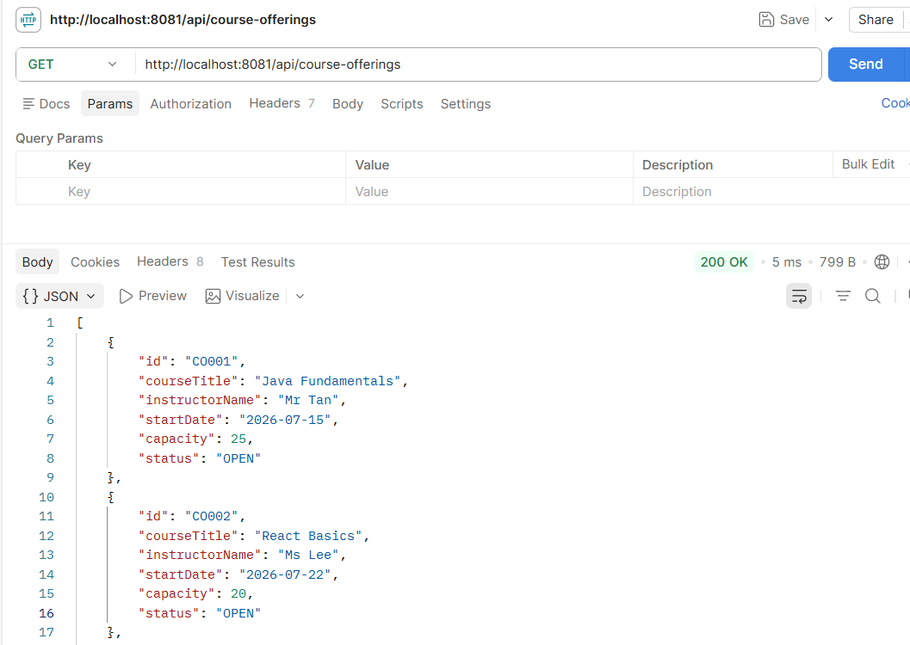
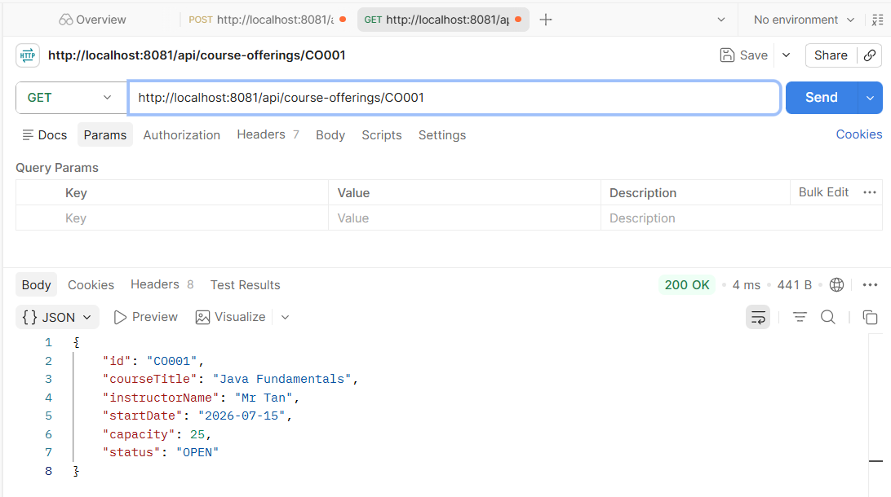
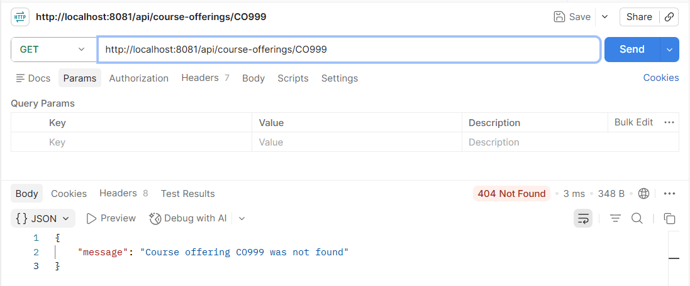
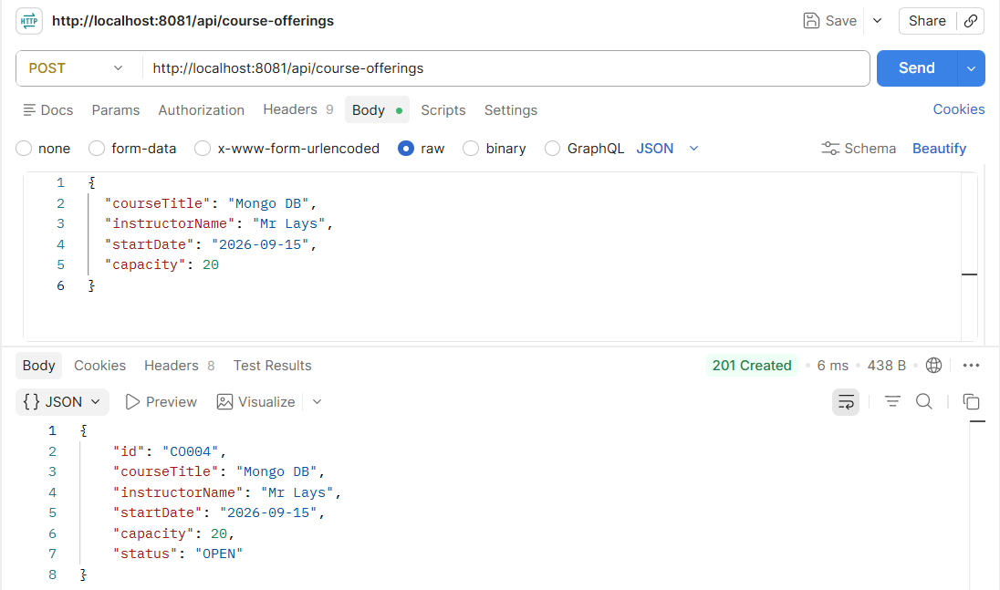
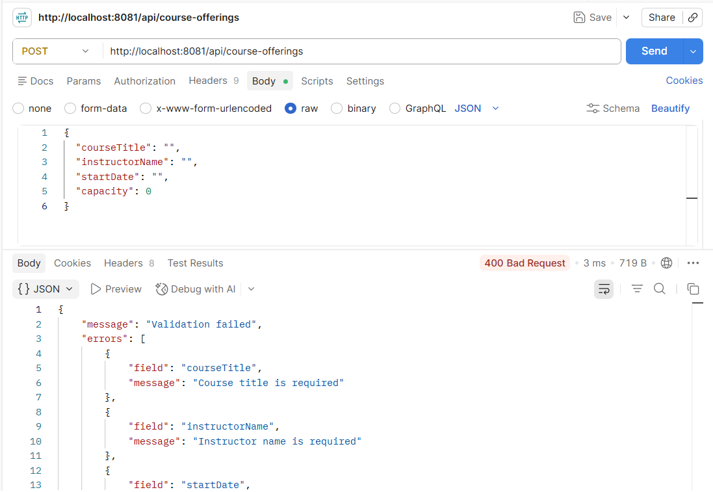

# NFS_JAVA_C2_2026 | Full-Stack Development with Java, React & MongoDB

## Programme Description

This 20-day programme is designed to help participants build a complete full-stack web application using Java, Spring Boot, React, and MongoDB.

The programme takes learners from programming and web fundamentals to backend API development, frontend interface design, database modelling, authentication, testing, performance improvement, and final capstone presentation.

Throughout the programme, participants will work on practical exercises and gradually build a small but production-like web application. The final outcome is a working capstone project that demonstrates the use of a React frontend, Spring Boot backend, MongoDB database, secure authentication, API documentation, testing practices, and deployment-readiness basics.

AI tools such as Gemini are used as learning accelerators to help scaffold examples, suggest refactoring ideas, draft tests, generate sample data, and support MongoDB query or aggregation design. However, participants are expected to review, verify, understand, and take ownership of all generated code.

---

## Programme Duration

* Duration: 20 training days

* Daily Duration: 7 hours per day

* Total Training Hours: 140 hours

* Mode: Instructor-led training with guided labs, team build activities, review sessions, quizzes, and capstone development

---

## Programme Objectives

By the end of this programme, participants will be able to:

* Understand web fundamentals, HTTP, REST, and JSON.

* Write basic to intermediate Java and JavaScript code.

* Build REST APIs using Spring Boot.

* Apply validation, authentication, authorisation, and error-handling practices.

* Model data effectively using MongoDB.

* Use MongoDB indexes, queries, pagination, and aggregation pipelines.

* Build accessible React user interfaces with routing, forms, state, and data fetching.

* Apply testing practices for backend and frontend development.

* Use AI coding assistants responsibly for learning, refactoring, testing, and documentation.

* Design, build, document, and present a full-stack capstone project.

---

---

## Day 5 Exercise 01 - HTTP Investigation

### What Was Added

**rest-basics/mock-api.js** *(trainer-provided)*
- Node.js mock API server using the built-in `http` module, running on port 8081
- Serves `/api/course-offerings` and `/api/instructors` with GET (list/single) and POST (create with validation)
- Returns appropriate status codes: 200 for success, 201 for created, 404 for not found, 400 for validation errors

**rest-basics/requests.http** *(new file)*
- Six REST Client requests testing the mock course-offerings API:
  1. Health check — `GET /api/health`
  2. Get all course offerings — `GET /api/course-offerings`
  3. Get a specific course offering — `GET /api/course-offerings/CO001`
  4. Get a course that doesn't exist — `GET /api/course-offerings/CO999`
  5. Create a new course offering (valid payload) — `POST /api/course-offerings`
  6. Create an invalid course offering (empty fields) — `POST /api/course-offerings`
- Investigation table and reflection answers documenting the HTTP behaviour observed for each request

### Investigation Table

| Method | URL | Status Code | Response Type | What Happened? |
|---|---|---:|---|---|
| GET | `/api/health` | 200 | Single object | Server responded with a health status object confirming the API is running. |
| GET | `/api/course-offerings` | 200 | List | Returned an array of 2 course offering objects (CO001, CO002) seeded in the mock API. |
| GET | `/api/course-offerings/CO001` | 200 | Single object | Returned the specific course offering matching that ID (Java Fundamentals). |
| GET | `/api/course-offerings/CO999` | 404 | Error object | ID CO999 doesn't exist in the data, so the server returned an error object with a "not found" message instead of course data. |
| POST | `/api/course-offerings` (valid body) | 201 | Single object | A new course offering was created successfully. Server generated a new ID (CO003), added `"status": "OPEN"` automatically, and returned the full created object. |
| POST | `/api/course-offerings` (empty fields) | 400 | Error object | All four required fields failed validation (empty strings, capacity 0). Server rejected the request and returned an `errors` array listing each failed field with its reason. |

### README Reflection - Exercise 01

**1. Which request returned a successful list response?**
`GET /api/course-offerings` returned status 200 with an array of course offering objects.

**2. Which request returned a not-found response?**
`GET /api/course-offerings/CO999` returned status 404 because that ID doesn't exist in the mock data.

**3. Which request returned a validation error?**
The `POST /api/course-offerings` request with empty fields returned status 400 with an `errors` array naming each invalid field.

**4. What is the difference between a successful response and an error response?**
A successful response returns the requested or created data (a single object or a list) with a 2xx status code. An error response returns a status code in the 4xx or 5xx range along with a `message` (and sometimes an `errors` array) explaining what went wrong instead of returning usable data.

**5. Why is the status code important for frontend developers?**
The status code tells the frontend how to handle the response before even looking at the body. A 200/201 means it's safe to use the returned data; a 404 means the frontend should show a "not found" message; a 400 means the frontend should show validation errors to the user. Without checking the status code, a frontend app might try to render an error object as if it were real data.

**Reflection: What is one thing you understand better about REST after this exercise?**
The status code and the response body work together as a pair — the body alone doesn't tell you whether something succeeded, and the status code alone doesn't tell you why. You need both to properly handle a response on the frontend.

### Output Screenshot

### GitHub Commit

[https://github.com/Munaafifah/NFS_JAVA_C2_2026/tree/day5](https://github.com/Munaafifah/NFS_JAVA_C2_2026/tree/day5)
