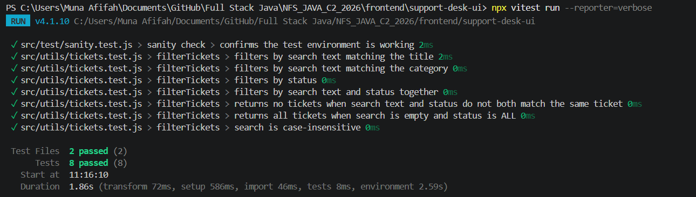
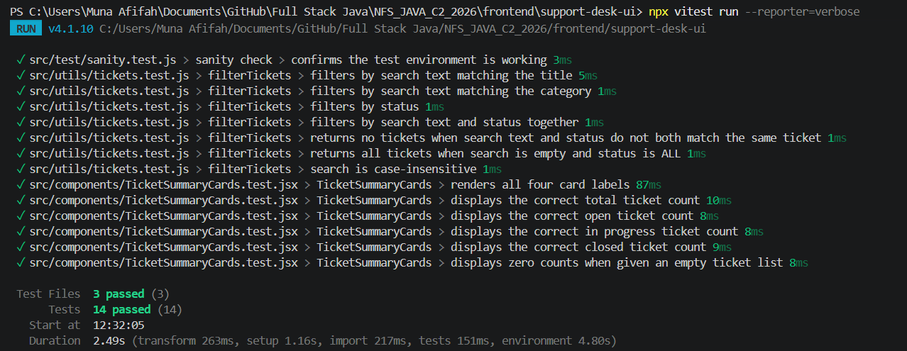

---

## Day 15 Exercise 01 - Set Up Frontend Testing Tools

### What Was Added
- Installed `vitest`, `jsdom`, `@testing-library/react`, `@testing-library/jest-dom`, and `@testing-library/user-event` as dev dependencies
- Added `test` and `test:watch` scripts to `package.json`
- Updated `vite.config.js` with a `test` block: `environment: 'jsdom'`, `globals: true`, `setupFiles: './src/test/setup.js'`, and `css: true`
- Created `src/test/setup.js` importing `@testing-library/jest-dom/vitest`, plus `afterEach` cleanup (unmounting components, clearing localStorage, restoring mocks) between tests
- Created a sample sanity test at `src/test/sanity.test.js` to confirm the test environment runs correctly
- Verified `npm run test` runs with no configuration errors and the sample test passes

### Output Screenshot

### GitHub Commit
[https://github.com/Munaafifah/NFS_JAVA_C2_2026/tree/day15](https://github.com/Munaafifah/NFS_JAVA_C2_2026/tree/day15)

---

## Day 15 Exercise 02 - Test Ticket Filter Utility

### What Was Added
- Created `src/utils/tickets.test.js` with unit tests for the existing `filterTickets(tickets, searchText, statusFilter, priorityFilter)` function
- Tests cover: filtering by search text matching title, filtering by search text matching category, filtering by status, filtering by search text and status together, returning no results when search and status don't both match the same ticket, returning all tickets when search is empty and status is `ALL`, and case-insensitive search
- All tests run against local sample data with no React rendering and no backend calls, matching the unit test definition from the Day 15 concepts guide
- Verified all 7 new tests pass alongside the existing sanity test, for 8 passing tests total

### Output Screenshot

### GitHub Commit
[https://github.com/Munaafifah/NFS_JAVA_C2_2026/tree/day15](https://github.com/Munaafifah/NFS_JAVA_C2_2026/tree/day15)

---

## Day 15 Exercise 03 - Test Ticket Summary Cards

### What Was Added
- Created `src/components/TicketSummaryCards.test.jsx` using React Testing Library to render `TicketSummaryCards` with sample ticket data
- Tests confirm all four card labels render (`Total Tickets`, `Open`, `In Progress`, `Closed`) and that each card displays the correct count, scoped per-card using `within()` so the test verifies each number is paired with the right label rather than just present anywhere on the page
- Added an edge case test confirming all counts correctly show `0` when given an empty ticket list
- Verified all 6 new component tests pass alongside the existing 8 tests from Exercises 1 and 2, for 14 passing tests total across 3 test files

### Output Screenshot

### GitHub Commit
[https://github.com/Munaafifah/NFS_JAVA_C2_2026/tree/day15](https://github.com/Munaafifah/NFS_JAVA_C2_2026/tree/day15)

---