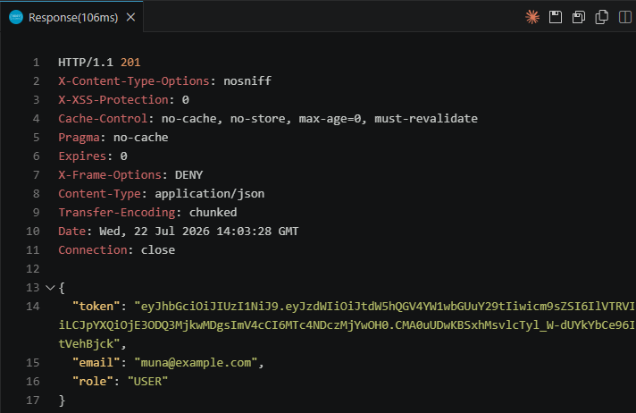
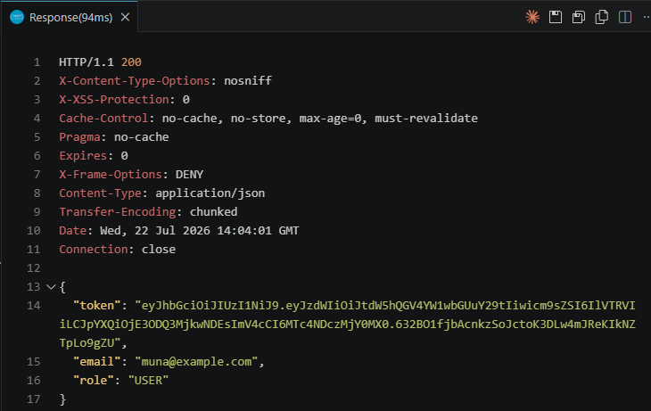
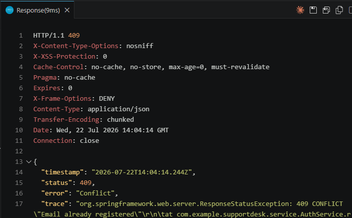
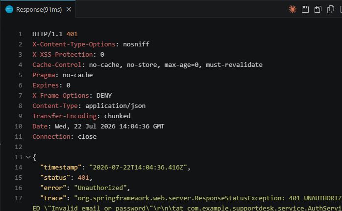

---

## Day 9 Exercise 2 - Register and Login

### What Was Added
**DTOs** *(new files, `dto` package)*
- `RegisterRequest.java` — validates `name`, `email` (must be valid format), and `password` (minimum 6 characters)
- `LoginRequest.java` — validates `email` and `password` are not blank
- `AuthResponse.java` — returns `token`, `email`, and `role` after successful register/login

**JwtService.java** *(new file, `service` package)*
- Generates a signed JWT containing the user's email as the subject and role as a claim
- Uses HS256 signing with a secret and expiry configured in `application-local.properties`

**AuthService.java** *(new file, `service` package)*
- `register()` — trims and lowercases the email, checks for duplicates, hashes the password with BCrypt, saves the user with role `USER`, and returns a JWT
- `login()` — verifies the email exists and the password matches the stored hash, returns a JWT if valid or `401 Unauthorized` if not

**AuthController.java** *(new file, `controller` package)*
- `POST /api/auth/register` — returns `201 Created` with the auth response
- `POST /api/auth/login` — returns `200 OK` with the auth response

**SecurityConfig.java** *(new file, `config` package)*
- Added `spring-boot-starter-security` and configured all endpoints to remain open (`permitAll`) for now, since protecting specific routes is covered in a later exercise
- Prevents Spring Security's default auto-lock behavior from blocking existing ticket endpoints

**pom.xml** *(updated)*
- Added `spring-boot-starter-security` for password hashing (BCrypt)
- Added `jjwt-api`, `jjwt-impl`, `jjwt-jackson` for creating and signing JWT tokens

**application-local.properties** *(updated)*
- Added `jwt.secret` and `jwt.expiration-ms` for token signing and expiry

**day09-auth.http** *(new file)*
- 4 tests: register success, login success, duplicate email, wrong password

---
### Test Results
**TEST 1: Register new user** — returned `201 Created` with a JWT token, email, and role `USER`.

**TEST 2: Login with correct credentials** — returned `200 OK` with a JWT token, email, and role.

**TEST 3: Register with duplicate email** — returned `409 Conflict` with an "Email already registered" message.

**TEST 4: Login with wrong password** — returned `401 Unauthorized` with an "Invalid email or password" message.

---
### Output Screenshots

### GitHub Commit
[https://github.com/Munaafifah/NFS_JAVA_C2_2026/tree/day9](https://github.com/Munaafifah/NFS_JAVA_C2_2026/tree/day9)

---