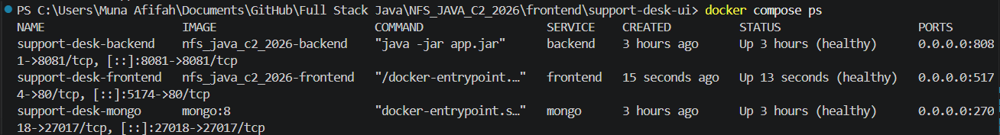
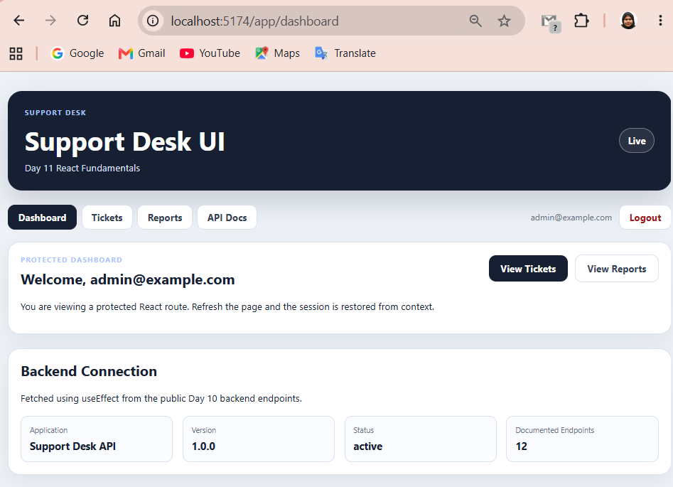
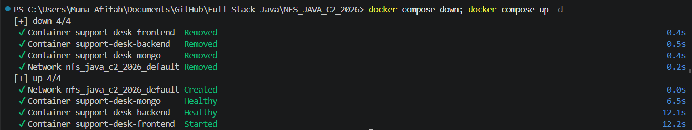

---

## Day 18 Exercise 01 - Frontend Dockerfile

### What Was Added
- Confirmed toolchain versions before starting: Java 21.0.5, Node v24.18.0, npm 11.3.0, Docker 29.7.2, Docker Compose v5.3.1
- Created a multi-stage `Dockerfile` in `frontend/support-desk-ui/`
- Build stage: `node:24-alpine`, runs `npm ci` then `npm run build` to produce the production Vite build in `/app/dist`
- Runtime stage: `nginx:alpine`, copies only the built static files from the build stage via `COPY --from=build /app/dist /usr/share/nginx/html` — no Node, npm, or source code present in the final image
- Confirmed `npm run dev` is never used anywhere in the Dockerfile; the runtime container only ever serves pre-built static files through Nginx
- Adjusted the trainer's example file layout (`Dockerfile` + `frontend/Dockerfile` at repo root) to match the project's actual structure: `support-desk-api/` and `frontend/support-desk-ui/` as separate folders, rather than a nested `frontend/` inside the backend

### GitHub Commit
[https://github.com/Munaafifah/NFS_JAVA_C2_2026/tree/day18](https://github.com/Munaafifah/NFS_JAVA_C2_2026/tree/day18)

---

## Day 18 Exercise 02 - Nginx Config

### What Was Added
- Created `nginx.conf` in `frontend/support-desk-ui/`, proxying `/api/` to the backend service and falling back to `index.html` for React Router routes
- Initial version used a static `proxy_pass http://backend:8081`, which resolves the hostname once at nginx startup — this crashed the container immediately (`host not found in upstream "backend"`) when tested standalone, since `backend` only exists as a resolvable name inside a Compose network
- Fixed by adding `resolver 127.0.0.11 valid=10s;` (Docker's embedded DNS server) combined with a `set $backend_upstream` + `proxy_pass $backend_upstream` pattern, forcing nginx to resolve `backend` per-request instead of at startup. This also protects against a real Compose startup race: even with `depends_on`, the frontend container could otherwise crash if it starts a moment before the backend is ready
- Verified standalone (no Compose network) with `docker build -t support-desk-ui:day18 .` and `docker run --rm --name support-desk-ui-day18 -p 5174:80 support-desk-ui:day18`:
  - Static file serving confirmed: `/`, JS bundle, CSS, and favicon all returned `200`
  - React Router fallback confirmed: navigating to `/login` correctly served `index.html` instead of a 404
  - API proxy correctly failed as expected in this standalone context: attempting login produced a `Connection refused` resolving `backend` via `127.0.0.11:53`, since no Compose network exists yet to make that hostname resolvable — this confirms the proxy config is wired correctly and only needs Exercise 3's network to complete the picture

### GitHub Commit
[https://github.com/Munaafifah/NFS_JAVA_C2_2026/tree/day18](https://github.com/Munaafifah/NFS_JAVA_C2_2026/tree/day18)

---

## Day 18 Exercise 03 - Compose File

### What Was Added
- Created `compose.yaml` and `mongo-init.js` at the repo root (`NFS_JAVA_C2_2026/`), defining three services: `mongo`, `backend`, `frontend`
- All container-to-container communication uses Compose service names, not `localhost` — the backend connects via `MONGODB_HOST: mongo`, and Nginx proxies via `http://backend:8081`
- `mongo-init.js` creates the same `support_app_user` account (scoped to `support_desk_db` only, not root/admin) that the local database already uses, so a fresh Compose volume ends up matching local dev
- Mapped Mongo's container port to host port `27018` instead of `27017`, deliberately avoiding a collision with the native local MongoDB service already running on the host
- Added healthchecks for all three services with `depends_on: condition: service_healthy`, so `backend` waits for Mongo to respond to a ping, and `frontend` waits for the backend's port to be open, before starting
- **Debugged a false-negative healthcheck:** the frontend container was reported `unhealthy` even though the app worked correctly end-to-end in the browser. `docker inspect` showed a consistent `wget: can't connect to remote host: Connection refused` since startup. Root cause: `wget http://localhost/` inside the container likely resolved to the IPv6 loopback (`::1`), which `nginx.conf`'s `listen 80;` doesn't bind, while Docker's port mapping talks to the container over IPv4 directly (explaining why the browser worked fine). Fixed by pointing the healthcheck at `http://127.0.0.1/` explicitly instead of `localhost`
- Verified the full stack end to end: brought up all three containers with `docker compose up --build`, confirmed `docker compose ps` shows all three as `running (healthy)`, hit `GET /api/readiness` directly against the backend (`200 READY`), and logged in through the browser at `http://localhost:5174` — successfully reached the protected dashboard, proving frontend → Nginx → backend → MongoDB all connected correctly through the Compose network

### Output Screenshot

### GitHub Commit
[https://github.com/Munaafifah/NFS_JAVA_C2_2026/tree/day18](https://github.com/Munaafifah/NFS_JAVA_C2_2026/tree/day18)

---

## Day 18 Exercise 04 - Environment and Secrets

### What Was Added
- Created `.env.example` at the repo root, with placeholders for `FRONTEND_PORT`, `BACKEND_PORT`, `MONGO_PORT`, and `JWT_SECRET` — matching the four variables `compose.yaml` already references
- Created a local `.env` (not committed) with real values for the same four variables, confirmed to be automatically picked up by Compose from the project root with no `--env-file` flag needed
- Verified by tearing the stack down and bringing it back up: `docker compose down` followed by `docker compose up -d` — mongo and backend came up `healthy` immediately, confirming the externalized values work correctly end to end
- Confirmed `.env` is excluded via `.gitignore`

**Why `.env` is not committed:** `.env` holds real values Compose substitutes into `compose.yaml` at runtime — most importantly `JWT_SECRET`, which the backend uses to sign and verify every login token. If that value were committed to git, anyone with access to the repository (now or from git history, even after later deletion) could forge a valid JWT and impersonate any user, including an admin. `.env.example` is committed instead, documenting exactly which variables are needed with safe placeholder values, so anyone cloning the repo knows what to fill in without ever seeing a real secret.

### Output Screenshot

### GitHub Commit
[https://github.com/Munaafifah/NFS_JAVA_C2_2026/tree/day18](https://github.com/Munaafifah/NFS_JAVA_C2_2026/tree/day18)

---

## Day 18 Exercise 05 - Broken Docker Compose Troubleshooting Lab

### What Was Added
- Trainer-provided lab files (`compose.broken.yml`, `.env.broken.example`) referenced a different reference project (`asset-tracker-api`) not available locally, and `.env.broken.example` itself was missing. Adapted the exercise to Support Desk instead, building `broken-compose/compose.broken.yml` from the project's own real working `compose.yaml`, with three intentionally introduced bugs matching the same categories as the original lab (see troubleshooting report below)
- Ran the broken stack with `docker compose -f compose.broken.yml --env-file .env.broken up --build`, diagnosed all three issues using `docker compose ps` and `docker compose logs`, without comparing against the working file first
- Produced `compose.fixed.yml` with all three corrections, verified via `docker compose ps` showing all three services `running (healthy)`, and confirmed end-to-end by logging in through the browser at `http://localhost:5175`
- Tested `down` vs `down -v`: confirmed the seeded admin login still worked identically after a full volume reset, since `mongo-init.js` recreates the `support_app_user` and the backend's `UserDataSeeder` recreates the admin account automatically against a fresh empty database
- Verified both `/api/health` (`200 UP`) and `/api/readiness` (`200 READY`, `database: CONNECTED`) directly against the fixed stack

### Troubleshooting Report

# Docker Troubleshooting Report

## Problem 1
Symptom: `support-desk-backend-lab` was stuck continuously exiting and restarting (`Restarting (1)`), never reaching a running state.
Command used: `docker compose -f compose.broken.yml --env-file .env.broken logs backend`
Log or evidence: `Caused by: org.springframework.util.PlaceholderResolutionException: Could not resolve placeholder 'MONGODB_PASSWORD' in value "${MONGODB_PASSWORD}"`
Root cause: `compose.broken.yml` set the environment variable as `MONGO_PASSWORD` instead of `MONGODB_PASSWORD`. The backend's `application.properties` reads `${MONGODB_PASSWORD}` with no default value, so the misnamed variable was never actually seen inside the container, and Spring Boot failed to start.
Fix: Renamed `MONGO_PASSWORD` to `MONGODB_PASSWORD` in `compose.fixed.yml`.
Why the fix works: The environment variable name now exactly matches the property key Spring Boot's placeholder resolver is looking for, so the value is found and injected correctly at startup.

## Problem 2
Symptom: Masked by Problem 1 — the backend never got far enough to reveal this on its own, but was found by reviewing `compose.broken.yml`'s `environment:` block once Problem 1 was understood.
Command used: Manual review of `MONGODB_HOST` in the backend service definition.
Log or evidence: `MONGODB_HOST: localhost` in `compose.broken.yml`.
Root cause: Inside a container, `localhost` refers to the container itself, not other services. The backend would have tried to reach MongoDB on its own container instead of the actual `mongo` service, since Docker Compose networking requires service names for container-to-container communication.
Fix: Changed `MONGODB_HOST` from `localhost` to `mongo` in `compose.fixed.yml`.
Why the fix works: Docker Compose's built-in DNS resolves the service name `mongo` to the correct container's internal IP address within the same Compose network, so the backend can actually reach the database.

## Problem 3
Symptom: `docker compose ps` reported `support-desk-frontend-lab` as `running (healthy)`, but opening `http://localhost:5175` in the browser returned `ERR_EMPTY_RESPONSE` — no response at all.
Command used: Browser test against the mapped host port, then comparing `compose.broken.yml`'s port mapping against `nginx.conf`.
Log or evidence: `ports: - "${FRONTEND_PORT:-5175}:8080"` in `compose.broken.yml`, while `nginx.conf` has `listen 80;`.
Root cause: The host port (5175) was mapped to container port 8080, but nginx only listens on port 80 inside the container — nothing was listening on 8080, so external requests got nothing back. The healthcheck still reported "healthy" because it runs *inside* the container and hits nginx directly on port 80, completely bypassing the broken host-side mapping — proving that a "healthy" status doesn't guarantee the service is actually reachable from outside.
Fix: Changed the port mapping to `"${FRONTEND_PORT:-5175}:80"` in `compose.fixed.yml`.
Why the fix works: Host port 5175 now correctly forwards to container port 80, where nginx is actually listening.

## Final verification
- [x] Frontend loads
- [x] Login works
- [x] Backend health check works
- [x] Backend readiness check works
- [x] MongoDB container is running
- [x] Backend can connect to MongoDB
- [x] Data can be reset with `down -v`

### GitHub Commit
[https://github.com/Munaafifah/NFS_JAVA_C2_2026/tree/day18](https://github.com/Munaafifah/NFS_JAVA_C2_2026/tree/day18)

---

