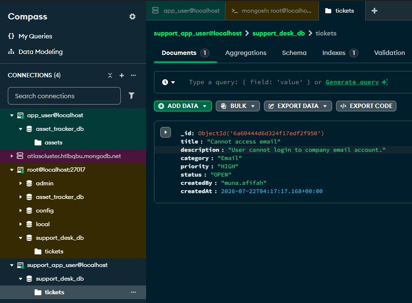
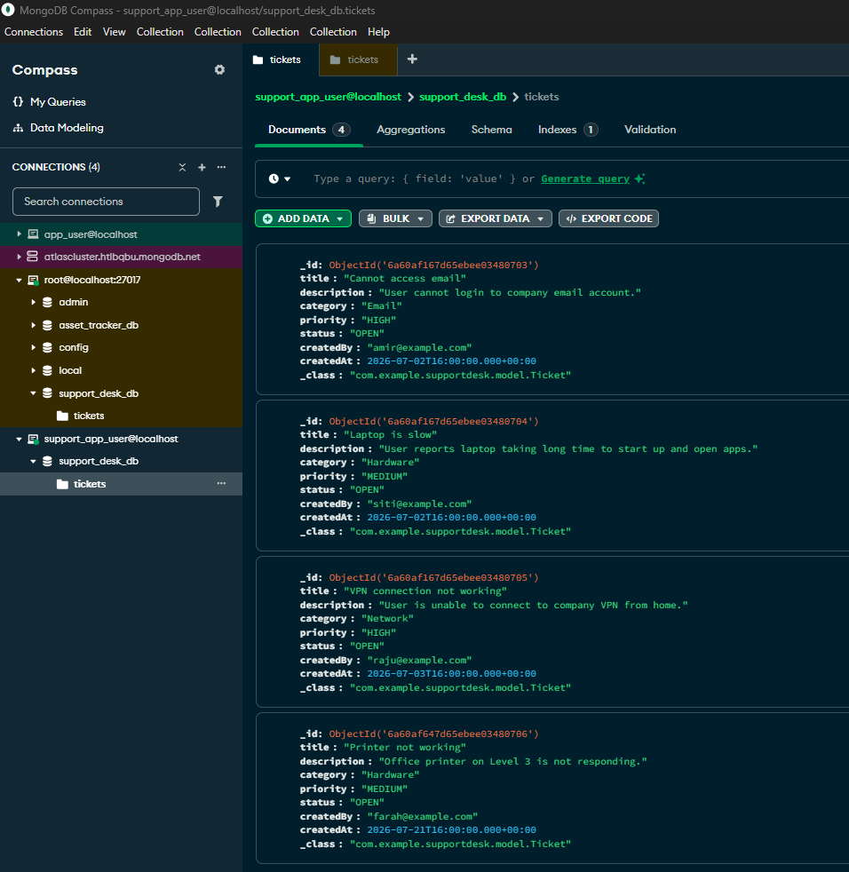
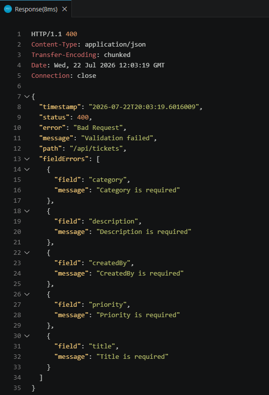

# NFS_JAVA_C2_2026 | Full-Stack Development with Java, React & MongoDB


## Programme Description


This 20-day programme is designed to help participants build a complete full-stack web application using Java, Spring Boot, React, and MongoDB.


The programme takes learners from programming and web fundamentals to backend API development, frontend interface design, database modelling, authentication, testing, performance improvement, and final capstone presentation.


Throughout the programme, participants will work on practical exercises and gradually build a small but production-like web application. The final outcome is a working capstone project that demonstrates the use of a React frontend, Spring Boot backend, MongoDB database, secure authentication, API documentation, testing practices, and deployment-readiness basics.


AI tools such as Gemini are used as learning accelerators to help scaffold examples, suggest refactoring ideas, draft tests, generate sample data, and support MongoDB query or aggregation design. However, participants are expected to review, verify, understand, and take ownership of all generated code.


---


## Programme Duration


* Duration: 20 training days

* Daily Duration: 7 hours per day

* Total Training Hours: 140 hours

* Mode: Instructor-led training with guided labs, team build activities, review sessions, quizzes, and capstone development


---


## Programme Objectives


By the end of this programme, participants will be able to:


* Understand web fundamentals, HTTP, REST, and JSON.

* Write basic to intermediate Java and JavaScript code.

* Build REST APIs using Spring Boot.

* Apply validation, authentication, authorisation, and error-handling practices.

* Model data effectively using MongoDB.

* Use MongoDB indexes, queries, pagination, and aggregation pipelines.

* Build accessible React user interfaces with routing, forms, state, and data fetching.

* Apply testing practices for backend and frontend development.

* Use AI coding assistants responsibly for learning, refactoring, testing, and documentation.

* Design, build, document, and present a full-stack capstone project.

---

## Day 7 Exercise 1 - Install and Secure MongoDB

### What Was Added
**MongoDB Community Server, Compass, and mongosh installed**
- Verified `mongod` v8.3.4 and `mongosh` v2.9.2 via command line
- Added MongoDB `bin` folder and `mongosh` install folder to Windows PATH

**Root administrator account created**
- Switched to `admin` database in `mongosh`
- Created root user with `db.createUser()`
- Verified creation by authenticating with `db.auth("root", "root")`

**Authentication enabled**
- Edited `mongod.cfg` to uncomment `security:` and add `authorization: enabled`
- Restarted the MongoDB Windows service
- Confirmed anonymous connections are rejected (`Unauthorized` error on `listDatabases` without login)
- Confirmed login succeeds using the root administrator account

**Application database and user created**
- Created `support_desk_db` database
- Created `support_app_user` with `readWrite` role scoped only to `support_desk_db`
- Verified the application user can log in and only sees `support_desk_db`

**Sample data created**
- Created `tickets` collection inside `support_desk_db`
- Inserted one ticket document with `title`, `description`, `category`, `priority`, `status`, `createdBy`, and `createdAt` fields
- Verified the document with `db.tickets.find()`

**Verified using MongoDB Compass**
- Connected Compass using both the root account and `support_app_user`
- Confirmed `support_desk_db` and `tickets` collection are visible with the sample document

---
### README Reflection

**What is the purpose of the `admin` database?**
The `admin` database stores administrative and authentication data for the whole MongoDB server, such as user accounts, roles, and privileges. It's the database you need to authenticate against to perform server-wide actions.

**Why should an application use its own database user instead of the root administrator?**
A dedicated application user limits access to only what the app needs (in this case, `readWrite` on `support_desk_db` only). If the app's credentials are ever leaked, the damage is contained to one database instead of exposing full control over the entire server.

**What is the difference between authentication and authorisation?**
Authentication is proving who you are (logging in with a username and password). Authorisation is what you're allowed to do once logged in (e.g. read-only vs read/write, which databases you can access).

**What would happen if authentication was disabled on a production database?**
Anyone who could reach the server over the network could connect without credentials and read, modify, or delete any data — as shown earlier when `listDatabases` succeeded with no login before `authorization: enabled` was set.

### Output Screenshot


### GitHub Commit
[https://github.com/Munaafifah/NFS_JAVA_C2_2026/tree/day7](https://github.com/Munaafifah/NFS_JAVA_C2_2026/tree/day7)

---

## Day 7 Exercise 2 - Create Ticket Model and Repository

### What Was Added
**Ticket.java** *(new file, `model` package)*
- Mapped to MongoDB collection `tickets` using `@Document(collection = "tickets")`
- Fields: `id` (`@Id`), `title`, `description`, `category`, `priority`, `status`, `createdBy`, `createdAt`
- No-args constructor plus a full-args constructor (excluding `id`, which MongoDB generates)
- Standard getters and setters for all fields

**TicketRepository.java** *(new file, `repository` package)*
- Interface extending `MongoRepository<Ticket, String>`
- Follows the same pattern as the existing `AssetRepository`
- Provides built-in MongoDB CRUD operations for `Ticket` documents

**MongoDB connection**
- Already configured in `application-local.properties` from Exercise 1
- Application connects to MongoDB running locally on the default port (`27017`) using database `asset_tracker_db`

```properties
spring.data.mongodb.host=localhost
spring.data.mongodb.port=27017
spring.data.mongodb.database=asset_tracker_db
spring.data.mongodb.authentication-database=asset_tracker_db
spring.data.mongodb.username=app_user
spring.data.mongodb.password=pwd12345
```

**Verification**
- Started the application with the `local` profile (`.\mvnw clean spring-boot:run "-Dspring-boot.run.profiles=local"`)
- Application started successfully with no errors, confirming the MongoDB configuration, `Ticket` model, and `TicketRepository` are correctly set up
- `TicketService` was **not** modified — it still uses the in-memory repository, as instructed

---
### GitHub Commit
[https://github.com/Munaafifah/NFS_JAVA_C2_2026/tree/day7](https://github.com/Munaafifah/NFS_JAVA_C2_2026/tree/day7)

---

## Day 7 Exercise 3 - Convert Ticket Read API to MongoDB

### What Was Added
**TicketService.java** *(updated)*
- Now depends on `TicketRepository` instead of an in-memory list
- `getAllTickets()` — retrieves all `Ticket` documents from MongoDB via `findAll()`, converts each to a `TicketResponse` DTO
- `getTicketById()` — retrieves a `Ticket` by MongoDB `_id` via `findById()`, throws `ResourceNotFoundException` (404) if not found
- `createTicket()` — saves a new `Ticket` document via `save()`, returns the saved ticket as a DTO
- Added a private `toResponse()` helper to map `Ticket` → `TicketResponse`

**MongoConfig.java** *(new file, `config` package)*
- Explicitly configures the `MongoClient` and `MongoTemplate` beans with connection credentials
- Added after troubleshooting an issue where Spring Boot's standard `application-local.properties` binding was not applying the MongoDB username/password (connection succeeded, but authentication was not applied — confirmed via `credential=null` in the driver logs)

**day07-tickets.http** *(new file, in `support-desk-api/requests/`)*
- `GET /api/tickets` — retrieves all tickets from MongoDB
- `GET /api/tickets/{id}` — retrieves one ticket by real MongoDB `_id`
- `GET /api/tickets/000000000000000000000000` — valid ObjectId format but non-existent, confirms `404 Not Found`
- `POST /api/tickets` — creates a new ticket and confirms it persists to MongoDB

**Controller unchanged**
- `TicketController` was not modified — it still calls `TicketService` the same way as before; only the service's internal data source changed

---
### How I Confirmed the Data Came From MongoDB
Before this change, tickets used hardcoded IDs like `T001`, `T002`, `T003` from an in-memory list. After connecting `TicketService` to `TicketRepository`, `GET /api/tickets` returned tickets with real MongoDB ObjectId-style `_id` values (e.g. `6a60af167d65ebee03480703`) instead. I cross-checked these exact IDs against MongoDB Compass under `support_desk_db` → `tickets` and confirmed every document matched, including a new ticket created via `POST /api/tickets` during testing, which also appeared in Compass immediately after the request — confirming the API is reading and writing directly to MongoDB rather than any in-memory data.


### Output Screenshot


### GitHub Commit
[https://github.com/Munaafifah/NFS_JAVA_C2_2026/tree/day7](https://github.com/Munaafifah/NFS_JAVA_C2_2026/tree/day7)

---


## Day 7 Exercise 4 - Save New Tickets to MongoDB

### What Was Added
**TicketService.java** *(no changes needed — already completed in Exercise 3)*
- `createTicket()` builds a `Ticket` from `CreateTicketRequest`, defaults `status` to `"OPEN"`, sets `createdAt` via `LocalDate.now()`
- Saves the ticket using `ticketRepository.save()`
- Returns a `TicketResponse` DTO (not the raw `Ticket` model)

**TicketController.java** *(no changes needed — already completed in Exercise 3)*
- `POST /api/tickets` uses `@Valid @RequestBody CreateTicketRequest`
- Returns `201 Created` on success via `ResponseEntity.status(HttpStatus.CREATED)`

**day07-tickets.http** *(updated)*
- Added an invalid-ticket test case (all fields empty) to confirm `400 Bad Request` with field-level validation errors

---
### Testing Results
**Valid request** — `POST /api/tickets` with a complete ticket body returned `201 Created`, and the ticket was saved to MongoDB with a real ObjectId (confirmed in MongoDB Compass under `support_desk_db.tickets`).

**Invalid request** — `POST /api/tickets` with all fields empty returned `400 Bad Request`, with a `fieldErrors` array listing each missing field (`title`, `description`, `category`, `priority`, `createdBy`) and its corresponding "is required" message.

---
### Output Screenshot


### GitHub Commit
[https://github.com/Munaafifah/NFS_JAVA_C2_2026/tree/day7](https://github.com/Munaafifah/NFS_JAVA_C2_2026/tree/day7)

---