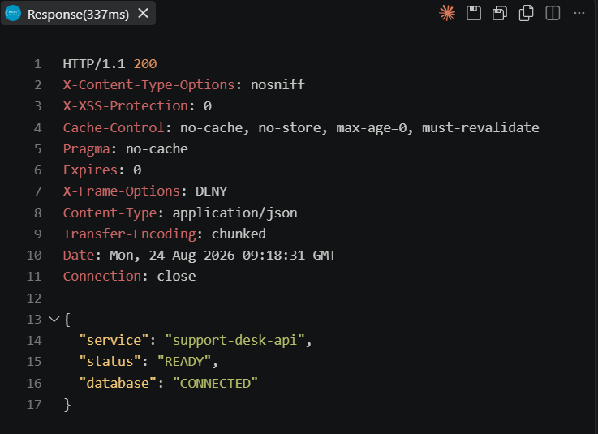

---

## Day 17 Exercise 01 - Structured Logs and Request Timing

### What Was Added
- Created `RequestLoggingFilter.java` in `com.example.supportdesk.filter`, a servlet filter that logs one structured line per request
- Set `@Order(Ordered.HIGHEST_PRECEDENCE)` so the filter wraps around Spring Security's filter chain, capturing accurate status codes even for requests rejected before reaching a controller
- Logged fields: request ID (short UUID), HTTP method, request path, response status, duration in milliseconds
- Confirmed no password, JWT token, request body, or Authorization header is ever logged
- Verified against a live request with an expired token: `GET /api/tickets` correctly logged `status=401` with accurate timing, proving the filter captures security-layer rejections, not just successful requests

### GitHub Commit
[https://github.com/Munaafifah/NFS_JAVA_C2_2026/tree/day17](https://github.com/Munaafifah/NFS_JAVA_C2_2026/tree/day17)

---

## Day 17 Exercise 02 - Readiness Endpoint

### What Was Added
- Created `ReadinessService.java` in `com.example.supportdesk.service`, which pings MongoDB via `MongoTemplate` and returns whether the database is reachable
- Created `ReadinessController.java` exposing `GET /api/readiness`, returning `200` with `status: "READY"` and `database: "CONNECTED"` when the ping succeeds, or `503 Service Unavailable` with `status: "NOT_READY"` when it fails
- Added `/api/readiness` to the permitted (public) endpoints in `SecurityConfig.java`, matching how `/api/health` is already handled, so the check doesn't require a JWT
- Verified the ready path live: stopped the local MongoDB service, confirmed the app logs connection errors while retrying, then restarted MongoDB and confirmed `/api/readiness` returned `200 READY` again once the connection recovered
- Noted the MongoDB driver's default 30-second server-selection timeout means a brief outage can resolve before the app gives up and returns 503 — currently adjusting `serverSelectionTimeoutMS` in the Mongo connection config so the 503 path responds quickly instead of hanging

### Output Screenshot


### GitHub Commit
[https://github.com/Munaafifah/NFS_JAVA_C2_2026/tree/day17](https://github.com/Munaafifah/NFS_JAVA_C2_2026/tree/day17)

---

## Day 17 Exercise 03 - Error Tracking Practice

### What Was Added
- Triggered and traced all five required error responses on the Support Desk API using `day17-tickets.http`
- Confirmed each status code appeared correctly in the `RequestLoggingFilter` output from Exercise 01, showing the exact status and duration for every request without exposing tokens or bodies

| Error | Request made | Why it happened | Where you saw it in logs |
|---|---|---|---|
| 401 Unauthorized | `GET /api/tickets` with no Authorization header | Endpoint requires a valid JWT; none was supplied | `RequestLoggingFilter` line showing `path=/api/tickets status=401` |
| 403 Forbidden | `POST /api/tickets` with a valid USER-role token | `POST /api/tickets` is restricted to `ADMIN` in `SecurityConfig`; USER role lacks that authority | `RequestLoggingFilter` line showing `path=/api/tickets status=403` |
| 400 Bad Request | `POST /api/tickets` with the `title` field missing | Request failed DTO validation on `TicketRequest` before reaching the service layer | `RequestLoggingFilter` line showing `path=/api/tickets status=400` |
| 404 Not Found | `GET /api/tickets/000000000000000000000000` | No ticket exists with that id; `findTicketOrThrow` throws when the repository lookup returns empty | `RequestLoggingFilter` line showing `path=/api/tickets/000000000000000000000000 status=404` |
| 409 Conflict | `POST /api/tickets` with a title matching an existing ticket | `ensureTitleIsUniqueForCreate` rejects duplicate titles before saving | `RequestLoggingFilter` line showing `path=/api/tickets status=409` |

### GitHub Commit
[https://github.com/Munaafifah/NFS_JAVA_C2_2026/tree/day17](https://github.com/Munaafifah/NFS_JAVA_C2_2026/tree/day17)

---

## Day 17 Exercise 04 - Performance and Index Review

### What Was Added
- Reviewed which `Ticket` fields are used for filtering, sorting, uniqueness, and reporting, and checked them against the actual indexes present in `support_desk_db`
- Found that `Ticket.java` already had `@Indexed` on `category`, `priority`, `status`, `createdBy`, and `createdAt`, but `db.tickets.getIndexes()` showed only the default `_id` index — the annotations were never applied to the live collection
- Root cause: `MongoConfig.java` manually defines `MongoClient` and `MongoTemplate` beans (needed earlier to fix a credential/auth issue), which breaks Spring Boot's automatic wiring of `auto-index-creation`, even with the property correctly set in `application.properties`
- Fixed by adding a `ContextRefreshedEvent` listener bean to `MongoConfig.java` that explicitly resolves and creates indexes for every `@Document` entity on startup — the documented Spring Data MongoDB pattern for this scenario, rather than relying on the property alone
- Verified the fix conclusively: dropped all indexes down to just `_id` via `db.tickets.dropIndexes()`, restarted the app, and confirmed all five indexes reappeared automatically without touching mongosh

**Index tuning notes:**

| Category | Fields |
|---|---|
| Used for filtering | `status`, `priority`, `category`, `createdBy` |
| Used for sorting | `createdAt` |
| Should be unique | `title` — currently enforced only at the application layer (`ensureTitleIsUniqueForCreate`), with no matching unique index in MongoDB. A near-simultaneous duplicate request could theoretically slip through; adding a unique index on `title` would close that gap |
| Used in reports | `status`, `priority` (tickets-by-status and tickets-by-priority aggregations) |

**Indexes before fix:**
```text
_id_    { _id: 1 }
```

**Indexes after fix (auto-created on startup):**
```text
_id_        { _id: 1 }
category    { category: 1 }
priority    { priority: 1 }
status      { status: 1 }
createdBy   { createdBy: 1 }
createdAt   { createdAt: 1 }
```

### GitHub Commit
[https://github.com/Munaafifah/NFS_JAVA_C2_2026/tree/day17](https://github.com/Munaafifah/NFS_JAVA_C2_2026/tree/day17)

---

## Day 17 Exercise 05 - Input Sanitisation

### What Was Added
- Created `InputSanitizer.java` in `com.example.supportdesk.util`, a static utility class with four methods matching the exercise's required tasks: `trimToNull` (trim + empty-to-null), `removeControlCharacters` (strips stray control characters), `sanitizeText` (combines both for free-text fields), and `normalizeCode` (uppercases and collapses whitespace for code-like fields)
- Kept sanitisation strictly separate from validation — the utility never decides whether a value is acceptable, only cleans up input that's already going to be used

**Reflection:**

1. **What is validation?** Deciding whether input is acceptable and rejecting it if it isn't — e.g. a missing `title` or an invalid `priority` value should return a `400`, not a guess at what was meant.
2. **What is sanitisation?** Cleaning up input that's already acceptable so it's stored consistently — trimming stray whitespace, stripping control characters — without changing whether the data is valid.
3. **Example where input should be cleaned:** A ticket title pasted as `"  Printer not working  "` with extra leading/trailing spaces — trimming it doesn't change what the user meant, so it's safe to clean automatically.
4. **Example where input should be rejected:** A `priority` value like `"urgent!!"` when only `LOW`/`MEDIUM`/`HIGH` are valid — this should return a `400`, not get silently coerced into one of the valid values, since guessing could mask a real bug on the frontend.

### GitHub Commit
[https://github.com/Munaafifah/NFS_JAVA_C2_2026/tree/day17](https://github.com/Munaafifah/NFS_JAVA_C2_2026/tree/day17)

---

## Day 17 Exercise 06 - Security Hardening Evidence

### What Was Added
Collected evidence for all six required security checks on the Support Desk API:

| # | Check | Evidence |
|---|---|---|
| 1 | Missing token returns 401 | `GET /api/tickets` with no Authorization header → `401`, confirmed in Exercise 03 |
| 2 | Wrong role returns 403 | `POST /api/tickets` with a USER-role token → `403`, confirmed in Exercise 03 |
| 3 | Duplicate record returns 409 | `POST /api/tickets` with a duplicate title → `409`, confirmed in Exercise 03 |
| 4 | Invalid input returns 400 | `POST /api/tickets` with missing `title` → `400`, confirmed in Exercise 03 |
| 5 | Logs don't show JWT tokens or passwords | Searched all `.java` files under `src` for `log.*password`, `log.*token`, and `log.*Authorization` via `Get-ChildItem -Recurse \| Select-String` — zero matches across all three searches |
| 6 | `.env` is not committed | `git log --all --full-history -- .env` returns no output, confirming `.env` has never been committed to the repo's history |

### GitHub Commit
[https://github.com/Munaafifah/NFS_JAVA_C2_2026/tree/day17](https://github.com/Munaafifah/NFS_JAVA_C2_2026/tree/day17)

---

## Day 17 Exercise 07 - Backend Dockerfile

### What Was Added
- Created a multi-stage `Dockerfile` for `support-desk-api` at the project root
- Build stage: `eclipse-temurin:21-jdk`, copies the Maven wrapper and `pom.xml` first (cached separately from source for faster rebuilds), then runs `./mvnw clean package -DskipTests` inside the container to produce the JAR
- Runtime stage: `eclipse-temurin:21-jre`, copies only the final built JAR from the build stage via `COPY --from=build` — no source code, Maven, or build cache present in the final image
- Used `EXPOSE 8081` instead of the brief's suggested 8080, since the actual app runs on port 8081 per `application.properties`
- No secrets present in the image — JWT secret and MongoDB credentials remain supplied via environment variables at runtime
- Built successfully with `docker build -t support-desk-api:day17 .` — completed all 17 build steps with no errors

### GitHub Commit
[https://github.com/Munaafifah/NFS_JAVA_C2_2026/tree/day17](https://github.com/Munaafifah/NFS_JAVA_C2_2026/tree/day17)

---