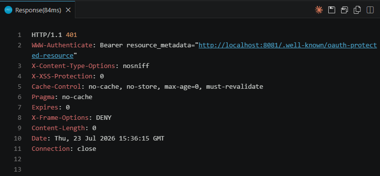
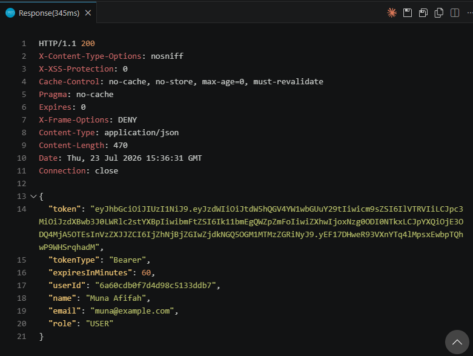
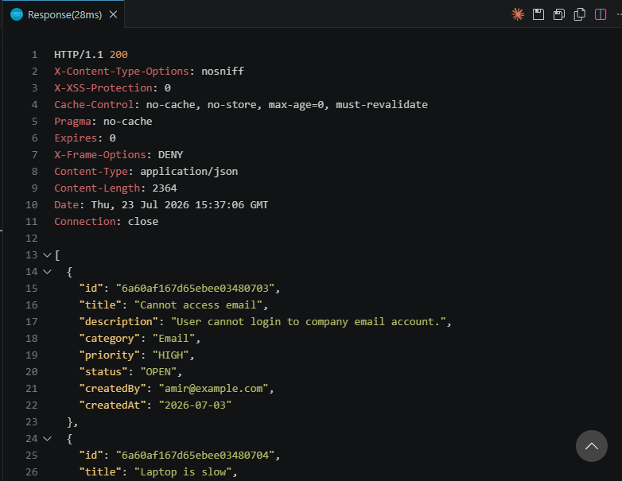
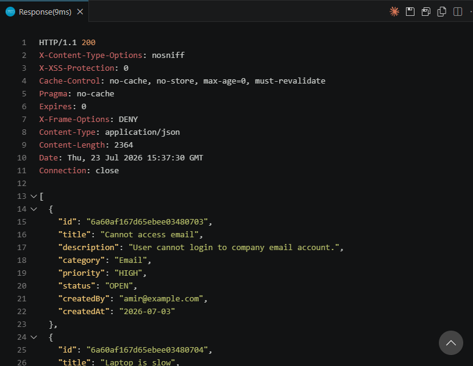

---

## Day 10 Exercise 1 - Add Versioned Ticket API Endpoints

### What Was Added
**TicketV1Controller.java** *(new file, `controller` package)*
- New controller mapped to `/api/v1/tickets`, reusing the existing `TicketService` entirely — no new business logic added
- Endpoints: `GET /api/v1/tickets`, `GET /api/v1/tickets/paged`, `GET /api/v1/tickets/{id}`, `POST /api/v1/tickets`

**SecurityConfig.java** *(updated)*
- Added a new rule: `/api/v1/tickets/**` requires `USER` or `ADMIN` role for both GET and POST, matching the exercise's simpler rule for the versioned endpoint (unlike `/api/tickets`, where POST is restricted to `ADMIN` only)

**day10-tickets.http** *(new file)*
- 4 tests covering the versioned endpoint's access control and confirming the old `/api/tickets` route still works

### Test Results
**TEST 1: Get v1 tickets without token** — returned `401 Unauthorized`, confirming the versioned endpoint is protected the same as the original.

**TEST 2: Login as USER** — returned `200 OK` with a fresh JWT token.

**TEST 3: Get v1 tickets with USER token** — returned `200 OK` with the ticket list, confirming the new `/api/v1/tickets` endpoint works correctly using the existing service layer.

**TEST 4: Old `/api/tickets` endpoint** — still returned `200 OK` as before, confirming both the old and new versioned routes work side by side without conflict.

### Reflection Question

**Why might a company keep both `/api/tickets` and `/api/v1/tickets` temporarily?**
To avoid breaking existing clients that are still using the old unversioned route. Introducing a new version doesn't mean the old one has to disappear immediately. Keeping both running side by side gives other teams or applications time to migrate to the new version before the old route is eventually deprecated and removed.

### Output Screenshots

### GitHub Commit
[https://github.com/Munaafifah/NFS_JAVA_C2_2026/tree/day10](https://github.com/Munaafifah/NFS_JAVA_C2_2026/tree/day10)

---