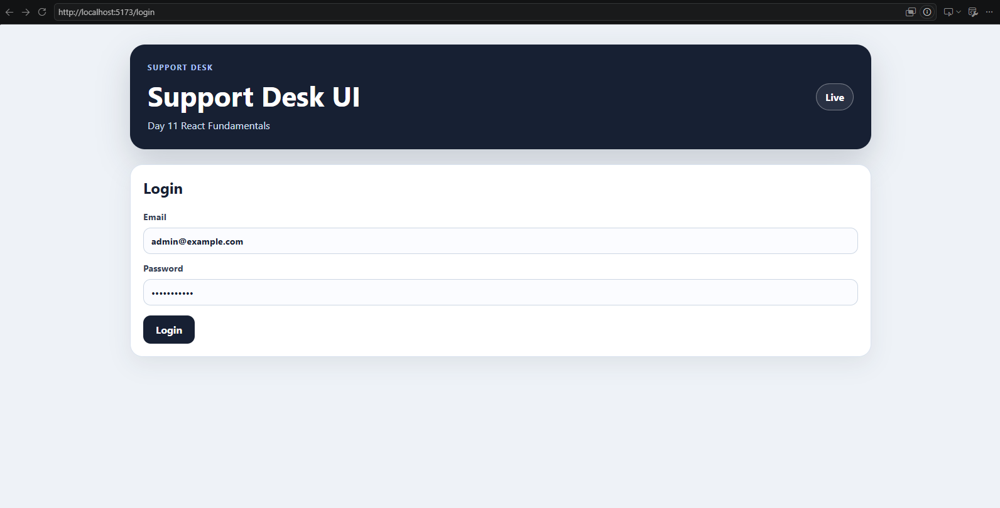
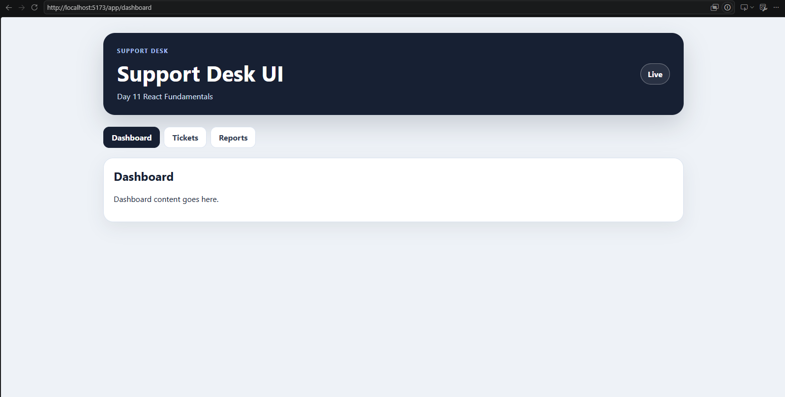
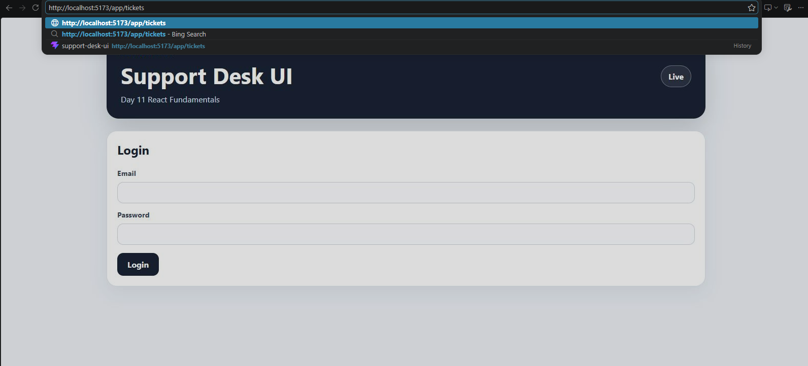
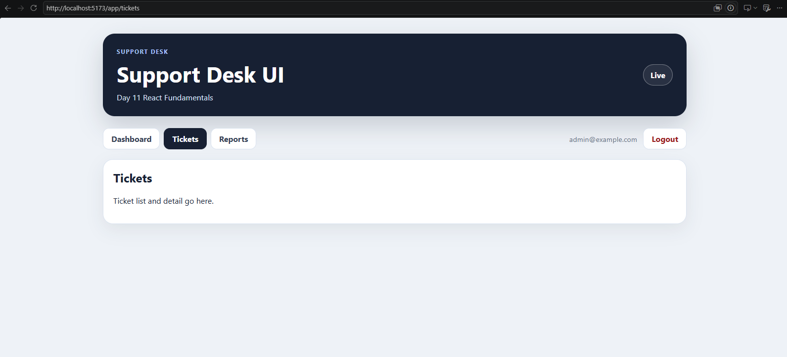

---

## Day 12 Exercise 01 - Add React Router

### What Was Added
- Installed `react-router-dom`
- Created `src/pages/LoginPage.jsx`, `src/pages/DashboardPage.jsx`, and `src/pages/TicketsPage.jsx` as placeholder route components
- Wrapped the app with `BrowserRouter` in `main.jsx`
- Updated `App.jsx` to define three routes using `Routes`/`Route`: `/login`, `/app/dashboard`, and `/app/tickets`, each rendered inside the shared `Layout`
- Verified each route renders its correct page by navigating directly to the URLs

### Output Screenshot

### GitHub Commit
[https://github.com/Munaafifah/NFS_JAVA_C2_2026/tree/day12](https://github.com/Munaafifah/NFS_JAVA_C2_2026/tree/day12)

---

## Day 12 Exercise 02 - Create Nested App Layout

### What Was Added
- Created `src/pages/ReportsPage.jsx` as a placeholder page
- Created `src/components/AppShell.jsx` with a `NavLink` navigation bar (Dashboard, Tickets, Reports) and an `Outlet` for rendering matched child routes
- Updated `App.jsx` to nest `/app/dashboard`, `/app/tickets`, and `/app/reports` as child routes under a parent `/app` route rendering `AppShell`
- Added `.app-nav` and `.nav-link` styles to `App.css`, including an `.active` state for the currently selected nav link

### Output Screenshot

### GitHub Commit
[https://github.com/Munaafifah/NFS_JAVA_C2_2026/tree/day12](https://github.com/Munaafifah/NFS_JAVA_C2_2026/tree/day12)

---

## Day 12 Exercise 03 - Login Page and Auth Context

### What Was Added
- Created `src/context/AuthContext.jsx` using the Context API to store `user`, `token`, and an `isAuthenticated` flag, with `login()` and `logout()` functions
- `login()` calls the backend's `POST /api/auth/login` endpoint with email/password and stores the returned token plus user profile (userId, name, email, role) on success
- Updated `src/pages/LoginPage.jsx` with a controlled email/password form, loading and error states, and a redirect to `/app/dashboard` on successful login
- Wrapped the app with `AuthProvider` in `main.jsx`
- Added submit button styling to `App.css`
- Verified login against the backend's seeded account, confirming the token is stored and the user is redirected into the protected app area

### Output Screenshot

### GitHub Commit
[https://github.com/Munaafifah/NFS_JAVA_C2_2026/tree/day12](https://github.com/Munaafifah/NFS_JAVA_C2_2026/tree/day12)

---

## Day 12 Exercise 04 - Protect Ticket Pages

### What Was Added
- Created `src/components/ProtectedRoute.jsx` that checks `isAuthenticated` from `AuthContext` and redirects to `/login` via `Navigate` if no token is present, otherwise renders the nested routes through `Outlet`
- Updated `App.jsx` to wrap the `/app` route (and its nested `dashboard`, `tickets`, `reports` routes) with `ProtectedRoute`
- Verified that visiting `/app/tickets` directly while logged out redirects to `/login`, and works normally after logging in

### Output Screenshot

### GitHub Commit
[https://github.com/Munaafifah/NFS_JAVA_C2_2026/tree/day12](https://github.com/Munaafifah/NFS_JAVA_C2_2026/tree/day12)

---

## Day 12 Exercise 05 - Redirect After Login

### What Was Added
- Updated `ProtectedRoute.jsx` to use `useLocation()` and pass the current location as `state` when redirecting unauthenticated users to `/login`
- Updated `LoginPage.jsx` to read `location.state.from.pathname`, falling back to `/app/dashboard` if no redirect state exists, and navigate there after a successful login
- Added a Logout button to `AppShell.jsx` so the full logout/redirect/login flow could be tested
- Fixed a file mix-up where `AppShell.jsx` had accidentally been overwritten with `LoginPage`'s content, which was causing every `/app/*` route to render the login form instead of the nav and page content
- Verified the full flow: visiting `/app/tickets` while logged out redirects to `/login`, and logging in successfully returns the user to `/app/tickets` instead of the default dashboard

### Output Screenshot

### GitHub Commit
[https://github.com/Munaafifah/NFS_JAVA_C2_2026/tree/day12](https://github.com/Munaafifah/NFS_JAVA_C2_2026/tree/day12)

---

## Day 12 Exercise 06 - Protected Route Reflection

### What Was Added
- Answered reflection questions on `BrowserRouter`, `Routes`/`Route`, `Outlet`, `Navigate`, and the difference between frontend and backend route protection
- Captured a routing flow sequence showing an unauthenticated attempt to access `/app/tickets` redirecting to `/login`, and a successful login redirecting back to `/app/tickets`

### README Reflection

1. What is the role of BrowserRouter?
BrowserRouter wraps the whole app and connects React Router to the browser's URL, so navigation updates the address bar and back/forward buttons work properly.

2. What is the difference between Routes and Route?
Routes is the container that looks at the current URL and picks which Route inside it matches; each Route defines one path and the component to render for it.

3. Why do we use Outlet?
Outlet is used inside a parent route to mark where its matched child route should render, so shared layout like the nav bar stays on screen while the inner content changes.

4. What does Navigate do?
Navigate redirects the user to a different route programmatically, without them clicking a link, used here to send unauthenticated users to /login.

5. Why is frontend route protection not enough by itself?
Frontend route protection only hides pages in the UI; someone could still call the backend API directly and bypass the React app entirely, so the real security has to be enforced on the server.

6. Which backend endpoints still need to enforce security?
Any endpoint returning or modifying real data needs backend security, like /api/v1/tickets/** and /api/v1/reports/**, which are already set to require authentication/roles in SecurityConfig.

### Output Screenshot

Redirected to Login When Accessing Protected Route

Redirected Back to Tickets After Login

### GitHub Commit
[https://github.com/Munaafifah/NFS_JAVA_C2_2026/tree/day12](https://github.com/Munaafifah/NFS_JAVA_C2_2026/tree/day12)

---